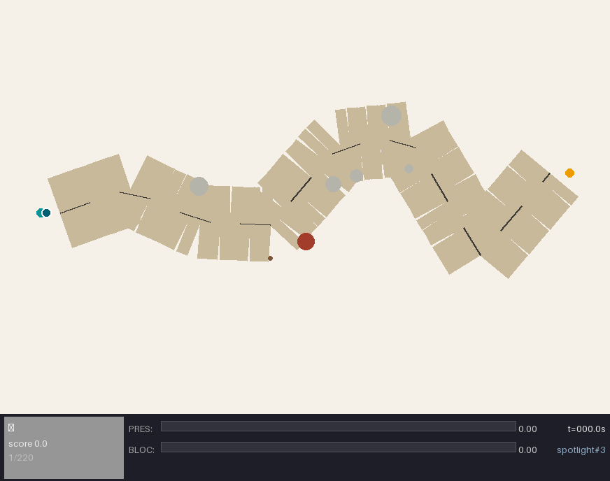
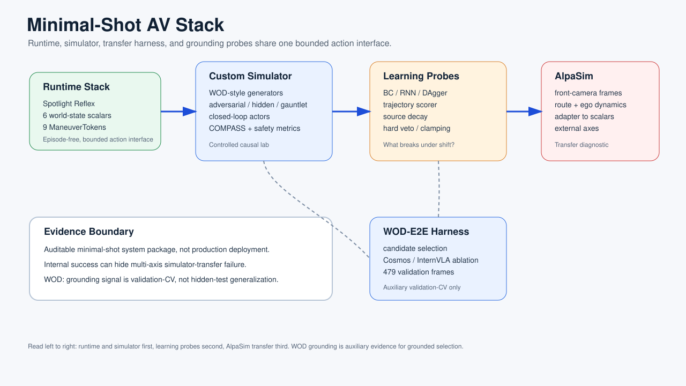
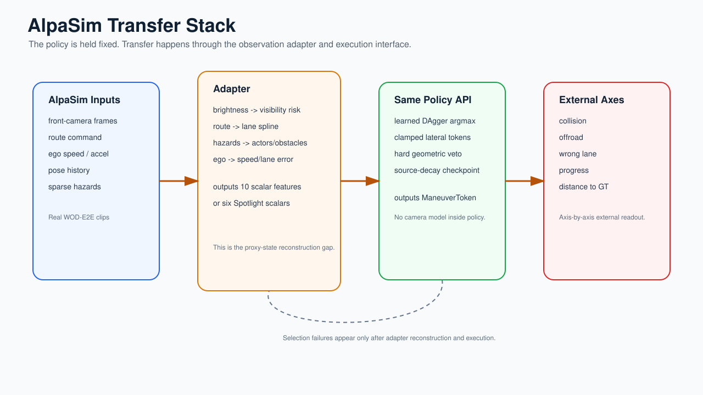
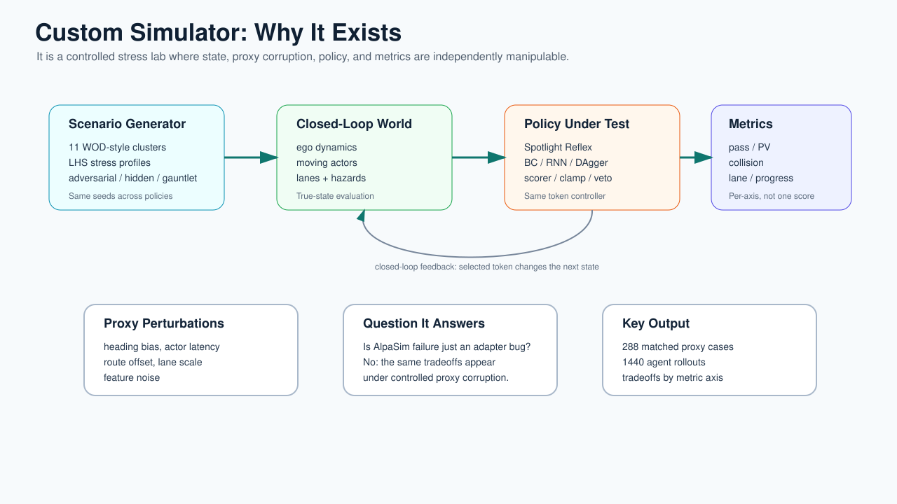
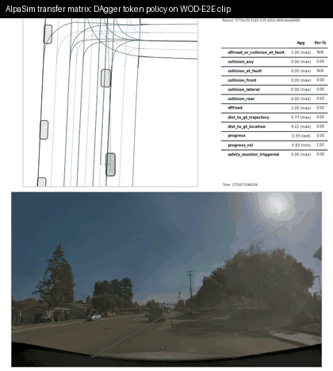
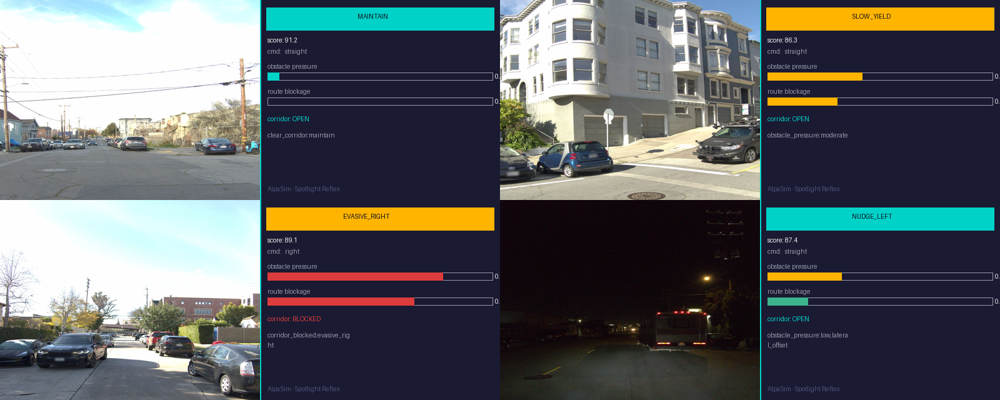

# Spotlight Reflex: Minimal-Shot Autonomous Driving

A closed-loop driving policy that reasons through unfamiliar long-tail scenarios
without fine-tuning on any AV dataset.

---


*Spotlight Reflex — wrong-way actor, low visibility, night. Selects `evasive_right`,
clears the actor, recovers to lane centre. No training data for this scenario.*



*Baseline policy — no world-state reasoning, drives directly into the actor.*

---

## What This Is

A minimal-shot autonomy prototype for Waymo's WOD-E2E long-tail benchmark, built
entirely from scratch. Two independent tracks:

**Spotlight Reflex (simulation track):** A closed-loop policy built on six geometric
world-state scalars — obstacle pressure, route blockage, lateral clearances — and nine
maneuver candidates scored against trust-region references. The decision is a function
of geometry only, not object identity. Runs in a custom 2D simulator and in Waymo's
sensor-realistic AlpaSim with the same code.

**WOD-E2E harness (benchmark track):** A trajectory selector trained on Waymo's 479
preference-labeled validation frames using segment-grouped 5-fold cross-validation.
Candidates come from kinematic physics, ridge regression, and temporal ego-history
models; the selector picks among them using ~137 features plus visual embeddings
(NVIDIA Cosmos, 64d) fed to a GPU MLP direct policy. Best result: **7.845 RFS**.

The two tracks are deliberately isolated — simulator metrics are never used for WOD
model selection.

## Why A Custom Simulator, Then AlpaSim

The custom simulator is the controlled lab. I built it to make long-tail AV scenes
cheap, randomized, and exactly measurable: the simulator knows the route, obstacles,
actor motion, clearance, progress, and collision state at every step. That makes it
possible to test whether a policy is using route/occupancy geometry rather than
memorizing labels or passing one hand-picked demo.

AlpaSim is the transfer test. After the mechanism worked internally, I kept the same
token-policy API and ran it through a second execution stack built from WOD-E2E
front-camera scenes. The AlpaSim adapter reconstructs the same proxy geometry from
camera, route, and ego-dynamics inputs, then calls the same policies: raw DAgger,
clamped DAgger, hard-veto hybrid, source-decayed DAgger, and Spotlight Reflex.

That split is intentional: the simulator answers **why** a policy decision is made
under known geometry; AlpaSim answers **what survives** when the same decision
interface is forced through sensor-realistic proxy-state reconstruction.

## Relation To Large Latent VLA Work

Recent systems such as [LaST-VLA](https://arxiv.org/abs/2603.01928) pursue a
large-model route: replace textual chain-of-thought with physically grounded latent
spatio-temporal reasoning, then train for trajectory generation at scale. This repo
does not try to reproduce that stack.

The complementary contribution here is narrower and more inspectable: keep the
action interface explicit, run the same token API in both the custom simulator and
AlpaSim, and measure transfer per axis — collision, offroad, lane adherence, and
progress — instead of hiding everything inside one aggregate score. The advantage is
not only auditability; it is failure localization. The experiments identify when
grounded selection transfers, when learned token selection breaks, and which metric
axis caused the break.

---

## Architecture At A Glance



*Repository map — custom simulator, AlpaSim transfer harness, WOD-E2E selector, and
the diagnostic evidence path are separate but auditable from the same branch.*



*AlpaSim stack — WOD-E2E scene assets feed the front-camera adapter; the same token
policies are evaluated as raw DAgger, clamped DAgger, hybrid-veto, and source-decayed
variants.*



*Internal simulator loop — policy tokens are scored against continuous safety axes
before being compared with external AlpaSim transfer behavior.*

---

## Scenario And Transfer Videos



*AlpaSim transfer matrix — WOD-E2E front-camera rollout with adapter map and metric
overlay. This GIF is generated from the 30-scene learned-policy matrix artifacts;
raw MP4 rollouts stay under ignored `runs/` directories.*



*AlpaSim — real WOD-E2E front-camera frames alongside the adapter's reasoning output.*


*Construction zone — narrow corridor (5.2 m), cone field, lane closure. `nudge_right`.*


*Intersection stress — two crossing actors, different timings, 207 steps.*


*Foreign object debris — candidate selection avoids a static long-tail obstacle and
returns to the lane reference.*

---

## Results

**Simulation — 350 rollouts, 0 collisions:**

| Suite | Runs | Pass |
|-------|------|------|
| WOD-style (all 11 clusters) | 110 | 100% |
| Compositional OOD | 60 | 100% |
| Adversarial (2–3 hazards) | 60 | 100% |
| Hidden holdout | 60 | 100% |
| Gauntlet (4 hazards, 3.5 m corridor) | 60 | 60% |

COMPASS: **9.137 / 10** (700 ranked runs) · 95% CI collision rate [0.0, 0.0053]

This is the primary Spotlight Reflex simulator benchmark: 350 deterministic rollouts over
seeds 1–10. The gauntlet row here is the 60-run primary-suite slice.

**Gauntlet vs baseline (same 420 scenarios, matched seeds):**

| Policy | Pass rate | Collision rate |
|--------|-----------|---------------|
| Baseline (no world-state reasoning) | 2.1% | 20.5% |
| Spotlight Reflex | **57.6%** | **7.9%** |

This is a separate larger matched comparison against the baseline policy
(420 scenarios, seeds 1–80), not the same sample as the 60-run gauntlet row above.

**WOD-E2E — 5-fold segment-grouped CV on 479 validation frames:**

| Selector | RFS | Folds |
|----------|-----|-------|
| Waymo baseline (official) | 7.022 | — |
| Local baseline | 7.131 | — |
| Gate-only | 7.803 | 5 |
| RFF direct policy | 7.834 | 5 |
| GPU MLP + Cosmos 64d | 7.845 | 5 |
| **Cosmos latent world prior + direct selector** | **7.848** | **5** |
| HGB Optuna peak (2-fold only, not comparable) | 7.880 | 2 |
| Oracle (perfect selector) | 9.264 | 5 |

Oracle gap: **1.407 RFS** for the best tracked 5-fold selector. The right candidate
exists in the pool; the remaining problem is selector grounding, not candidate generation.
Grounding ablations are summarized in
[`docs/corl2027/results/wod_grounding_ablation_table.md`](docs/corl2027/results/wod_grounding_ablation_table.md).

**AlpaSim transfer diagnostics — 10 shared WOD-E2E clips, paired by scene:**

| Variant | Collision | Offroad | Wrong lane | Progress | Distance |
|---------|----------:|--------:|-----------:|---------:|---------:|
| Raw DAgger iter2 | 0.600 | 0.900 | 0.700 | 0.034 | 62.0 m |
| Clamped DAgger iter2 | 0.700 | 0.500 | 0.200 | 0.384 | 59.9 m |
| Axis-constrained clamped | 0.700 | 0.200 | 0.200 | 0.358 | 54.8 m |
| Hybrid clamped-veto | 0.800 | 0.200 | 0.700 | 0.837 | 166.1 m |
| Source-decayed DAgger | 0.600 | 0.900 | 0.400 | 0.175 | 62.9 m |

The external result is intentionally reported per axis, not as a single winner:
clamping improves route geometry, axis-constrained clamping further improves offroad and
distance-to-ground-truth, hybrid veto improves progress/offroad behavior, and source
decay improves wrong-lane rate. Full paired tests are in
[`docs/corl2027/results/alpasim_matrix10_with_axis_analysis.md`](docs/corl2027/results/alpasim_matrix10_with_axis_analysis.md).
The proxy-visibility audit is the key interpretation check: the axis-constrained and
hard-veto AlpaSim runs both saw `0/1990` structured-hazard frames, so collision failures
are upstream of token ranking and require actor-aware proxy reconstruction rather than a
stronger veto threshold
([audit](docs/corl2027/results/alpasim_proxy_visibility_audit.md)).
The repo now includes the oracle-proxy probe for that diagnosis:
[`scripts/build_alpasim_oracle_actor_proxy.py`](scripts/build_alpasim_oracle_actor_proxy.py)
extracts privileged world-frame actor poses from AlpaSim ASL logs, and the
`token_dagger_iter2_axis_constrained_oracle_actor_clamped` preset injects them into the
same learned selector for a controlled oracle-proxy ablation
([commands](docs/notes/alpasim-integration.md#oracle-actor-proxy-ablation)).
Do not conflate the actor-aware numbers: the `0.70 -> 0.40` collision reduction is a
score-cutoff world-frame oracle diagnostic, and the historical `0.70 -> 0.60` raw result
was a 10-clip diagnostic. The canonical matched raw diagnostic is the `30/30` world-frame
oracle rerun in [`artifacts/alpasim_actor_blindness_30scene_raw_analysis.md`](artifacts/alpasim_actor_blindness_30scene_raw_analysis.md):
collision stays `0.60 -> 0.60` with `better=0, worse=0`, offroad worsens
`0.207 -> 0.310`, wrong-lane improves `0.241 -> 0.172`, and progress improves
`0.170 -> 0.184`. That makes the actor-complete probe informative but still inconclusive
for the collision-causality probe. The follow-up collision-surface audit
([Markdown](artifacts/alpasim_collision_surface_30scene_audit.md),
[JSON](artifacts/alpasim_collision_surface_30scene_audit.json)) shows why: the same
`18/30` clips collide under baseline and oracle. At first impact, baseline logs show
`maintain` as top candidate and `0/18` structured-hazard frames, while oracle logs show
proxy hits, actors, and non-maintain selected actions on `17/17` logged collision clips.
The remaining collision surface therefore points beyond selector ranking alone, toward
candidate-set coverage or controller/traffic execution. The selector-side candidate
counterfactual
([Markdown](artifacts/alpasim_candidate_counterfactual_30scene.md),
[JSON](artifacts/alpasim_candidate_counterfactual_30scene.json)) injects the same
world-frame actor proxy into the baseline timeline and reconstructs candidate feasibility
without rerunning AlpaSim. It finds `0/18` actor-axis-safe first-impact frames, only
`5/25` missed actor-axis-safe actionable frames, and `12/18` scenes where actor-axis-safe
selected tokens still collide later. That narrows selector miss to a minority explanation;
the remaining proof step is true candidate/controller replay. The selector-free direct
grid replay now covers that next step
([cost-ranked](artifacts/alpasim_direct_actor_planner_collision18_v2_analysis.md),
[max-clearance](artifacts/alpasim_direct_grid_max_clearance_collision18_analysis.md)):
both runs improve only `2/18` collision clips (`1.000 -> 0.889`, McNemar `p=0.5000`).
The max-clearance replay also improves distance-to-ground-truth (`1.41 m -> 0.74 m`),
but it still collides on `16/18` clips, so the residual failure is not explained by the
learned selector or direct-grid cost ranking alone.
The partial bridge analysis
([Markdown](artifacts/alpasim_partial_bridge_preimpact.md),
[JSON](artifacts/alpasim_partial_bridge_preimpact.json)) connects this external failure
to the controlled proxy perturbation: at first impact, baseline adapter logs contain
`0/18` structured hazards while the world-frame oracle proxy has positive actor hazards in
`18/18`; actionable collision windows have median `22` oracle hazards versus `4` in
terminal-matched non-collision controls. This is a hazard-dropout bridge in the
structured-hazard interface, not yet a full residual-density bridge for route, heading,
lane, or feature-noise errors.

This table evaluates learned-policy transfer variants. It should be read as the
transfer-diagnostic extension rather than a replacement for the original Spotlight
readiness check (`collision_at_fault: 0.0`, `dist_to_gt: 0.42 m`).

---

## Scope and Limitations

- **Development analysis, not zero-shot.** The WOD-E2E selector is trained on the same validation preference labels it is evaluated on — under segment-grouped cross-validation to prevent data leakage, but still the validation set. Moving training to the Waymo train split would make this a true test-set generalisation claim.
- **No camera perception.** The WOD-E2E model sees only ego velocity history, speed, acceleration, and route intent — not the camera images. This is the identified bottleneck; a preference-aligned visual encoder is the next step.
- **2D abstract simulation.** The simulator is 2D with structured obstacles, not a physics engine. AlpaSim integration runs the same policy in a sensor-realistic environment but at the trajectory-plugin level.
- **Test set not evaluated.** The packaging pipeline is complete. The test TFRecords (Waymo Google Drive, sign-in gated) are the only missing piece for a test-set run.

---

## Documentation

Two primary references — each focused on one track with no repeated content:

- **[`docs/simulation.md`](docs/simulation.md)** — Policy architecture (6 scalars,
  9 candidates, trust-region scoring, reference rules), simulator we built (11 WOD
  clusters, compositional OOD generator, 8 actor models, COMPASS), AlpaSim integration
  (4-channel adapter), results, and failure modes.

- **[`docs/wod-e2e-system-walkthrough.md`](docs/wod-e2e-system-walkthrough.md)** —
  WOD-E2E data and frame structure, candidate generation pipeline, selector training,
  cross-validation protocol, performance results, and a full external-tools section
  (Cosmos architecture, InternVLA architecture, Optuna TPE algorithm, RFF derivation,
  GPU MLP architecture).

- **[`docs/presentation.tex`](docs/presentation.tex)** — LaTeX Beamer slide deck
  (`pdflatex docs/presentation.tex` or paste into Overleaf).
- **[`presentation.md`](presentation.md)** / **[`presentation-sota.pdf`](presentation-sota.pdf)** —
  branch-level presentation with architecture graphs, simulator results,
  AlpaSim transfer diagnostics, WOD-E2E results, and audit links.
- **[`docs/diagrams/`](docs/diagrams)** — Mermaid source schemas used directly in
  the presentation; rendered slide assets live in `docs/images/mermaid_*.svg`.
- **[`docs/corl2027/paper.tex`](docs/corl2027/paper.tex)** /
  **[`docs/corl2027/paper.pdf`](docs/corl2027/paper.pdf)** — current CoRL 2027
  draft on grounded token selection and proxy-state transfer failure.

If you are browsing the stable `main` branch, switch to
[`CoRL-2027`](https://github.com/amtellezfernandez/minimal-shot-av/tree/CoRL-2027)
for the more technical experiment logs, AlpaSim transfer harness, and ongoing paper
work. On this branch specifically, start here:

- **[`docs/corl2027/AUDIT.md`](docs/corl2027/AUDIT.md)** — the shortest audit path:
  branch assumptions, what is published on Hugging Face, what can be checked without
  AlpaSim, and the exact commands for the full external matrix.
- **`./scripts/run_corl2027_audit.sh`** — repo-local wrapper that runs the current
  paper-evidence audits and, if a transfer-matrix directory already exists, refreshes
  the paired AlpaSim analysis from disk.

---

## Quickstart

```bash
# Full reproducible AlpaSim runtime bootstrap: clone pinned upstream checkout if
# missing, create .venv via uv, run readiness, and build runtime images only on
# supported hosts.
./scripts/bootstrap_alpasim_runtime.sh

# Single demo rollout — wrong-way actor scenario
uv run --no-sync python scripts/run_demo.py \
  --policy spotlight-reflex \
  --scenario-cluster spotlight \
  --seed 3 \
  --artifacts-dir artifacts/demo_spotlight

# Full 350-rollout evaluation
uv run --no-sync python scripts/evaluate_scenarios.py \
  --policy spotlight-reflex \
  --suite all \
  --seed-start 1 \
  --seed-end 10 \
  --output-dir artifacts/eval_all

# Geometry invariance regression test
uv run --no-sync python scripts/run_tests.py --quick
```

Available clusters: `construction` · `intersection` · `pedestrian` · `cyclist`
· `cut-in` · `foreign object debris` · `special vehicle` · `spotlight` · `others`

For AlpaSim specifically, keep the checkout path explicit:

```bash
export ALPASIM_ROOT=/abs/path/to/alpasim
./scripts/bootstrap_alpasim_runtime.sh
./.venv/bin/python scripts/fetch_checkpoints.py
./.venv/bin/python scripts/run_alpasim_local_external.py \
  --mode print \
  --model token_dagger_iter2_hybrid_clamped \
  --scene-preset fresh_3scene
```

`bootstrap_alpasim_checkout.sh` clones the pinned upstream AlpaSim checkout and
builds a minimal `$ALPASIM_ROOT/.venv` with `uv`. The launcher then invokes
`$ALPASIM_ROOT/.venv/bin/python` and `$ALPASIM_ROOT/.venv/bin/alpasim_wizard`
directly, so it does not depend on AlpaSim's full workspace lockfile.
During setup, repo-tracked AlpaSim patches in `third_party/alpasim_overrides/`
are applied first; this includes the route-waypoint bridge required by the
actor-axis proxy.

Published paper checkpoints live in the public Hugging Face repo
`amtellezfernandez/minimal-shot-av-corl2027-checkpoints`. The tracked manifest at
`artifacts/models_manifest.json` defines the exact files, checksums, and local target
paths used by `scripts/fetch_checkpoints.py`.

Important: `ALPASIM_ROOT` must point at a real nested AlpaSim git checkout, not a
copied folder. If you copied `alpasim/` between machines and it lost its `.git`
metadata, the wizard will resolve configs against the wrong repo root and fail.
`./scripts/bootstrap_alpasim_checkout.sh` now detects that case, moves the invalid
tree aside, and reclones the pinned upstream checkout automatically.

Before any real launch, `./scripts/check_alpasim_readiness.py` verifies the four
failure points that caused most of the Spark bring-up issues: checkout shape,
Docker access, presence of the local `alpasim-base:0.66.0` image, and gated USDZ
scene artifacts for the requested preset.

For the CoRL evidence loop, the repo now exposes three explicit gates:

```bash
# Audit what the current artifacts can honestly claim.
./.venv/bin/python scripts/audit_corl_evidence_strength.py

# Check whether internal proxy perturbations predict external AlpaSim failures.
./.venv/bin/python scripts/analyze_transfer_predictors.py

# Plan the decisive 30-scene matrix, including the axis-constrained selector.
./.venv/bin/python scripts/run_alpasim_transfer_matrix.py \
  --mode print \
  --scene-presets front_camera_30scene_merged \
  --matrix-dir runs/alpasim_transfer_matrix_30scene_axis \
  --allow-existing-matrix-dir
```

Switch `--mode print` to `--mode both --continue-on-error` on an x86_64 AlpaSim
host after readiness passes. The Best-Paper-level blocker is explicit in
`artifacts/corl_evidence_strength_audit.md`: the current local artifacts support a
strong diagnostic paper, but not yet a positive external method claim.

For a one-command repo audit on this branch, use:

```bash
./scripts/run_corl2027_audit.sh
```

That wrapper:

1. checks the repo-local evidence-strength audit
2. checks the internal-to-external transfer predictor analysis
3. refreshes the paired AlpaSim matrix analysis if an external matrix is already present
4. prints the exact markdown paths a reviewer should read first

Current limitation: real AlpaSim rollouts are only supported on `x86_64` hosts.
The NVIDIA NRE `sensorsim` image used by the wizard is amd64-only; on ARM hosts
such as DGX Spark we observed emulated `sensorsim` hangs and crashes before the
gRPC port became ready. The readiness check now fails fast on ARM unless
`MSA_ALLOW_UNSUPPORTED_ALPASIM_ARM=1` is set explicitly.

If the repo contains a folder-local Hugging Face token at `.env.alpasim_hf`,
you can trigger direct gated AlpaSim downloads and the learned-policy matrix with:

```bash
./scripts/run_alpasim_transfer_matrix_repo.sh \
  --mode both \
  --models token_dagger_iter2,token_dagger_iter2_clamped,token_dagger_iter2_hybrid_clamped,token_dagger_srcdecay \
  --scene-presets front_camera_10scene_smoke \
  --matrix-dir runs/alpasim_transfer_matrix_run_10scene \
  --allow-existing-matrix-dir \
  --continue-on-error
```

That wrapper now does four repo-local setup steps automatically before the run:

1. validates or repairs the nested AlpaSim checkout
2. bootstraps the AlpaSim Python env and plugin registry
3. runs a readiness preflight before any expensive Docker work
4. builds the required local Docker image `alpasim-base:0.66.0` if it is missing

For an explicit preflight without launching anything:

```bash
./scripts/check_alpasim_readiness.py --scene-preset front_camera_10scene_smoke
```
