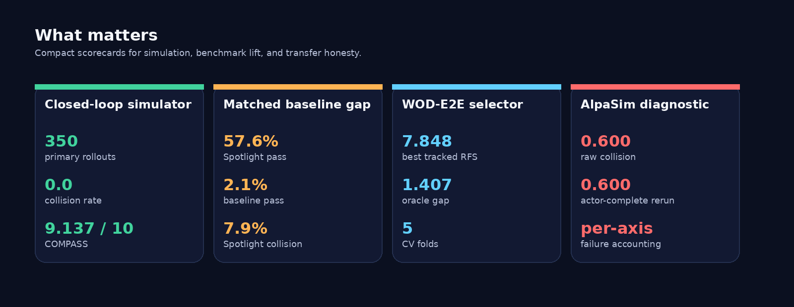

# Spotlight Reflex

> Minimal-shot autonomous driving with custom long-tail simulation, AlpaSim transfer diagnostics, and a grounded WOD-E2E selector stack.


## Why This Repo Pops

| Track | Claim | Signal |
|---|---|---|
| Closed-loop simulator | Geometry-first policy survives long-tail scenes | `350` rollouts, `0` collisions outside gauntlet |
| Gauntlet match-up | World-state reasoning beats the baseline hard | `57.6%` vs `2.1%` pass |
| WOD-E2E selector | Candidate grounding is real, measurable, improvable | `7.848` best tracked RFS |
| AlpaSim transfer | Failures are localized per axis instead of hidden in one scalar | collision / offroad / lane / progress split |

## The AV Paradigm

This README should sell one idea fast: this is a compact autonomy stack that does
not hide behind scale-only rhetoric.

- **Reason over geometry:** six world-state scalars and explicit maneuver choices.
- **Act in closed loop:** success and failure are shown as full rollouts, not static metrics.
- **Transfer honestly:** AlpaSim is used to expose what breaks under a sensor-realistic adapter.
- **Audit the boundary:** the paper line is not "everything works"; it is "we can localize what still fails."

That combination is what makes the project look like an autonomy paradigm rather than
just another benchmark table.

## Media Wall


## Watch This Order

If you only show four things, show them in this order:

1. **Spotlight Reflex beats the baseline on the same seed.**
   [`docs/videos/spotlight_vs_baseline.mp4`](docs/videos/spotlight_vs_baseline.mp4)
2. **Construction corridor.**
   [`docs/videos/construction_success.mp4`](docs/videos/construction_success.mp4)
3. **Intersection stress.**
   [`docs/videos/intersection_stress.mp4`](docs/videos/intersection_stress.mp4)
4. **AlpaSim transfer clip plus reasoning panel.**
   [`docs/videos/alpasim_transfer.mp4`](docs/videos/alpasim_transfer.mp4) and `docs/images/alpasim_reasoning_panel.png`

That sequence tells the right story:

- success in a rare hazard,
- breadth across scene types,
- pressure under multi-agent timing,
- and then honest external transfer diagnostics.

## Fast Facts

- **Spotlight Reflex:** six geometric world-state scalars, nine maneuver tokens, trust-region scoring, no object-identity dependence.
- **Custom simulator:** randomized WOD-style clusters, compositional OOD stress, matched baselines, full closed-loop measurement.
- **AlpaSim harness:** same token-policy API forced through a sensor-realistic adapter so transfer failures can be isolated.
- **WOD-E2E stack:** candidate generation plus a learned selector over preference-labeled Waymo validation frames.

## Scoreboard



| Result | Number |
|---|---:|
| Primary simulator runs | `350` |
| Primary simulator collision rate | `0.0` |
| COMPASS | `9.137 / 10` |
| Gauntlet pass, Spotlight Reflex | `57.6%` |
| Gauntlet pass, baseline | `2.1%` |
| Best tracked WOD-E2E selector | `7.848 RFS` |
| WOD oracle gap | `1.407 RFS` |
| Canonical AlpaSim raw collision | `0.600` |
| World-frame actor-complete rerun collision | `0.600` |

## Architecture


This repo is intentionally split into three visible surfaces:

1. `Simulation stack`:
   Spotlight Reflex, scenarios, simulator eval, and AlpaSim integration.
2. `WOD-E2E stack`:
   Waymo parsing, candidates, selector training, and submission writing.
3. `Reporting`:
   comparison and report-generation helpers.

## Find Things Fast

| If you need... | Go here |
|---|---|
| the main repo map | [`docs/repo_audit_map.md`](docs/repo_audit_map.md) |
| the source tree map | [`src/minimal_shot_av/README.md`](src/minimal_shot_av/README.md) |
| simulator / Spotlight Reflex | [`src/minimal_shot_av/simulator/README.md`](src/minimal_shot_av/simulator/README.md) |
| simulator write-up | [`docs/simulation.md`](docs/simulation.md) |
| AlpaSim integration / reproduction | [`docs/corl2027/AUDIT.md`](docs/corl2027/AUDIT.md) |
| AlpaSim override boundary | [`third_party/alpasim_overrides/README.md`](third_party/alpasim_overrides/README.md) |
| Waymo / WOD-E2E stack | [`src/minimal_shot_av/model/README.md`](src/minimal_shot_av/model/README.md) |
| WOD walkthrough | [`docs/wod-e2e-system-walkthrough.md`](docs/wod-e2e-system-walkthrough.md) |
| report / comparison helpers | [`src/minimal_shot_av/neutral/README.md`](src/minimal_shot_av/neutral/README.md) |
| current paper | [`docs/corl2027/paper.pdf`](docs/corl2027/paper.pdf) |

## Demo Artifacts

| Bundle | Path |
|---|---|
| Grand demo bundle | [`artifacts/sota_submission_bundles/grand_commission/README.md`](artifacts/sota_submission_bundles/grand_commission/README.md) |
| Minor demo bundle | [`artifacts/sota_submission_bundles/minor_commission/README.md`](artifacts/sota_submission_bundles/minor_commission/README.md) |
| Visual gallery | [`artifacts/sota_submission_bundles/minor_visual_gallery/index.html`](artifacts/sota_submission_bundles/minor_visual_gallery/index.html) |
| Grand spotlight rollout | [`artifacts/sota_submission_bundles/grand_spotlight_demo/latest_rollout.svg`](artifacts/sota_submission_bundles/grand_spotlight_demo/latest_rollout.svg) |
| Grand baseline rollout | [`artifacts/sota_submission_bundles/grand_baseline_spotlight_demo/latest_rollout.svg`](artifacts/sota_submission_bundles/grand_baseline_spotlight_demo/latest_rollout.svg) |
| Grand intersection rollout | [`artifacts/sota_submission_bundles/grand_intersection_stress_seed3/latest_rollout.svg`](artifacts/sota_submission_bundles/grand_intersection_stress_seed3/latest_rollout.svg) |
| Video clips | [`docs/videos/`](docs/videos/) |
| Video reel plan | [`docs/video_reel_plan.md`](docs/video_reel_plan.md) |

## The Compact Pitch

This is not a generic AV repo and not a single-metric benchmark dump. It is a tightly
auditable stack for showing:

- a geometry-grounded policy that works in custom long-tail closed-loop simulation,
- a benchmark selector that gets real lift on WOD-E2E candidate ranking,
- and an external AlpaSim diagnostic path that makes transfer failure visible instead of vague.

The strongest current paper line is the transfer result: collision can survive actor
completion and learned-selector removal, which means the remaining boundary is deeper
than a simple proxy-visibility or ranking story.

## Run Something

```bash
# Single Spotlight Reflex demo
uv run --no-sync python scripts/run_demo.py \
  --policy spotlight-reflex \
  --scenario-cluster spotlight \
  --seed 3 \
  --artifacts-dir artifacts/demo_spotlight

# Quick repo check
uv run --no-sync python scripts/run_tests.py --quick

# Current paper evidence audit
./scripts/run_corl2027_audit.sh
```
