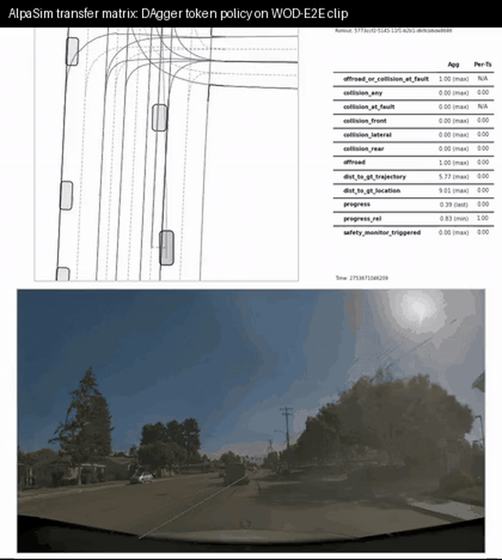

# Minimal-Shot Autonomous Driving

> CoRL 2027 repository for AlpaSim transfer diagnostics, WOD-E2E selector evidence, and the Spotlight Reflex code used to generate diagnostic candidates.

## CoRL Evidence Boundary

The 2D simulator in this repo is **not** a CoRL result surface. It is an internal
debugging harness for exercising candidate generation, rendering rollouts, and checking
failure modes before running external diagnostics.

CoRL-facing evidence is limited to:

| Evidence surface | Status |
|---|---|
| AlpaSim transfer diagnostics | External diagnostic evidence; collision/offroad/wrong-lane axes are reported directly. |
| WOD-E2E selector stack | Dataset-backed candidate-ranking evidence. |
| 2D simulator / COMPASS / GIF demos | Internal debug artifacts only; not benchmark evidence and not a simulator realism claim. |

The simulator GIFs below are visual debugging artifacts. They should not be cited as
evidence that the method works in realistic autonomous driving.

### Spotlight Reaches Goal


### Repo-Internal Reactive Baseline Stalls Near Goal


- The top demo GIFs use the strongest successful showcase preset for each scenario.
- `Baseline` here means this repo's own potential-field reactive planner, not an external method.
- The repo-internal reactive baseline looks smoother early, but it does not finish the rollout.
- The rollout SVGs below are the same current demo artifacts used to generate these GIFs.

| Construction corridor | Intersection stress |
|---|---|
|  |  |

| AlpaSim transfer | AlpaSim rollout |
|---|---|
|  |  |

### What the AlpaSim panel is showing


- left: the external AlpaSim rollout under the transferred policy
- right: the policy-side diagnostic view used to localize whether failure comes from
  collision pressure, offroad drift, lane violation, or progress loss
- point of the panel: the transfer result is not just a scalar collision number; it is
  an axis-by-axis failure breakdown

Taken together, the proof block above shows:

- internal visual debugging for candidate behavior
- external transfer evidence with failure localization, not just one scalar score

## CoRL-Facing Results

| Track | Claim | Signal |
|---|---|---|
| AlpaSim transfer | Failure survives actor completion and selector removal | collision / offroad / wrong-lane / progress split |
| WOD-E2E selector | Candidate grounding is measurable on dataset-backed ranking | `7.848` best tracked RFS |
| Internal simulator | Debug-only harness, not a paper result | visual rollouts and local regression checks only |

## Technical Scope

This repository centers a compact autonomy stack with explicit geometry and transfer
diagnostics.

- **Reason over geometry:** six world-state scalars and explicit maneuver choices.
- **Transfer honestly:** AlpaSim is used to expose what breaks under a sensor-realistic adapter.
- **Audit the boundary:** the paper line is not "the simulator works"; it is "we can localize what still fails externally."

## More Evidence

For CoRL, go straight to:

- transfer audit path:
  [`docs/corl2027/AUDIT.md`](docs/corl2027/AUDIT.md)
- AlpaSim result analyses:
  [`artifacts/corl2027/`](artifacts/corl2027/)
- WOD-E2E walkthrough:
  [`docs/wod-e2e-system-walkthrough.md`](docs/wod-e2e-system-walkthrough.md)
- internal debug simulator write-up:
  [`docs/simulation.md`](docs/simulation.md)

## Fast Facts

- **Spotlight Reflex:** six geometric world-state scalars, nine maneuver tokens, trust-region scoring, no object-identity dependence.
- **Internal debug simulator:** randomized WOD-style clusters and matched baselines for development only.
- **AlpaSim harness:** same token-policy API forced through a sensor-realistic adapter so transfer failures can be isolated.
- **WOD-E2E stack:** candidate generation plus a learned selector over preference-labeled Waymo validation frames.

## Scoreboard

| Result | Number |
|---|---:|
| Best tracked WOD-E2E selector | `7.848 RFS` |
| WOD oracle gap | `1.407 RFS` |
| Canonical AlpaSim raw collision | `0.600` |
| World-frame actor-complete rerun collision | `0.600` |
| Internal simulator / COMPASS | debug-only, not CoRL evidence |

## Architecture


This repo is intentionally split into three visible surfaces:

1. `Simulation stack`:
   Spotlight Reflex, internal debug scenarios, and AlpaSim integration.
2. `WOD-E2E stack`:
   Waymo parsing, candidates, selector training, and submission writing.
3. `Reporting`:
   comparison and report-generation helpers.

## Find Things Fast

| If you need... | Go here |
|---|---|
| Spotlight Reflex / internal debug simulator | [`src/minimal_shot_av/simulator/README.md`](src/minimal_shot_av/simulator/README.md) |
| internal simulator write-up | [`docs/simulation.md`](docs/simulation.md) |
| AlpaSim integration / reproduction | [`docs/corl2027/AUDIT.md`](docs/corl2027/AUDIT.md) |
| patched-upstream AlpaSim work | [`third_party/alpasim_overrides/README.md`](third_party/alpasim_overrides/README.md) |
| Waymo / WOD-E2E stack | [`src/minimal_shot_av/model/README.md`](src/minimal_shot_av/model/README.md) |
| nuPlan setup / public mini path | [`docs/notes/nuplan-setup.md`](docs/notes/nuplan-setup.md) |
| WOD walkthrough | [`docs/wod-e2e-system-walkthrough.md`](docs/wod-e2e-system-walkthrough.md) |
| report / comparison helpers | [`src/minimal_shot_av/neutral/README.md`](src/minimal_shot_av/neutral/README.md) |
| command entrypoints | [`src/minimal_shot_av/cli/README.md`](src/minimal_shot_av/cli/README.md) |
| local upstream checkouts / datasets | [`workspace/README.md`](workspace/README.md) |
| current paper | [`docs/corl2027/paper.pdf`](docs/corl2027/paper.pdf) |
| audit presentation PDF | [`docs/presentation.pdf`](docs/presentation.pdf) |

## Demo Artifacts

These are internal visual/debug artifacts, not CoRL benchmark evidence.

| Bundle | Path |
|---|---|
| Grand demo bundle | [`artifacts/sota_submission_bundles/grand_commission/README.md`](artifacts/sota_submission_bundles/grand_commission/README.md) |
| Minor demo bundle | [`artifacts/sota_submission_bundles/minor_commission/README.md`](artifacts/sota_submission_bundles/minor_commission/README.md) |
| Visual gallery | [`artifacts/sota_submission_bundles/minor_visual_gallery/index.html`](artifacts/sota_submission_bundles/minor_visual_gallery/index.html) |
| Grand spotlight rollout | [`artifacts/sota_submission_bundles/grand_spotlight_demo/latest_rollout.svg`](artifacts/sota_submission_bundles/grand_spotlight_demo/latest_rollout.svg) |
| Grand baseline rollout | [`artifacts/sota_submission_bundles/grand_baseline_spotlight_demo/latest_rollout.svg`](artifacts/sota_submission_bundles/grand_baseline_spotlight_demo/latest_rollout.svg) |
| Grand intersection rollout | [`artifacts/sota_submission_bundles/grand_intersection_stress_seed3/latest_rollout.svg`](artifacts/sota_submission_bundles/grand_intersection_stress_seed3/latest_rollout.svg) |
| Embeddable GIFs | [`docs/images/`](docs/images/) |
| Video reel plan | [`docs/video_reel_plan.md`](docs/video_reel_plan.md) |

## The Compact Pitch

This is not a simulator-realism paper. It is a diagnostic repo for showing:

- a benchmark selector that gets real lift on WOD-E2E candidate ranking,
- and an external AlpaSim diagnostic path that makes transfer failure visible instead of vague.

The strongest current paper line is the transfer result: collision can survive actor
completion and learned-selector removal, which means the remaining boundary is deeper
than a simple proxy-visibility or ranking story.

## Run Something

```bash
# Direct nuPlan setup on a fresh machine
./scripts/bootstrap_nuplan_env.sh
./.venv/bin/python scripts/fetch_nuplan_public_mini.py --db-count 5
PYTHONPATH=src ./.venv/bin/python scripts/run_nuplan_maneuvertoken_rollout.py \
  --nuplan-db-file workspace/nuplan/public_mini \
  --limit 50 \
  --output-json artifacts/corl2027/nuplan_mini_rollout50.json \
  --output-markdown artifacts/corl2027/nuplan_mini_rollout50.md
PYTHONPATH=src ./.venv/bin/python scripts/train_nuplan_maneuvertoken_selector.py \
  --nuplan-db-file workspace/nuplan/public_mini \
  --limit 200 \
  --epochs 50 \
  --hidden-dim 16 \
  --output artifacts/corl2027/nuplan_mini_selector200.json

# Single Spotlight Reflex demo
uv run --no-sync python scripts/run_demo.py \
  --policy spotlight-reflex \
  --scenario-cluster spotlight \
  --seed 3 \
  --artifacts-dir artifacts/demo_spotlight

# Quick repo check
uv run --no-sync python scripts/run_tests.py --quick

# Current paper evidence audit
./scripts/run_corl2027_audit.sh
```
