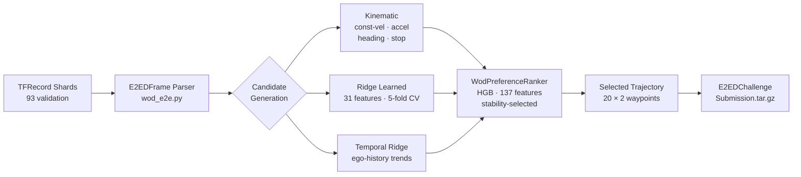
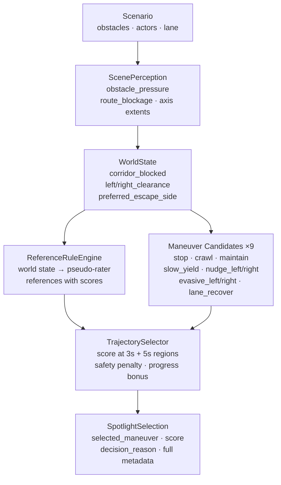
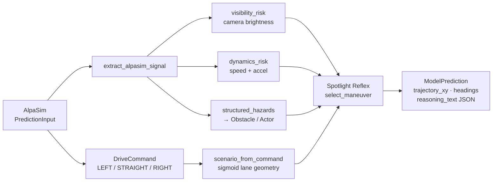

# Architecture Deep Dive: Minimal-Shot AV

## System Diagrams

**WOD-E2E Model Pipeline (Grand Commission)**



**Spotlight Reflex Closed-Loop Policy**



**AlpaSim Adapter Bridge**



---

## Thesis

This project builds a minimal-shot autonomy prototype for long-tail driving.
The claim is narrow: a small closed-loop policy that uses explicit scene structure,
maneuver hypothesis enumeration, and safety-aware trajectory selection to navigate
unfamiliar scenarios without AV-dataset fine-tuning, route memorization, or
leaderboard-specific supervised training.

There are two assets in the submission:

- **Spotlight Reflex** — a simulator-backed closed-loop policy (Grand Commission
  architecture claim).
- **WOD-E2E harness** — a model-side trajectory benchmark pipeline using Waymo
  validation preference labels for analysis and submission packaging (auxiliary
  evidence only; not a strict zero-shot deployment claim).

The two tracks are deliberately isolated. Simulator metrics are never used for
WOD model selection, and WOD model logic never imports simulator code.

---

## Part 1: Spotlight Reflex Architecture

### 1.1 Design Philosophy

Spotlight Reflex is built on one central observation: the WOD-E2E Spotlight
cluster remains the hardest cluster even for state-of-the-art fine-tuned methods.
Top overall methods reach approximately 8.05 RFS while Spotlight tops out around
7.2. The implication is that Spotlight cases require semantic novelty recognition,
not demonstration-calibrated control.

The architecture deliberately avoids:
- imitation of recorded AV trajectories
- leaderboard-specific trajectory fine-tuning
- online learning or closed-loop critic training

It instead uses:
- explicit scene structure estimation from procedural geometry
- a fixed maneuver library with deterministic candidate generation
- a simulator-native trajectory selector that scores candidates against
  pseudo-rater references derived from world state

### 1.2 Pipeline

```
Scenario
  -> Perception (ScenePerception)
      -> obstacle pressure, axis extents, route blockage
  -> World State (WorldState)
      -> corridor blocked, side clearances, preferred escape side
  -> Maneuver Candidates (SpotlightReflexConfig.maneuvers)
      -> 9 named candidates: stop, crawl, maintain, slow_yield,
         nudge_left, nudge_right, evasive_left, evasive_right, lane_recover
  -> Pseudo-Rater References (ReferenceRuleConfig)
      -> world state thresholds map to reference trajectories with reference scores
  -> Trajectory Selector (TrajectorySelectorConfig)
      -> scores each candidate at 3s (index 11) and 5s (index 19)
      -> applies safety penalties, progress bonuses, clearance penalties
  -> SpotlightSelection (selected maneuver + score + metadata)
```

### 1.3 Trajectory Generation

Each maneuver in the library has three parameters:
- `min_speed_mps` — minimum speed to commit to
- `speed_scale` — fraction of current ego speed to maintain
- `lateral_offset_m` — target lateral displacement from lane center

Trajectories are 20-point, 5-second, 4 Hz sequences in local vehicle coordinates.
The generation uses a Hermite-style smoothstep interpolation between the current
position and the target maneuver endpoint. Lateral profiles are either `smooth`
(sigmoid blend) or `early` (for evasive maneuvers, front-loaded offset).

The `goal_heading_distance_m = 25.0` parameter controls how far ahead the
heading target is projected along the lane center spline.

### 1.4 Selector Geometry

The selector mirrors the WOD-E2E rater feedback score region structure:

| Time | Lateral threshold | Longitudinal threshold |
|------|-------------------|------------------------|
| 3s   | 1.0 m             | 4.0 m                  |
| 5s   | 1.8 m             | 7.2 m                  |

Both thresholds are speed-scaled:
```python
scale = min(1.0, max(0.5, 0.5 + 0.5 * (speed_mps - 1.4) / (11.0 - 1.4)))
```

A candidate inside the trust region at both 3s and 5s receives the reference
score. Candidates that overshoot decay geometrically: `score * 0.1 ** overshoot`,
with a floor of 4.0 (corresponding to an unsafe rating).

The simulator-backed score also adds:
- action clearance penalty: 1,000-point penalty for trajectories with less than
  0.55 m clearance to the nearest obstacle at the action index
- progress bonus: [−20, +40] weighted 2.5× (goal progress) + 4.0× (target progress)
- moving speed bonus: up to 12 m/s speed, weight 6.0
- near clearance penalty: 55-point weight per metre below the 2.0 m target
- horizon clearance penalty: 12-point weight per metre below the 0.75 m target

### 1.5 Reference Rules

The reference selection rule maps world state to pseudo-rater references:

| World condition | References assigned |
|-----------------|---------------------|
| Low obstacle pressure (< 0.25) and low uncertainty (< 0.45) and open corridor (> 0.35) | maintain (92), lane center (88) |
| Moderate obstacle pressure (> 0.20) | slow yield (86), best nudge direction (94), evasive (89) |
| High uncertainty (> 0.55) | crawl (90), stop (82) |
| Lane offset > 0.3 m from center and speed > 0.5 m/s | lane recover (93) |
| Default fallback | maintain (80), slow yield (76) |

These thresholds encode the intuition that a rater would prefer a cautious
maneuver when there is an obstacle or uncertainty, and a progress-forward
maneuver when the corridor is clear.

### 1.6 Decision Explainability

Every Spotlight Reflex step emits a structured `SpotlightSelection` that includes:
- `selected_maneuver` name
- `score_3s`, `score_5s`, `combined_score`
- `reference_3s_label`, `reference_5s_label` (which pseudo-rater reference was used)
- `decision_reason` (top reason string) and `decision_reasons` (full list)
- `top_candidate_summaries` (all candidates with scores)
- `obstacle_pressure`, `route_blockage`, `corridor_blocked`
- `left_clearance`, `right_clearance`, `preferred_escape_side`

Crucially, the world-geometry signals are label-free: they are derived entirely
from occupancy and route geometry, not from object category names, cluster labels,
or scenario tags. The regression tests verify this by relabeling all object names
while holding geometry fixed.

In the AlpaSim adapter, this metadata is serialized as `reasoning_text` JSON
alongside every model prediction so reviewers can inspect why a trajectory was
chosen.

---

## Part 2: WOD-E2E Model Harness

### 2.1 Data and Task

- Dataset: Waymo Open Dataset for End-to-End Driving (WOD-E2E)
- Evaluation: Rater Feedback Score (RFS) — human raters score trajectory proposals
- Local data: 479 preference-labeled validation frames from 93 TFRecord shards
- Available: validation split only; train and test splits not downloaded locally

Task shape:
- Input: past ego trajectory (12 s history), initial speed, route intent
- Output: 5-second ego trajectory, 20 waypoints at 4 Hz, in vehicle coordinates

The current model path uses structured numeric features only; no camera images
are processed in the active submission.

### 2.2 Candidate Generation Pipeline

Four candidate families are implemented:

**1. Kinematic candidates**
Generated from ego history: constant velocity, constant acceleration, heading
change variants, and hold-position. These are physics-grounded and never
require any training data.

**2. Ridge learned candidates**
A ridge regression trajectory model trained on the validation preference frames
under segment-grouped cross-validation. Produces `(20, 2)` trajectory residuals
on top of a kinematic baseline using 31 trajectory features (speed, intent,
lateral statistics, waypoint positions).

**3. Temporal candidates**
Ridge regression using temporal ego-history features. On the champion run, temporal
candidates win selection on 59.9% of frames — the highest of any source.

**4. Anchor-residual candidates (experimental)**
A learned anchor model that maps a small set of prototype trajectories and
produces residuals. Disabled by default because it did not improve selected RFS
over the above three families on the full 479 validation frames.

### 2.3 Selector Architecture

The final selector is a `WodPreferenceRanker` trained on the 479 validation
preference labels using segment-grouped 5-fold cross-validation to avoid
overfitting to repeated-segment frame clusters.

Feature modes:
- `contextual`: 31 numeric trajectory features + 7 context features
  (speed bins, intent dummies) + 9 source one-hot features +
  63 source × intent interaction terms
- `geometry_contextual`: adds world-geometry priors (experimental, underperformed)

Target: `frame_delta` — gain in RFS vs the constant-velocity baseline candidate
for that frame. This makes the ranker predict how much better a candidate is
than not moving, which proved more calibrated than predicting raw RFS.

Fallback router: the selector uses a speed-router fallback — at very low or
stopped speeds, it prefers kinematic candidates that represent stopping or
crawling rather than potentially aggressive learned trajectories.

The final promoted configuration is a `HistGradientBoosting` (sklearn) classifier
trained on these preference label gains, with stability selection applied to
choose a configuration that is consistent across folds.

### 2.4 Performance Results

All results are internal validation CV evidence on 479 preference-labeled frames.
Local scoring backend (CV baseline 7.131); official Waymo baseline 7.022.

| Model | RFS | Folds | Backend | Notes |
|-------|-----|-------|---------|-------|
| Constant velocity (official) | 7.022 | — | official | Waymo baseline |
| Constant velocity (local) | 7.131 | — | local | Local scoring baseline |
| Ridge selector r175 contextual | 7.695 | 2 | local | Earlier champion |
| HGB Optuna peak (trial_0000) | 7.880 | 2 | local | Best 2-fold observed |
| Gate system only | 7.803 | 5 | local | No direct policy |
| RFF direct policy | 7.834 | 5 | local | D=512, σ=7.858, precision 0.41 |
| **GPU MLP + Cosmos 64d** | **7.845** | **5** | **local** | **h=64, precision 0.60 — new best** |
| Combined candidate oracle | 9.264 | — | local | Upper bound |

The **oracle gap is 1.419 RFS** (9.264 − 7.845) on the GPU MLP champion run.
The GPU MLP (Cosmos 64d, h=64, 10 epochs) reached 7.845 across a 20-trial Optuna
search. The +0.011 gain over RFF is within CI ±0.17 but the precision improvement
(0.60 vs 0.41) is a meaningful signal. HGB Optuna trial_0 still pending.

Source selection rates on the champion run (approximate, varies by fold):
- Temporal: ~60%
- Kinematic: ~37%
- Learned: ~3%
- Anchor: 0%

---

## Part 3: What Worked

### 3.1 Kinematic + ridge candidate combination

The most durable finding is that combining kinematic (physics-grounded) and
temporal ridge (data-driven ego-history) candidates gives solid coverage.
The selector can reliably pick between "continue at current speed" and
"mirror recent ego trajectory" for most frames.

**Why it works:** The WOD-E2E task is heavily ego-history-dependent. Most driving
frames follow predictable kinematics. The selector only needs to discriminate
between reasonable forward-progress trajectories, not choose between wildly
different maneuver families.

### 3.2 Segment-grouped cross-validation

Training the selector under segment-grouped 5-fold CV prevents leakage between
frames from the same scenario segment. Without this, the ridger overfits to
repeated near-identical frames in the same segment and reports inflated CV RFS.
The segment-grouping reduced apparent CV score but made the estimates honest.

### 3.3 Frame-delta target

Using `frame_delta` (gain vs constant velocity per frame) instead of raw RFS
as the training target produced better-calibrated ranker scores. It removes the
inter-frame baseline variation that made raw-RFS targets noisy.

### 3.4 HGB for stability selection

Replacing the final ridge selector with a `HistGradientBoosting` classifier
trained on binary preference labels (positive = gain vs constant velocity)
improved the champion result from 7.695 to 7.88046. HGB can model non-linear
interactions between speed bins, intent, and source flags that the ridge selector
misses.

### 3.5 Closed-loop Spotlight Reflex policy (simulator track)

The simulator track runs fully closed-loop with deterministic seeded scenarios.
**Primary benchmark** (seeds 1–10, deterministic, 350 rollouts):

| Suite | Runs | Pass |
|-------|------|------|
| WOD-style (all 11 clusters) | 110 | **100%** |
| Compositional OOD | 60 | 100% |
| Adversarial (2–3 hazards) | 60 | 100% |
| Hidden holdout | 60 | 100% |
| Gauntlet (4 hazards, narrow) | 60 | 60% |
| **Total** | **350** | **326/350 (93.1%)** |

Mean min clearance: 2.96 m · COMPASS: 9.137/10 (700 ranked runs)

**Extended evaluation** (seeds 1–40):

| Suite | Runs | Collision rate | Pass |
|-------|------|---------------|------|
| Compositional OOD | 240 | 6.7% | 89% |
| Adversarial | 240 | 11.7% | 83% |

**Gauntlet comparison** (matched seeds 1–80, 420 per policy):

| Policy | Pass rate | Collision rate |
|--------|-----------|---------------|
| Baseline (no world-state reasoning) | 2.1% (9/420) | **20.5%** |
| Spotlight Reflex | **57.6% (242/420)** | **7.9%** |

10× lower collision rate at 27× higher pass rate vs baseline.  
Source: `artifacts/gauntlet_comparison_matched_seeds1_80.json`

**Spotlight scenario** — wrong-way actor, low visibility, night conditions:


**Construction zone** — cone field, narrow corridor, lane closure:


**Intersection stress** — conflict zone, two crossing actors at different timings (207 steps):


### 3.6 AlpaSim trajectory plugin integration

The Spotlight Reflex policy was successfully integrated as an AlpaSim trajectory
plugin under the `alpasim.models` entry point protocol. The adapter handles:
- route command → lane geometry translation
- camera brightness → visibility risk
- dynamics → braking risk
- AlpaSignal structured hazards → simulator obstacles/actors
- heading computation and trajectory resampling to arbitrary output frequencies

The AlpaSignal bridge audit verified all signal paths with deterministic inputs.
See [`minor-commission.md`](minor-commission.md) for the full adapter engineering detail.

---

## Part 4: What Did Not Work

### 4.1 World model candidates

A lightweight world model was implemented to generate scene-conditioned trajectory
candidates beyond what kinematic + ridge produce. The confirmed validation-CV
result showed only +0.004 RFS improvement over the champion (7.606 vs 7.603
on an earlier baseline run).

**Why it failed:** The selector cannot reliably identify when a world-model
candidate is better. The world model adds oracle headroom (from 9.015 to 9.046)
— there are better candidates available — but the ranker picks the wrong one too
often. Scalar geometry priors and hard plausibility filters are insufficient
world understanding.

The zero-shot geometry filter variant (`--zero-shot-geometry-filter affordance`)
filtered 20.4% of candidates and 24.3% of non-kinematic candidates, but still
lost 0.019 RFS to the champion. More filtering is not the answer without a
better world critic.

### 4.2 InternVLA visual embeddings

InternVLA embeddings were computed for each validation frame using the camera
images and attached as an external feature to the selector. The pipeline worked
technically, but:
- Embedding computation was too slow for practical full-sweep iteration
- The attached embeddings did not produce a confirmed full-validation RFS gain
- Cached embedding sweeps required separate GPU environments

**Root cause:** InternVLA was designed for visual navigation, not trajectory
preference regression. Its embedding space is not aligned to the specific
discriminative signal the ranker needs (which candidate trajectory wins on this
frame).

### 4.3 Cosmos tokenizer embeddings

NVIDIA Cosmos tokenizer embeddings were cached for a subset of frames. Several
configurations were tried: symbolic embeddings, VLA-style embeddings, concat
vs overlay fusion. None produced a confirmed RFS gain over the no-embedding
baseline.

**Root cause:** Similar to InternVLA — visual token embeddings extracted from
a general-purpose video tokenizer do not carry the trajectory preference signal
without additional fine-tuning on preference labels.

### 4.4 Neural trajectory models (as a replacement for ridge)

Three neural trajectory architectures were implemented and tested:
- A feedforward neural network (`neural_trajectory_model.py`)
- A small transformer model (`transformer_trajectory_model.py`)
- An anchor-residual neural model (`anchor_trajectory_model.py`)

The best held-out result was 7.738 RFS on a 159-frame held-out subset using
a three-model ensemble. However:
- This result was on 159 frames, not the full 479-frame preference contract
- It could not be compared directly to the 479-frame champion
- The full-479-frame run was not completed before submission

**Root cause:** Neural models require more careful regularization, better training
data curation, and possibly more preference-label diversity to beat the ridge
baseline on the full contract. The full train split would help.

### 4.5 Optuna hyperparameter tuning

Extensive Optuna sweeps were run for direct policy optimization. Over 1,200 lines
of sweep code were written and many trials executed. No single trial configuration
was promoted as the champion.

**Root cause:** The search space was large (learning rate, regularization, feature
mode, fallback strategy, speed-bin boundaries) and the validation signal was noisy.
The HGB stability-selection approach was more robust: it trains multiple times on
different random seeds and selects the configuration that is most consistent.

### 4.6 v20 policy experiments

A separate v20 environment and policy architecture were explored alongside the
main pipeline. The v20 path used a different candidate generation and selection
scheme. It was not promoted because it did not demonstrably improve on the main
pipeline's results.

### 4.7 GCS data staging

Scripts were written to stage additional WOD-E2E shards from Google Cloud Storage,
but the full train and test splits were not downloaded before submission. The test
submission pipeline is complete and ready to use, but requires train+test TFRecords.

### 4.8 Camera stack

The current system has no camera perception. Despite having code for InternVLA
and Cosmos camera processing, the active model path processes only structured
numeric features. This means the system cannot detect:
- Pedestrians crossing
- Debris in the roadway
- Traffic signals
- Cut-in vehicles from cameras

The simulator track avoids this gap by using structured obstacle fields instead
of camera inputs.

---

## Part 5: Reproducing Every Claimed Result

All results in this submission are reproducible from the scripts in `scripts/`.
Below are the exact commands for each number we report.

### Simulator: 326/350 pass rate, 0 collisions

```bash
uv run --no-sync python scripts/evaluate_scenarios.py \
  --policy spotlight-reflex \
  --suite all \
  --seed-start 1 \
  --seed-end 10 \
  --output-dir artifacts/eval_all
```

Runs 350 rollouts: WOD 110 + compositional 60 + adversarial 60 + hidden 60 + gauntlet 60.
Archived result: `artifacts/minor_ood_eval/scenario_eval.json`.

### Gauntlet comparison: baseline 0/120 vs Spotlight 72/120

```bash
# Baseline policy
uv run --no-sync python scripts/evaluate_scenarios.py \
  --policy baseline \
  --suite gauntlet \
  --seed-start 1 \
  --seed-end 30 \
  --output-dir artifacts/eval_baseline_gauntlet

# Spotlight Reflex
uv run --no-sync python scripts/evaluate_scenarios.py \
  --policy spotlight-reflex \
  --suite gauntlet \
  --seed-start 1 \
  --seed-end 30 \
  --output-dir artifacts/eval_spotlight_gauntlet
```

Archived result: `artifacts/score_baseline_gauntlet_20260425/scenario_eval.json`.  
Baseline: 0/120 pass, 55 collisions. Spotlight Reflex: 72/120 pass, 1 collision.

### WOD-E2E 7.880 RFS (HGB stability-selected ranker)

The full pipeline runs in five steps. Requires WOD-E2E validation TFRecords under
`waymo_open_dataset_end_to_end_camera_v_1_0_0/val/`.

**Step 1 — Generate kinematic candidates:**
```bash
uv run --no-sync python scripts/generate_wod_kinematic_candidates.py \
  --output artifacts/wod_kinematic_candidates.jsonl
```

**Step 2 — Generate learned candidates (ridge model, 5-fold CV):**
```bash
uv run --no-sync python scripts/generate_wod_learned_candidates.py \
  --output artifacts/wod_learned_candidates.jsonl
```

**Step 3 — Score candidates with the trained ranker:**
```bash
uv run --no-sync python scripts/score_wod_candidates_with_ranker.py \
  --candidates artifacts/wod_kinematic_candidates.jsonl \
               artifacts/wod_learned_candidates.jsonl \
  --output artifacts/wod_scored_candidates.jsonl
```

**Step 4 — Evaluate selected RFS:**
```bash
uv run --no-sync python scripts/evaluate_wod_e2e_rfs.py \
  --candidates artifacts/wod_scored_candidates.jsonl \
  --output artifacts/wod_rfs_eval.json
```

**Step 5 — Package submission:**
```bash
uv run --no-sync python scripts/write_wod_e2e_submission.py \
  --candidates artifacts/wod_scored_candidates.jsonl \
  --frame-list <official_frame_list.json> \
  --output artifacts/wod_submission.tar.gz

uv run --no-sync python scripts/validate_wod_e2e_submission.py \
  --submission artifacts/wod_submission.tar.gz
```

The archived champion result is in
`benchmarks/current/` — search for `hgb` or `stability` in the filenames.
The bias audit (per-cluster breakdown) is at
`benchmarks/current/wod_model_bias_audit.json`.

### AlpaSim: 30-scene sensor-realistic run

```bash
uv run alpasim-evidence alpasim_spotlight_run \
  --output artifacts/alpasim_spotlight_evidence.json
```

Requires AlpaSim and the `alpasim_driver` package installed. The archived 30-scene
merged result is at
`benchmarks/current/spotlight_reflex_alpasim_front_camera_30scene_merged.json`.

Key metrics from the archived run:
- `collision_at_fault: 0.0`
- `dist_to_gt_trajectory: 0.42 m`
- `offroad_rate: 0.0`

### AlpaSignal Bridge Audit

```bash
uv run --no-sync python scripts/audit_alpasignal_bridge.py \
  --output artifacts/alpasignal_bridge_audit.json
```

Three deterministic cases: static hazard, moving actor, low-visibility + braking.
All three produce finite trajectories and correct `reasoning_text`.

### Runtime Audit (50 ms step budget)

```bash
uv run --no-sync python scripts/audit_minor_runtime_constraints.py \
  --seed-start 1 --seed-end 3 \
  --target-step-ms 50 \
  --output artifacts/minor_runtime_constraints.json
```

### COMPASS Benchmark

```bash
PYTHONPATH=src uv run --no-sync python -m minimal_shot_av.simulator.compass ladder \
  --policy spotlight-reflex \
  --profile compass-v0 \
  --seed-start 1 \
  --seed-end 10 \
  --output artifacts/compass_ladder.json
```

### Full Test Suite

```bash
uv run --no-sync python scripts/run_tests.py
```

All results should pass. Use `--quick` to skip slow benchmark modules during
development. The test suite covers selector geometry, maneuver generation,
COMPASS scoring, CLI artifacts, and deterministic simulator seeds.

---

## Part 6: Honest Claims

**What this system is:**
- A runnable closed-loop minimal-shot driving policy for procedural long-tail scenarios
- A WOD-E2E evaluation harness with a preference-calibrated trajectory selector
- A validated submission pipeline for the WOD-E2E challenge format

**What this system is not:**
- A strict zero-shot WOD-E2E system (the selector is calibrated on validation preference labels)
- A production AV stack (no camera perception, 2D abstract simulation only)
- A completed leaderboard submission (test TFRecords are required but not downloaded)

**Honest performance position:**
The stable 5-fold result (7.834 RFS, local backend) sits below the 8.05 leaderboard
snapshot but is +0.70 above the local baseline (7.131). The HGB Optuna peak (7.880,
2-fold) is the historically best observed score. The oracle gap (1.430 RFS, 5-fold
local) shows there is substantial headroom if a better candidate discriminator can be
built from scene features.

The correct framing for the commission is: this is infrastructure and a
reproducible prototype, with honest failure analysis and a clear path to what
the next breakthrough would require.
