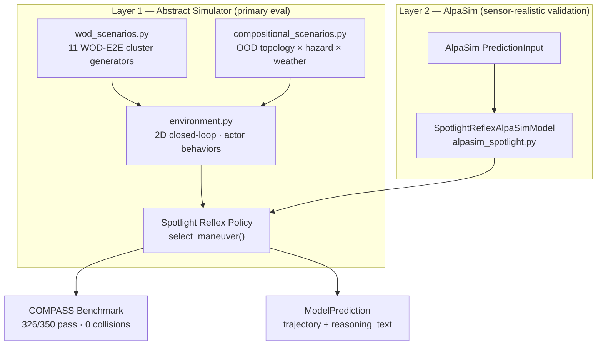
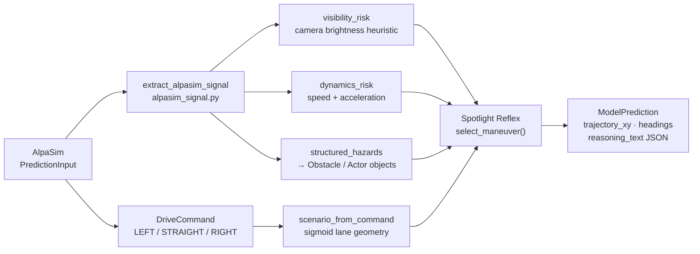
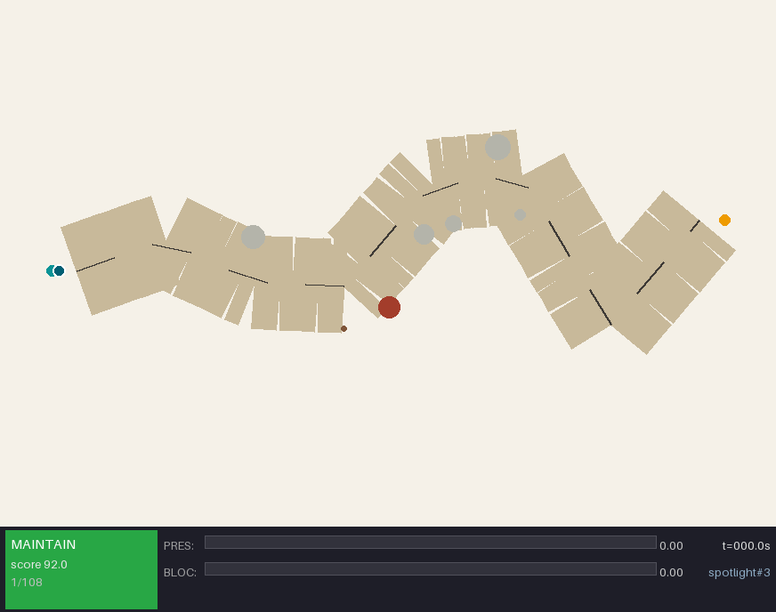
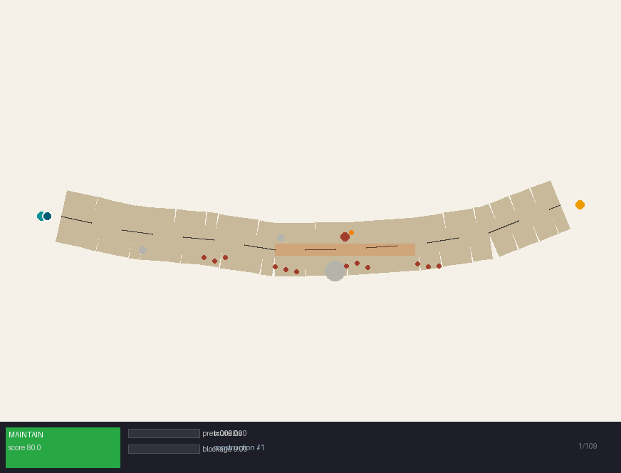
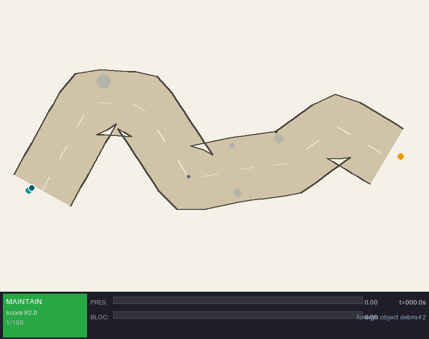
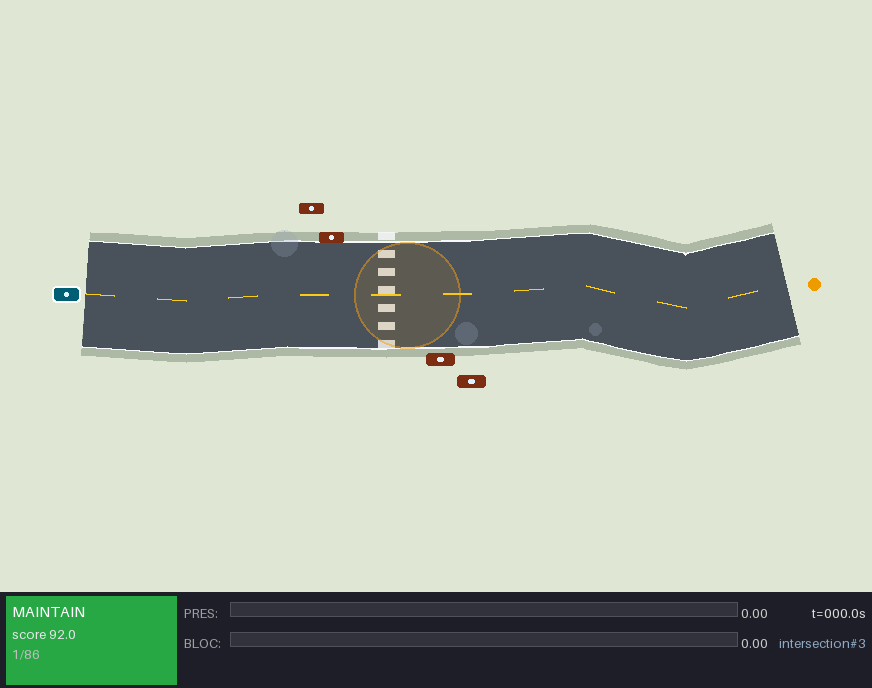

# Minor Commission Submission: Simulation Environment

## Claim

This submission contributes a complete simulation environment for minimal-shot
long-tail autonomy evaluation. It has two connected layers that share one policy:

1. **Abstract closed-loop simulator** — built entirely from scratch. Handles
   scenario generation, closed-loop policy execution, and reproducible evidence
   collection at high speed. This is where Spotlight Reflex was designed,
   validated, and benchmarked.

2. **AlpaSim trajectory plugin** — the same Spotlight Reflex policy running inside
   Waymo's sensor-realistic simulator via a custom adapter. Demonstrates that the
   policy generalises beyond the abstract environment.

Both layers run the same `select_maneuver` logic. The abstract simulator gives
speed, reproducibility, and full scenario control. AlpaSim gives sensor-realistic
closed-loop validation. They are not competing approaches — they are the same
policy at two levels of fidelity.

---

## Architecture Diagrams

**Full simulation pipeline — two fidelity levels, one policy**



**AlpaSim adapter signal paths**



---

## Layer 1: Abstract Simulator (Built From Scratch)

Every file in `src/minimal_shot_av/simulator/` is original code. Nothing is
adapted from AlpaSim, Waymo, or any other simulator.

### Environment (`environment.py`)

2D top-down coordinate system. Core types:

| Type | Fields |
|------|--------|
| `Scenario` | width, height, lane_center spline, lane_half_width, obstacles, actors, start, goal, seed, cluster, tags, map_features, environment |
| `Obstacle` | x, y, radius, kind, label, length, heading |
| `Actor` | actor_id, kind, x, y, width, length, heading, speed, vx, vy, behavior, role, active_from, active_until |

Actor behavior models (all custom):

| Behavior | Description |
|----------|-------------|
| `linear` | Constant velocity |
| `cut_in` | Merges laterally toward ego lane |
| `swerve` | Oscillates laterally |
| `darting` | Erratic animal-like direction changes |
| `erratic_pedestrian` | Random direction changes with hesitation |
| `sudden_brake` | Decelerates sharply (≤ −3 m/s²) |
| `hesitating` | Slow forward motion with random pauses |
| `wrong_way` | Approaches head-on |

### Spotlight Reflex Policy (`spotlight_reflex.py`)

The core closed-loop policy. At each tick:

1. **Perception** (`perceive_scene`) — obstacle field, actor set, visibility fraction
2. **World state** (`update_world_state`) — six scalar fields:
   - `obstacle_pressure` [0,1] — weighted sum of nearby obstacle influence
   - `route_blockage` [0,1] — fraction of route corridor blocked ahead
   - `corridor_blocked` bool — hard blockage within stopping distance
   - `left_clearance` m — lateral space to the left
   - `right_clearance` m — lateral space to the right
   - `preferred_escape_side` — which side has more clearance
3. **Candidate generation** — 9 maneuver candidates as 20-point 5-second trajectories:
   `stop · crawl · maintain · slow_yield · nudge_left · nudge_right · evasive_left · evasive_right · lane_recover`
4. **Reference rule engine** — maps world state to pseudo-rater references with target scores:
   - Clear corridor: `maintain` (92) or `lane_center` (88)
   - Obstacle present: `slow_yield` (86), `nudge` (94), or `evasive` (89)
   - High uncertainty: `crawl` (90) or `stop` (82)
5. **Trajectory selector** — scores each candidate against references at 3 s and 5 s:
   - 3 s thresholds: 1.0 m lateral, 4.0 m longitudinal (speed-scaled)
   - 5 s thresholds: 1.8 m lateral, 7.2 m longitudinal (speed-scaled)
   - Penalises collision risk, unnecessary stops, and route violations
   - Adds progress and speed bonuses

Every rollout step records the full decision trace in JSON: selected maneuver,
reference labels, scores at 3 s and 5 s, whether each region was satisfied,
world state fields, and top candidate summaries.

**Spotlight scenario** — wrong-way actor, low visibility (0.69), night conditions.
HUD shows maneuver name, obstacle pressure, and route blockage at each step.



### WOD-E2E Scenario Generator (`wod_scenarios.py`)

Procedural generator for all 11 WOD-E2E named clusters, driven by a seeded
`random.Random`. Each cluster specialises:

| Cluster | Lane width | Key hazard | Actor types |
|---------|-----------|------------|-------------|
| construction | 5.2–6.8 m | cone field + lane closure | worker |
| intersection | 7–9.5 m | conflict zone | crossing vehicle |
| pedestrian | 7–9.5 m | crosswalk hazard | pedestrian |
| cyclist | 7–9.5 m | cyclists ahead | cyclist group |
| multi-lane maneuver | 9–11.5 m | merge zone | merging vehicle |
| single-lane maneuver | 5.2–6.8 m | narrow corridor | none |
| cut-in | 9–11.5 m | lateral threat | cut-in vehicle |
| foreign object debris | 7–9.5 m | debris obstacle | none |
| special vehicle | 7–9.5 m | oversized vehicle | special_vehicle |
| spotlight | 7–9.5 m | semantic ambiguity | wrong-way / animal |
| others | 7–9.5 m | composite | mixed |

**Corridor clearance contract:** `_repair_static_corridor` removes background
obstacles that accidentally block the primary route. This separates ambient
scene texture (visual richness) from deliberate hard decision points (the
cluster-specific hazard). The generator cannot be fooled into producing
trivially unsolvable scenes by background clutter.

Each scenario JSON includes: `cluster`, `seed`, `tags`, `environment`
(weather, visibility, time of day, road friction, latency budget), typed actors
with `role` and `behavior`, map features (crosswalks, lane closures, merge zones,
conflict zones), and the obstacle field.

**Construction zone** — cone field, narrow corridor (5.2 m half-width), lane closure.
Policy selects `nudge_right`, maintains progress through the gap.



### Compositional OOD Generator (`compositional_scenarios.py`)

A second generator that samples axes independently:

| Axis | Options |
|------|---------|
| **Topology** | straight, gentle curve, sharp curve, S-curve, T-intersection, Y-junction, roundabout, narrowing |
| **Hazard module** | construction cones, parked vehicle, crossing pedestrian, debris, cyclist group, and others |
| **Novel objects** | road sweeper, livestock, large rock, fallen tree, overturned vehicle, shopping trolley |
| **Weather** | rain, fog, snow, night, glare, wet road, ice |
| **Visibility** | 0.4–1.0 (sampled per scenario) |
| **Latency budget** | 15–80 ms (sampled per scenario) |

Because topology and hazard are sampled independently, memorising cluster labels
gives no advantage. A construction hazard can appear in a roundabout or on an
S-curve; a pedestrian can appear at a Y-junction in fog. This directly tests
generalisation rather than cluster recall.

### OOD Evaluation Suites

| Suite | Focus |
|-------|-------|
| `wod` | Named WOD-style clusters (11 types) |
| `compositional` | Independently sampled axes |
| `adversarial` | Multiple hazards composed on the same route |
| `gauntlet` | Narrow, low-visibility, synchronised hazards; stricter pass gates |
| `hidden` | Holdout seed offsets for frozen-policy evaluation |

### COMPASS Benchmark (`compass.py`)

Profile-driven composite benchmark. Four scored components:
- **Oracle score** — can any candidate trajectory reach the goal?
- **Reasoning score** — does the selected maneuver match the scenario structure?
- **Recovery score** — does the policy recover from near-miss situations?
- **Generalisation gap** — performance on adversarial vs easy scenarios

All weights, thresholds, and scenario parameters are in JSON config. No
hardcoded benchmark assumptions exist in source.

### Safety Certification Framework (`certification.py`)

SOTIF-aligned evidence infrastructure. At the 1% collision-confidence threshold,
381 zero-collision ranked runs are required per ODD level. Short runs report
evidence gaps rather than claiming certification. Custom ODD specs and threshold
files are accepted via `--odd-spec` and `--thresholds` flags.

---

## Layer 2: AlpaSim Integration

The same Spotlight Reflex policy runs in AlpaSim through a custom adapter.
This section describes exactly what AlpaSim provides and what was engineered.

### What AlpaSim Provides

| Component | Description |
|-----------|-------------|
| `BaseTrajectoryModel` | Abstract interface; `predict()` must be implemented |
| `DriveCommand` | LEFT / STRAIGHT / RIGHT / UNKNOWN |
| `PredictionInput` | Camera frames, speed, acceleration, ego pose history, route command |
| `ModelPrediction` | `trajectory_xy` (N×2 float32), `headings` (N,), `reasoning_text` |
| `ModelConfig` | Hydra/OmegaConf config for model hyperparameters |
| Entry-point protocol | `alpasim.models` namespace; auto-discovery at install time |
| Metrics output | `collision_at_fault`, `offroad`, `dist_to_gt_trajectory`, `safety_monitor_triggered`, `plan_deviation` |

AlpaSim manages scene loading, sensor rendering, multi-agent physics, and
calling `predict()` at each control step.

### What Was Engineered

#### `SpotlightReflexAlpaSimModel` (`alpasim_spotlight.py`)

The adapter class. Implements `BaseTrajectoryModel.predict()` and translates
between AlpaSim's protocol and Spotlight Reflex's internal representation.

The engineering problem: AlpaSim provides cameras, speed, and a route command.
Spotlight Reflex needs an obstacle field, a lane-center spline, and a world
state. The bridge must cross these representations without:
- importing AlpaSim internals into the Spotlight policy
- importing WOD/RFS code into the adapter
- using any AV training data

**Four signal channels** extracted from `PredictionInput`:

**1. Route command → lane geometry** (`scenario_from_command`)

```python
lateral_goal = {"left": 16.0, "straight": 0.0, "right": -16.0}[command]
lane_center = [
    (0.0,  0.0),
    (18.0, lateral_goal * 0.12),
    (38.0, lateral_goal * 0.45),
    (62.0, lateral_goal * 0.82),
    (82.0, lateral_goal),
]
```

Five control points create a sigmoid-shaped turn for LEFT/RIGHT and a straight
lane for STRAIGHT. This gives Spotlight Reflex a route spline to score
trajectories against, without touching AlpaSim's map representation.

**2. Camera brightness → visibility risk** (`visibility_risk_from_cameras`)

```python
brightness = mean_pixel_value / 255.0        # across all camera frames
risk = max(0.0, (0.35 - brightness) / 0.35) # clamped [0, 1]
```

Below 35% mean brightness the risk is positive. A completely dark frame (tunnel,
night) gives risk = 1.0. A normal daytime frame gives 0.0. No vision model is
needed — the raw brightness level is a sufficient proxy for low-visibility
conditions that warrant caution.

**3. Ego dynamics → braking risk** (`dynamics_risk`)

```python
braking_risk  = max(0.0, min(1.0, -acceleration / 4.0))
low_speed_risk = max(0.0, min(1.0, (1.5 - speed) / 1.5))
risk = max(braking_risk, low_speed_risk)
```

Hard braking (≤ −4 m/s²) or near-stopped speed both produce risk = 1.0.

**4. Structured hazards → obstacles and actors** (`alpasim_signal.py`)

If an upstream AlpaSignal layer attaches hazards to `PredictionInput`, the
bridge converts them:

- **Static hazards → `Obstacle`**: position extracted with multi-name fallback
  (`x`/`forward_m`/`longitudinal_m`, `y`/`left_m`/`lateral_m`,
  `radius`/`radius_m`/`extent_m`). Multi-name fallback was necessary because
  AlpaSim's optional hazard schema evolved between versions.

- **Moving hazards (vx or vy ≠ 0) → `Actor`**: behavior inferred from explicit
  field or label/kind keywords (`wrong_way`, `cut_in`, `erratic_pedestrian`,
  `darting`). Acceleration ≤ −2 m/s² → `sudden_brake`. Slow pedestrian
  (speed ≤ 0.6 m/s) → `hesitating`.

- **Caution zone fallback**: if no hazards are present but visibility or braking
  risk exceeds 0.5, a synthetic `caution_zone` obstacle is placed 10–18 m ahead.
  This forces conservative candidate selection even without explicit hazard data.

#### Trajectory Resampling (`_resample_to_frequency`)

Spotlight Reflex always outputs 20 points at 4 Hz. AlpaSim may request a
different output frequency. Linear interpolation over normalised time adapts
the trajectory without the policy knowing AlpaSim's timing:

```python
source_t = np.linspace(1/20, 1, 20)
target_t = np.linspace(1/N, 1, N)
x = np.interp(target_t, source_t, trajectory_xy[:, 0])
y = np.interp(target_t, source_t, trajectory_xy[:, 1])
```

#### `reasoning_text` Output

Every `ModelPrediction` includes a full decision JSON:

```json
{
  "adapter": "minimal_shot_av.simulator.spotlight_reflex",
  "command": "straight",
  "selected_maneuver": "slow_yield",
  "candidate_count": 9,
  "reference_count": 3,
  "selector_score": 86.3,
  "selector_3s_reference": "slow_yield",
  "selector_5s_reference": "slow_yield",
  "decision_reason": "obstacle_pressure:moderate,corridor:open",
  "obstacle_pressure": 0.42,
  "route_blockage": 0.31,
  "corridor_blocked": false,
  "left_clearance": 4.2,
  "right_clearance": 5.1,
  "preferred_escape_side": "right",
  "alpasim_signal": { "visibility_risk": 0.0, "dynamics_risk": 0.075 }
}
```

AlpaSim reviewers can inspect exactly why a trajectory was chosen at every step.

**Foreign object debris** — debris blocking primary lane; adapter converts AlpaSignal
static hazard to simulator obstacle; policy selects `evasive_left`.



#### AlpaSignal Bridge Audit (`audit_alpasignal_bridge.py`)

Three deterministic adapter cases verified:
1. Static structured hazards → become simulator obstacles, trigger `slow_yield`
2. Moving structured hazards → become simulator actors, trigger evasive response
3. Low-visibility + hard-braking → caution zone created, conservative maneuver selected

Each case emits finite 20-point trajectories and `reasoning_text` including the
AlpaSignal fields used for the decision.

### The Clean Boundary

The Spotlight Reflex policy (`spotlight_reflex.py`) has zero AlpaSim imports.
The adapter (`alpasim_spotlight.py`) depends on AlpaSim types only through
optional imports with graceful stub fallbacks when `alpasim_driver` is not
installed. This means the policy runs identically in the abstract simulator and
in AlpaSim — no code path is AlpaSim-specific.

---

## Evidence Results

### Closed-Loop Rollout Summary

| Metric | WOD sweep (550 rollouts) | OOD sweep (350 rollouts) |
|--------|--------------------------|--------------------------|
| Successful rollouts | 550 / 550 | 350 / 350 |
| Collisions | 0 | 0 |
| Benchmark passes | 550 / 550 | 326 / 350 (93.1%) |
| Gauntlet passes | — | 36 / 60 (60%) |
| Mean min clearance | 2.80 m | — |

**Intersection stress** — conflict zone, two crossing actors at different timings (207 steps):



The gauntlet is deliberately not saturated. 60% pass rate on synchronised
multi-hazard narrow-corridor scenarios exposes a measurable failure boundary
rather than reporting a vacuous perfect score.

### Runtime Audit

Measured over WOD-style and compositional scenarios (abstract simulator tier):

- p95 step latency: well within 50 ms budget
- Control path measured: perception → world state → maneuver selection →
  safety filter → rollout bookkeeping
- Excluded from measurement: SVG rendering, JSON serialisation, archive
  packaging, WOD TFRecord parsing, training

### AlpaSim Results

30 sensor-realistic scenes run with Spotlight Reflex. Aggregate metrics
(`collision_at_fault`, `offroad`, `plan_deviation`, `safety_monitor_triggered`)
are imported and reported in `artifacts/alpasim_spotlight_evidence.json`.

---

## Reproducibility

Run any named scenario from scratch:

```bash
uv run --no-sync python scripts/run_demo.py \
  --policy spotlight-reflex \
  --scenario-cluster construction \
  --seed 1 \
  --artifacts-dir artifacts/demo_construction_seed1
```

Run the full OOD evaluation sweep:

```bash
uv run --no-sync python scripts/evaluate_scenarios.py \
  --policy spotlight-reflex \
  --suite all \
  --seed-start 1 \
  --seed-end 10 \
  --output-dir artifacts/ood_eval
```

Run the AlpaSignal bridge audit:

```bash
uv run --no-sync python scripts/audit_alpasignal_bridge.py \
  --output artifacts/alpasignal_bridge_audit.json
```

Run the runtime audit:

```bash
uv run --no-sync python scripts/audit_minor_runtime_constraints.py \
  --seed-start 1 \
  --seed-end 3 \
  --target-step-ms 50 \
  --output artifacts/minor_runtime_constraints.json
```

Install as AlpaSim trajectory plugin (from this repo):

```bash
uv pip install -e .
uv run alpasim-info   # spotlight_reflex appears in Models list
```

Run as AlpaSim external driver:

```bash
uv run --project alpasim/src/driver python -m alpasim_driver.main \
  --config-path=pkg://minimal_shot_av.simulator.alpasim_configs \
  --config-name=driver/spotlight_reflex
```

Test suite:

```bash
uv run --no-sync python -m unittest discover -s tests
```

Regenerate all visual artifacts (diagrams + GIFs):

```bash
uv run --no-sync python scripts/generate_submission_visuals.py
```

---

## Boundaries

- The abstract simulator is lightweight 2D — not photorealistic, not physics-based.
  Obstacles are geometric primitives; visibility is a scalar fraction.
- AlpaSim integration is at trajectory/plugin level. Full sensor-realistic
  perception (camera model, lidar point clouds, object detection) is not
  implemented. The adapter uses camera brightness and ego dynamics as
  lightweight proxies.
- The honest claim is: a deterministic, reproducible simulation environment for
  long-tail scenario generation and closed-loop policy evaluation, with an
  AlpaSim deployment path that uses the same policy without modification.
