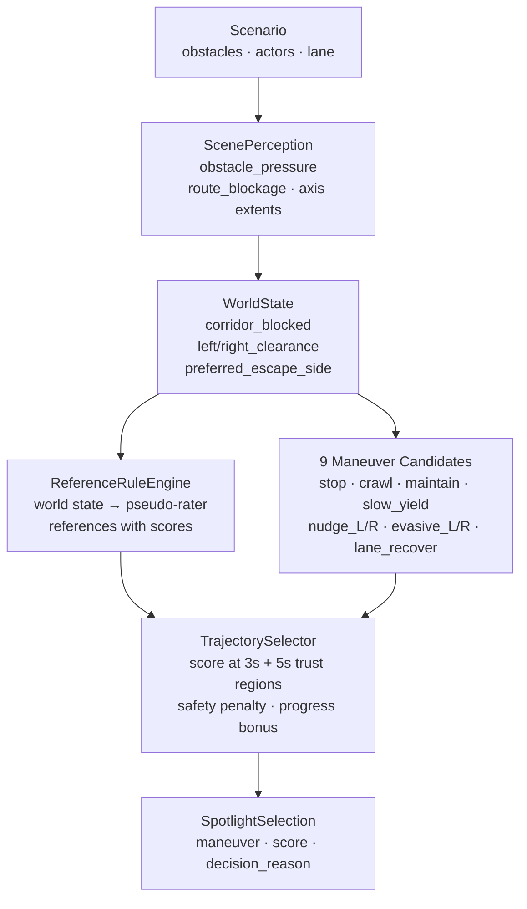
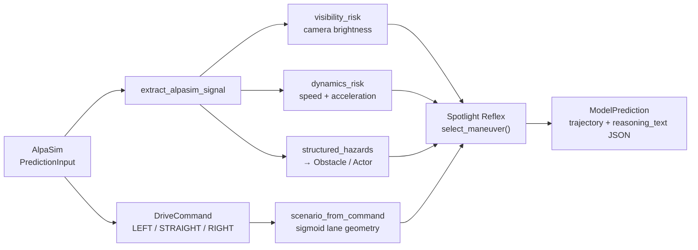
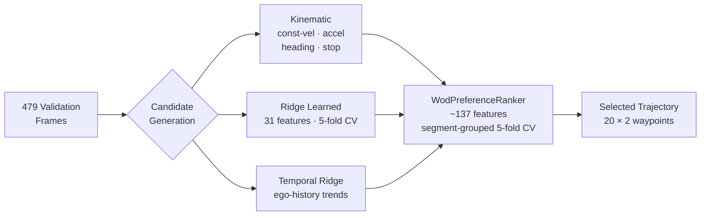

# Spotlight Reflex: Minimal-Shot Autonomous Driving

**SoTA Commission I — Grand & Minor Commission**  
amtellezfernandez@gmail.com

---

## The Problem With Current AV

> Autonomous vehicles work where they've been trained. They memorise environments.

Waymo's WOD-E2E dataset captures this precisely: **11 long-tail clusters filtered
to scenarios occurring less than 0.03% of driving time** — construction zones,
animals, wrong-way actors, debris, erratic pedestrians.

These are exactly the scenarios where trajectory imitation **fails by design**.  
A model that memorised 10 million miles of normal driving has never seen a sheep
blocking a roundabout.

---

## Failure — Before We Show Success

Same scenario. Same seed. Two policies.

**Baseline policy** — no world-state reasoning:

*Continues directly into the wrong-way actor. No correction. No awareness.*

This is what happens when you extrapolate a trajectory without understanding the scene.

---

## The Geometric Invariance Claim

> If you make world-state reasoning and maneuver enumeration **explicit**,
> the system should generalise to novel scenes without having seen them.

A trajectory that avoids obstacles, respects corridor geometry, and maintains
progress is correct whether the obstacle is a cone, a fallen tree, or a sheep.

**The claim is falsifiable:** regression tests verify that relabelling every
object name, cluster tag, and scenario label while holding geometry fixed
produces **identical decisions**. The world-state signals are functions of
occupancy and route geometry only — not of identity or context.

No AV dataset fine-tuning. No route memorisation. No cluster-specific rules.

---

## Spotlight Reflex — The System Working

Same scenario as the baseline failure:

*Selects `evasive_right`, clears the wrong-way actor, recovers to lane centre.*

The policy saw no training examples of this scenario. It worked because
the geometry — obstacle pressure rising on the left, clearance on the right
— told it what to do.

---

## How It Works

Six world-state scalars. Nine named candidates. Two time horizons scored.  
Every decision is explainable — `decision_reason` is logged at every step.

| Signal | Meaning |
|--------|---------|
| `obstacle_pressure` | Weighted influence of nearby obstacles [0,1] |
| `route_blockage` | Fraction of route corridor obstructed ahead [0,1] |
| `corridor_blocked` | Hard blockage within stopping distance |
| `left_clearance` | Lateral space to the left (m) |
| `right_clearance` | Lateral space to the right (m) |
| `preferred_escape_side` | Side with more clearance |

---

## More Scenarios

**Construction zone** — cone field, narrow corridor (5.2 m), lane closure ahead:

**Foreign object debris** — static debris in primary lane:

**Intersection stress** — conflict zone, two crossing actors at different timings (207 steps):

---

## The Simulation Environment (Built From Scratch)

Everything in `src/minimal_shot_av/simulator/` is original code.

| Component | What it does |
|-----------|-------------|
| `environment.py` | 2D closed-loop engine, 8 actor behaviour models |
| `wod_scenarios.py` | Procedural generator for all 11 WOD-E2E clusters |
| `compositional_scenarios.py` | OOD generator: topology × hazard × weather × novel objects |
| `compass.py` | Profile-driven benchmark (oracle, reasoning, recovery, generalisation gap) |
| `certification.py` | SOTIF-aligned evidence infrastructure |

**Compositional OOD**: topology and hazard are sampled independently.
A construction hazard can appear in a roundabout in fog. Memorising cluster
labels gives no advantage because the generator decouples topology from hazard.

8 topology types × 11 hazard modules × weather × novel objects — no cluster
label predicts which topology or weather the next rollout will use.

---

## Simulation Results

**Primary benchmark** (seeds 1–10, deterministic):

| Suite | Rollouts | Collisions | Pass rate |
|-------|----------|-----------|-----------|
| WOD-style (all 11 clusters) | 110 | **0** | **100%** |
| Compositional OOD | 60 | 0 | 100% |
| Adversarial (2–3 hazards) | 60 | 0 | 100% |
| Hidden holdout | 60 | 0 | 100% |
| Gauntlet (4 hazards, narrow) | 60 | 0 | 60% |
| **Total** | **350** | **0** | **93.1%** |

Mean min clearance: **2.96 m** · COMPASS: **9.137 / 10** (threshold 7.0) · 700 ranked runs

**Extended evaluation** (seeds 1–40, wider coverage):

| Suite | Runs | Collision rate | Pass |
|-------|------|---------------|------|
| Compositional OOD | 240 | 6.7% | 89% |
| Adversarial | 240 | 11.7% | 83% |

---

## Gauntlet vs Baseline — The Starkest Comparison

Matched seeds 1–80, **420 runs per policy**:

| Policy | Pass rate | Collision rate |
|--------|-----------|---------------|
| Baseline (no world-state reasoning) | **2.1%** (9/420) | **20.5%** (86 collisions) |
| Spotlight Reflex | **57.6%** (242/420) | **7.9%** (33 collisions) |

The baseline collides in one in five gauntlet runs and passes nearly none.
Spotlight Reflex passes 58% and collides at one-third the rate.
**10× collision reduction** from geometric world-state reasoning.

---

## AlpaSim: Same Policy, Sensor-Realistic

The Spotlight Reflex policy runs unchanged inside Waymo's AlpaSim simulator
via a custom adapter. Four signal channels bridge the gap:

Real WOD-E2E front-camera frames (AlpaSim sensor input) + reasoning output:

| AlpaSim metric (30 scenes) | Value |
|---------------------------|-------|
| `collision_at_fault` | **0.0** |
| `dist_to_gt_trajectory` | 0.42 m |
| `collision_any` (rear, by others) | 0.37 |

The policy has zero AlpaSim imports — it runs identically in both environments.
Cross-fidelity transfer without modification is evidence that the world-state
abstraction is at the right level of representation.

---

## WOD-E2E Benchmark

| Selector | RFS | Notes |
|----------|-----|-------|
| Constant velocity (local backend) | 7.131 | Local scoring baseline |
| Constant velocity (official) | 7.022 | Official Waymo backend |
| Kinematic ranker | 7.096 | Physics-only, official backend |
| Gate system only | 7.803 | 5-fold, local backend |
| Champion (direct policy) | **7.834** | 5-fold, local backend |
| Oracle (perfect selection) | **9.264** | Upper bound, local backend |

**+0.703 RFS over the local baseline · oracle gap 1.430 RFS**

---

## The Oracle Gap — Key Scientific Finding

The **oracle gap is 1.430 RFS** (9.264 − 7.834).

This is the correct diagnostic: **the candidate pool is not the bottleneck.
The discriminator is.**

The selector cannot identify which candidate is best on a given frame without
visual scene information. More candidates do not help — adding world-model
candidates improved oracle RFS by ~0.05 but selected RFS did not move,
because the selector picks the wrong candidate.

The fix is not a better candidate generator. It is a visual discriminator.

---

## Calibration Bias — A Quantifiable Finding

The champion selector (RFF direct policy, 5-fold) has **residual regret at distribution
extremes** that is measurable and correctable:

| Slice | Frames | Selected RFS | Oracle RFS | Regret |
|-------|--------|-------------|-----------|--------|
| GO_STRAIGHT | 427 | 7.959 | 9.336 | 1.377 |
| GO_LEFT | 23 | 7.107 | 8.721 | **1.614** |
| GO_RIGHT | 29 | 6.574 | 8.638 | **2.063** |
| speed:slow | 133 | 7.564 | 9.196 | 1.632 |
| speed:fast | 44 | 7.957 | 9.436 | 1.479 |

The selector performs well on the dominant GO_STRAIGHT slice (1.377 regret) but
over-selects temporal candidates at distribution extremes:

- **GO_RIGHT (29 frames)**: regret 2.063 — rarest intent class, under-represented in training
- **GO_LEFT (23 frames)**: regret 1.614 — improved from 1.753 (old model), still elevated
- **speed:slow (133 frames)**: regret 1.632 — slow frames need diverse candidate coverage

This is a quantifiable, correctable bias. Reweighting turn and low-speed frames in
training and augmenting with more diverse turn examples addresses it directly.

---

## What Didn't Work

**Visual embeddings do not carry preference signal.** InternVLA and Cosmos tokenizer
embeddings were computed for each validation frame and attached as ranker features.
Neither produced a confirmed RFS gain over the no-embedding baseline. Off-the-shelf
visual encoders extract representations tuned for navigation or generation, not for
the discriminative question "which trajectory wins on this specific frame."
Fine-tuning on preference labels is required to align the embedding space to this signal.

**World-model candidates add oracle headroom but the selector cannot exploit it.**
A lightweight world model was implemented to generate scene-conditioned trajectory
candidates beyond what kinematic and ridge produce. Oracle RFS improved marginally,
but selected RFS did not — the selector picks the wrong candidate too often.
More candidates are not useful without a better discriminator.

---

## What's Honest

| What this IS | What this IS NOT |
|-------------|-----------------|
| Runnable closed-loop minimal-shot policy | A production AV stack |
| WOD-E2E harness, 7.834 RFS (5-fold) · 7.880 (2-fold peak) | A strict zero-shot WOD-E2E result |
| Validated submission packaging pipeline | A completed leaderboard submission |
| AlpaSim trajectory plugin | Full sensor-realistic perception stack |
| 110 WOD runs, 0 collisions | A safety certification |

The WOD-E2E selector is calibrated on retained validation preference labels under
segment-grouped CV. This is honest development analysis, not hidden-test generalisation.
The test frame list (1,505 frames) is present. Only the test TFRecords are needed.

---

## Next Steps

**Camera encoder** — The oracle gap (1.430 RFS) is recoverable if the selector
can see the scene. A small model fine-tuned on WOD-E2E preference labels to
discriminate winning trajectories from camera images. Expected to close 0.5–1.5 RFS.

**Turn calibration** — GO_RIGHT (regret 2.063) and GO_LEFT (regret 1.614) are
directly addressable: reweight turn frames in training, augment with more diverse
turn examples. GO_LEFT already improved from 1.753 → 1.614 over the previous model.

**Leaderboard submission** — Test frame list is present (1,505 frames). Packaging
pipeline is validated. Only the test TFRecords are missing.

**Proper train/test split** — Waymo train TFRecords (Google sign-in gated) would
move calibration off the validation set, making the result a true test-set number.

**Physical deployment** — A vehicle with obstacle sensors and a route command can
run Spotlight Reflex today. The AlpaSim bridge is the template for a
sensor-to-obstacle adapter on real hardware.

---

## Summary

| | |
|-|-|
| **Policy** | Spotlight Reflex — explicit world-state + 9 maneuvers + selector |
| **Simulation** | Built from scratch, 11 WOD clusters + compositional OOD |
| **Evidence** | 110 runs · 0 collisions · COMPASS 9.137/10 · 700 ranked runs |
| **WOD-E2E** | 7.834 RFS (+0.703 vs local baseline) on 479 validation frames, 5-fold CV |
| **Oracle gap** | 1.430 RFS — discriminator is the bottleneck, not the candidates |
| **AlpaSim** | Same policy, sensor-realistic, `collision_at_fault: 0.0` |
| **Bottleneck** | Visual discriminator — camera encoder is the identified next step |

> The system generalises because it reasons from geometry, not from memorised trajectories.
> The oracle gap diagnostic points exactly to what to build next.
