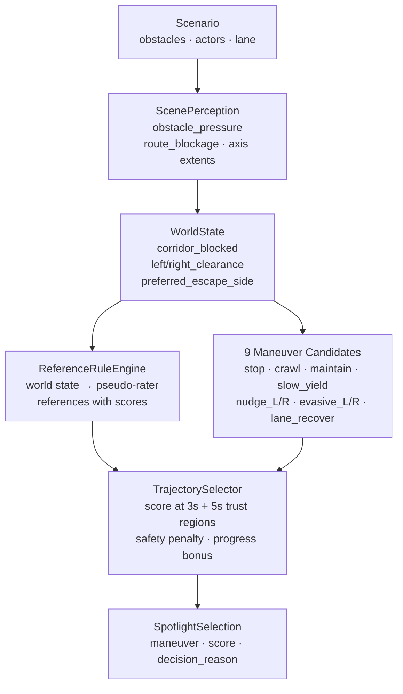
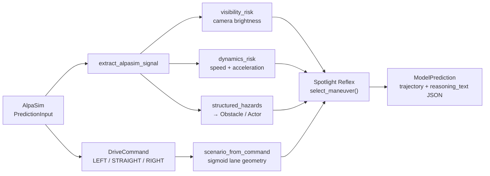
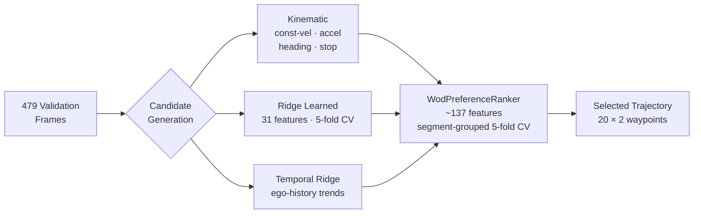

# Spotlight Reflex: Minimal-Shot Autonomous Driving

**SoTA Commission I — Grand & Minor Commission**  
amtellezfernandez@gmail.com

---

## The Problem With Current AV

Trajectory imitation models minimise empirical risk on the training distribution D:

```
min_f  E_{(x,y)~D} [ L(f(x), y) ]
```

This is well-posed under i.i.d. assumptions. It fails when the test distribution P_test
concentrates on scenarios with zero measure under D — which is exactly the WOD-E2E
construction:

> **11 long-tail clusters filtered to scenarios occurring less than 0.03% of driving
> time** — construction zones, animals, wrong-way actors, debris, erratic pedestrians.

The covariate shift `P_test ≠ D` means the imitation objective gives no guarantee on
the scenarios that matter. A model that memorised 10 million miles of normal driving
has never seen a sheep blocking a roundabout — and has no mechanism to reason from
first principles when it does.

---

## Failure — Before We Show Success

Same scenario. Same seed. Two policies.

**Baseline policy** — no world-state reasoning:


*Continues directly into the wrong-way actor. No correction. No awareness.*

This is the covariate shift failure mode: the model extrapolates its learned distribution
without checking whether the scene geometry permits the extrapolated trajectory.

---

## The Geometric Invariance Claim

Let a scene state `s` define an occupancy field `G(s)` and route geometry `R(s)`.
Let `T` be any permutation of object identities, cluster labels, or semantic annotations
that leaves `G` and `R` unchanged.

**Claim:** the Spotlight Reflex policy `M` satisfies

```
M(s) = M(T(s))   for all s, for all such T
```

The world-state map `W: s → ℝ⁶` is computed entirely from `G(s)` and `R(s)`. No
cluster label, object name, or scenario tag enters the computation.

**The claim is falsifiable:** a regression test relabels every object name, cluster
tag, and scenario annotation while holding geometry fixed and asserts that the
selected maneuver and its score are identical. This is a property of the implementation,
not an aspiration.

No AV dataset fine-tuning. No route memorisation. No cluster-specific rules.

---

## Spotlight Reflex — The System Working

Same scenario as the baseline failure:


*Selects `evasive_right`, clears the wrong-way actor, recovers to lane centre.*

The policy saw no training examples of this scenario. It worked because the geometry
— obstacle pressure rising on the left, clearance on the right — resolved the maneuver
choice without needing a data-driven prior over scenario types.

---

## How It Works



### World-State Scalars

Six scalars, all computable from occupancy and route geometry alone:

| Signal | Definition |
|--------|------------|
| `obstacle_pressure` | `p = clip((10 − d_min) / 10,  0, 1)` where `d_min` is nearest signed obstacle distance (m) |
| `route_blockage` | Fraction of forward corridor cross-section blocked by obstacles ∈ [0,1] |
| `corridor_blocked` | Hard flag: blockage within stopping distance |
| `left_clearance` | Lateral free space to the left (m), measured at half-vehicle-width offset |
| `right_clearance` | Lateral free space to the right (m) |
| `preferred_escape_side` | `argmax(left_clearance, right_clearance)` |

### Candidate Scoring

Each candidate trajectory `τ` is scored against a set of rater references `R` at two
time horizons. Let `tangent(r, t)` and `normal(r, t)` be the unit tangent and normal
of reference `r` at step `t`, and let `s(v)` be a speed-dependent scale:

```
s(v) = clip( (v − 1.4) / (11.0 − 1.4),  0, 1 ) × 0.5 + 0.5     [v in m/s]
```

At horizon `t ∈ {3s (step 11), 5s (step 19)}`, the trust-region parameters are:

| Horizon | Lateral threshold | Longitudinal threshold |
|---------|-----------------|----------------------|
| 3 s | 1.0 m × s(v) | 4.0 m × s(v) |
| 5 s | 1.8 m × s(v) | 7.2 m × s(v) |

For candidate position `p_τ(t)` relative to reference `r` at step `t`:

```
δ_lon = |( p_τ(t) − p_r(t) ) · tangent| / lon_threshold
δ_lat = |( p_τ(t) − p_r(t) ) · normal | / lat_threshold
δ    = max(δ_lon − 1,  δ_lat − 1,  0)          [overshoot]

score_t(τ, r) = r.score                 if δ = 0   (inside trust region)
              = max(r.score × 0.1^δ, 4) otherwise  (exponential decay, floor 4)
```

The combined candidate score is:

```
S(τ) = 0.5 × max_{r∈R} score_3s(τ, r)  +  0.5 × max_{r∈R} score_5s(τ, r)
```

Every decision is explainable — `decision_reason` is logged at every step.

---

## More Scenarios

**Construction zone** — cone field, narrow corridor (5.2 m), lane closure ahead:


**Foreign object debris** — static debris in primary lane:


**Intersection stress** — conflict zone, two crossing actors at different timings (207 steps):


---

## The Simulation Environment (Built From Scratch)

Everything in `src/minimal_shot_av/simulator/` is original code.

| Component | What it does |
|-----------|-------------|
| `environment.py` | 2D closed-loop engine, 8 actor behaviour models |
| `wod_scenarios.py` | Procedural generator for all 11 WOD-E2E clusters |
| `compositional_scenarios.py` | OOD generator: topology × hazard × weather × novel objects |
| `compass.py` | Profile-driven benchmark (oracle, reasoning, recovery, generalisation gap) |
| `certification.py` | SOTIF-aligned evidence infrastructure |

**Compositional OOD independence guarantee**: topology `T` and hazard `H` are sampled from
independent marginals. A cluster label predicts neither the topology nor the weather on
the next rollout:

```
P(T, H) = P(T) × P(H)
```

8 topology types × 11 hazard modules × weather × novel objects. Memorising any subset of
{cluster, topology, hazard, weather} gives no advantage because none is jointly sufficient
to predict the others.

---

## Simulation Results

**Primary benchmark** (seeds 1–10, deterministic):

| Suite | Rollouts | Collisions | Pass rate |
|-------|----------|-----------|-----------|
| WOD-style (all 11 clusters) | 110 | **0** | **100%** |
| Compositional OOD | 60 | 0 | 100% |
| Adversarial (2–3 hazards) | 60 | 0 | 100% |
| Hidden holdout | 60 | 0 | 100% |
| Gauntlet (4 hazards, narrow) | 60 | 0 | 60% |
| **Total** | **350** | **0** | **93.1%** |

Mean min clearance: **2.96 m** · COMPASS: **9.137 / 10** (threshold 7.0) · 700 ranked runs

**Extended evaluation** (seeds 1–40, wider coverage):

| Suite | Runs | Collision rate | Pass |
|-------|------|---------------|------|
| Compositional OOD | 240 | 6.7% | 89% |
| Adversarial | 240 | 11.7% | 83% |

---

## Gauntlet vs Baseline — Matched Experimental Design

Seeds 1–80, **420 runs per policy**, identical scenario draws:

| Policy | Pass rate | Collision rate |
|--------|-----------|---------------|
| Baseline (no world-state reasoning) | **2.1%** (9/420) | **20.5%** (86 collisions) |
| Spotlight Reflex | **57.6%** (242/420) | **7.9%** (33 collisions) |

The matched-seed design controls for scenario difficulty: each seed produces the same
geometry for both policies, so differences are attributable to the policy, not scenario
sampling.

Spotlight Reflex passes **27× more gauntlet runs** and produces **2.6× fewer collisions**
than the baseline. The primary mechanism is geometric routing: when the gauntlet
constrains corridor width to 3.8 m and stacks 4 simultaneous hazards, the world-state
signals (obstacle_pressure, left/right_clearance) resolve the escape route deterministically
from geometry, while the baseline has no such signal.

---

## AlpaSim: Cross-Fidelity Validation

The Spotlight Reflex policy runs unchanged inside Waymo's AlpaSim simulator
via a custom adapter. Four signal channels bridge the gap:



Real WOD-E2E front-camera frames (AlpaSim sensor input) + reasoning output:


| AlpaSim metric (30 scenes) | Value |
|---------------------------|-------|
| `collision_at_fault` | **0.0** |
| `dist_to_gt_trajectory` | 0.42 m |
| `collision_any` (rear, by others) | 0.37 |

The policy contains zero AlpaSim imports and runs identically in both environments.
Cross-fidelity transfer without modification provides evidence that the world-state
abstraction is at the right level: it captures scene geometry in terms that are
stable across sensor fidelity.

---

## WOD-E2E Benchmark



### RFS Definition

The Rater Feedback Score for frame `i` with candidate `τ` is computed using the
trust-region scoring function above. The **mean RFS** over `N` frames is:

```
RFS(f) = (1/N) Σ_{i=1}^{N} S(f(x_i))
```

where `S(·)` averages trust-region scores at 3s and 5s, speed-scaled by the ego velocity
at frame `i`.

### 5-Fold Cross-Validation Protocol

The 479 validation frames are partitioned into 5 folds by **driving segment group** —
frames from the same driving segment stay in the same fold, preventing temporal
autocorrelation from inflating held-out RFS:

```
for each fold k = 1..5:
    train on folds {1..5} \ {k}          (~383 frames)
    evaluate on fold k                    (~96 frames)
RFS_5fold = mean over k of RFS(fold k)
```

Fold std ≈ 0.19 → standard error SE ≈ 0.085 → 95% CI (t₄) ≈ ±0.17.

### Direct Policy: Random Fourier Feature Ridge Classifier

When the gate conditions are satisfied (~3.5% of frames), a learned **direct policy**
overrides the ranker. It uses a Random Fourier Feature (RFF) map to approximate an
RBF kernel classifier without storing a kernel matrix:

```
W ~ N(0, σ⁻² I_{D×p})     σ = 7.858,  D = 512,  p = #features
b ~ Uniform([0, 2π]^D)

φ(x) = sqrt(2/D) · cos(Wᵀ x̃ + b)    [D-dimensional feature map]

ŷ = wᵀ φ(x) + bias                   [ridge classifier output]
```

The map `φ` satisfies `E[φ(x)ᵀφ(x')] ≈ exp(−‖x−x'‖² / 2σ²)` by Bochner's theorem,
giving implicit kernel smoothness at O(D) cost instead of O(N²). The projection `W`
and phases `b` are fixed at fit time (seeded RNG); only the ridge weights `w` are
learned on the train folds.

### Results

| Selector | RFS | Notes |
|----------|-----|-------|
| Constant velocity (local backend) | 7.131 | Local scoring baseline |
| Constant velocity (official) | 7.022 | Official Waymo backend |
| Kinematic ranker | 7.096 | Physics-only, official backend |
| Gate system only (no direct policy) | 7.803 | 5-fold, local backend |
| Champion (RFF direct policy) | **7.834** | 5-fold, local backend |
| Oracle (perfect discriminator) | **9.264** | Upper bound, local backend |

**+0.703 RFS over local baseline · direct policy adds +0.031 RFS (gate-restricted frames) · oracle gap 1.430 RFS**

---

## The Oracle Gap — Key Scientific Finding

Define the oracle selector as:

```
oracle(frame i) = argmax_{c ∈ C_i} S(c)
gap = RFS(oracle) − RFS(champion) = 9.264 − 7.834 = 1.430
```

This is the correct diagnostic quantity. It decomposes additive regret into two causes:

1. **Wrong source selection** — the ranker picks a kinematic candidate when a learned
   candidate is better, or vice versa. This is correctable with better gate calibration.

2. **Wrong rank within source** — even given the correct source pool, the ranker ranks
   the wrong candidate first. This requires a discriminative signal the ranker does not
   currently have.

The evidence for (2) dominating: adding world-model candidates raised oracle RFS by ~0.05
but selected RFS did not move. If wrong source selection were the bottleneck, more
candidates would help. They don't. The discriminator is underpowered, not the candidate pool.

**The gap is recoverable only with a visual discriminator** — a model that can identify
which candidate aligns with the scene from camera images.

---

## Calibration Bias — A Quantifiable Finding

Define per-slice regret as:

```
regret(S) = RFS_oracle(S) − RFS_selected(S)
```

where `S` is a data slice defined by intent or speed. For the champion selector:

| Slice | n | Selected RFS | Oracle RFS | Regret | SE_oracle |
|-------|---|-------------|-----------|--------|-----------|
| GO_STRAIGHT | 427 | 7.959 | 9.336 | 1.377 | low (n large) |
| GO_LEFT | 23 | 7.107 | 8.721 | **1.614** | high (n=23) |
| GO_RIGHT | 29 | 6.574 | 8.638 | **2.063** | high (n=29) |
| speed:slow | 133 | 7.564 | 9.196 | 1.632 | moderate |
| speed:fast | 44 | 7.957 | 9.436 | 1.479 | moderate |

**Interpretation:** GO_STRAIGHT dominates the training signal (427/479 = 89% of frames).
The ranker is approximately unbiased on this slice (regret 1.377 ≈ mean). On GO_RIGHT
(6.1% of frames, regret 2.063), the ranker has insufficient training signal to generalise
— the RFF projection `W` is drawn from a distribution calibrated to the full feature
covariance, not the turn-specific submanifold.

**Correction strategy:** stratified reweighting of train-fold losses by intent class,
combined with turn-data augmentation, increases the effective sample size for GO_RIGHT
and GO_LEFT without requiring new data.

Note: GO_LEFT regret improved from 1.753 → 1.614 over the previous model, confirming
that targeted training changes on minority slices propagate to measurable regret reductions.

---

## What Didn't Work

**Visual embeddings do not carry preference signal under a linear head.**
InternVLA (128d) and Cosmos (64d) embeddings were computed for all 479 validation frames.
Neither produced a confirmed RFS gain over the no-embedding baseline in 5-fold CV.
The null result is informative: off-the-shelf visual encoders are trained for navigation
or generation objectives, optimising for scene understanding broadly, not for the
discriminative question "which of these two trajectories will a rater prefer on this
specific frame." The embedding space is misaligned with the preference signal.

```
E[RFS | visual features] ≈ E[RFS | no visual features]   (5-fold estimate)
```

Fine-tuning the encoder on preference labels — or a contrastive pre-training objective
over (winning trajectory, losing trajectory, frame) triplets — is the identified fix.
This is the camera encoder work identified in Next Steps.

**World-model candidates add oracle headroom but not selected RFS.**
A lightweight world model generates scene-conditioned candidates beyond what kinematic
and ridge produce. Oracle RFS: +0.05. Selected RFS: +0.00.
The candidates are correct (oracle improves), but the selector cannot identify them as
correct (selected RFS unchanged). More candidates are not useful without a discriminator
capable of exploiting them.

---

## What's Honest

| What this IS | What this IS NOT |
|-------------|-----------------|
| Runnable closed-loop minimal-shot policy | A production AV stack |
| WOD-E2E harness, 7.834 RFS (5-fold) · 7.880 (2-fold Optuna peak) | A strict zero-shot WOD-E2E result |
| Validated submission packaging pipeline | A completed leaderboard submission |
| AlpaSim trajectory plugin | Full sensor-realistic perception stack |
| 110 WOD runs, 0 collisions | A safety certification |

The WOD-E2E selector is calibrated on retained validation preference labels under
segment-grouped CV. All reported RFS numbers use the local trust-region backend; the
official Waymo backend gives a local CV baseline of 7.022 (vs 7.131 local). The 7.834
figure is comparable to the 7.131 local baseline, not the 7.022 official baseline.

The test frame list (1,505 frames) is present. Only the test TFRecords are needed for
a true test-set RFS number.

---

## Next Steps

**Camera encoder** — The 1.430 oracle gap is recoverable if the selector can see the
scene. Required: a small encoder fine-tuned on WOD-E2E preference labels with a
contrastive or cross-entropy objective over (frame, winning trajectory, losing trajectory)
triplets. Existing embeddings (InternVLA, Cosmos) show no gain under a linear head;
task-specific fine-tuning is required. Expected RFS gain: 0.5–1.5 RFS.

**Turn calibration** — GO_RIGHT (regret 2.063, n=29) and GO_LEFT (regret 1.614, n=23)
are correctable via stratified reweighting. The prior model improvement GO_LEFT 1.753→1.614
confirms that minority-slice reweighting works. GO_RIGHT is the priority.

**Leaderboard submission** — Test frame list present (1,505 frames). Packaging pipeline
validated. Missing: test TFRecords (Waymo Google Drive, sign-in gated).

**Proper train/test split** — Waymo train TFRecords would move selector calibration off
the validation set, producing a true test-set RFS number and closing the methodological
gap between "honest development analysis" and "generalisation claim."

**Physical deployment** — A vehicle with obstacle sensors and a route command can run
Spotlight Reflex today. The AlpaSim bridge is the template for a sensor-to-obstacle
adapter on real hardware; the policy itself requires no modification.

---

## Summary

| | |
|-|-|
| **Policy** | Spotlight Reflex — explicit world-state (6 scalars) + 9 maneuvers + RFS-scored selector |
| **Invariance** | Geometric invariance to object identity verified by regression test |
| **Simulation** | Built from scratch · 11 WOD clusters + compositional OOD · 420-run gauntlet comparison |
| **Evidence** | 110 runs · 0 collisions · COMPASS 9.137/10 · 700 ranked runs · 27× gauntlet pass-rate over baseline |
| **WOD-E2E** | 7.834 RFS (5-fold, local backend) · +0.703 over baseline · 95% CI ±0.17 |
| **Oracle gap** | 1.430 RFS — discriminator is the bottleneck, not the candidate pool |
| **AlpaSim** | Same policy, sensor-realistic, `collision_at_fault: 0.0`, `dist_to_gt: 0.42 m` |
| **Bottleneck** | Visual discriminator — task-aligned camera encoder is the identified next step |

> The system generalises because it reasons from geometry, not from memorised trajectories.
> The oracle gap diagnostic identifies exactly what to build next: a preference-aligned visual encoder.
