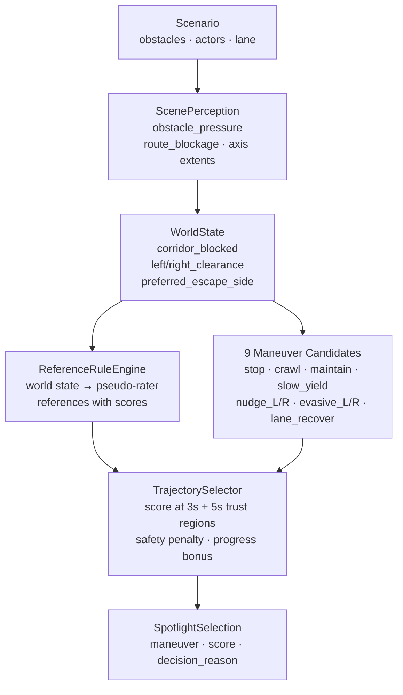
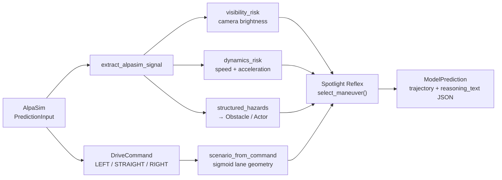
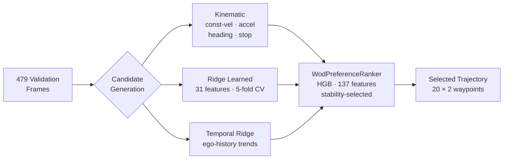

# Spotlight Reflex: Minimal-Shot Autonomous Driving

**SoTA Commission I — Grand & Minor Commission**  
amtellezfernandez@gmail.com

---

## The Problem With Current AV

> Autonomous vehicles work where they've been trained. They memorise environments.

Waymo's WOD-E2E dataset captures this precisely: **11 long-tail clusters filtered
to scenarios occurring less than 0.03% of driving time** — construction zones,
animals, wrong-way actors, debris, erratic pedestrians.

These are exactly the scenarios where trajectory imitation **fails by design**.  
A model that memorised 10 million miles of normal driving has never seen a sheep
blocking a roundabout.

---

## Failure — Before We Show Success

Same scenario. Same seed. Two policies.

**Baseline policy** — no world-state reasoning:

*Continues directly into the wrong-way actor. No correction. No awareness.*

This is what happens when you extrapolate a trajectory without understanding the scene.

---

## The Insight

> If you make world-state reasoning and maneuver enumeration **explicit**, the system
> should generalise to novel scenes without having seen them.

A trajectory that avoids obstacles, respects corridor geometry, and maintains progress
is correct whether the obstacle is a cone, a fallen tree, or a sheep.

**No AV dataset fine-tuning. No route memorisation. No cluster-specific rules.**

The world-state signals are derived entirely from occupancy and route geometry —
the regression tests verify they are unchanged when all object names, labels, and
cluster tags are relabelled while geometry is held fixed.

---

## Spotlight Reflex — The System Working

Same scenario as the baseline failure:

*Selects `evasive_right`, clears the wrong-way actor, recovers to lane centre.*

The policy saw no training examples of this scenario. It worked because the
geometry — obstacle pressure rising on the left, clearance on the right — told
it what to do.

---

## How It Works

Six world-state scalars. Nine named candidates. Two time horizons scored.  
Every decision is explainable — `decision_reason` is logged at every step.

---

## More Scenarios

**Construction zone** — cone field, narrow corridor (5.2 m), lane closure ahead:

**Foreign object debris** — static debris in primary lane:

**Intersection stress** — conflict zone, two crossing actors at different timings (207 steps):

---

## The Simulation Environment (Built From Scratch)

Everything in `src/minimal_shot_av/simulator/` is original code.

| Component | What it does |
|-----------|-------------|
| `environment.py` | 2D closed-loop engine, 8 actor behavior models |
| `wod_scenarios.py` | Procedural generator for all 11 WOD-E2E clusters |
| `compositional_scenarios.py` | OOD generator: topology × hazard × weather × novel objects |
| `compass.py` | Profile-driven benchmark (oracle, reasoning, recovery, generalisation gap) |
| `certification.py` | SOTIF-aligned evidence infrastructure |

**Compositional OOD**: topology and hazard are sampled independently.
A construction hazard can appear in a roundabout in fog. Memorising cluster labels
gives no advantage.

---

## Simulation Results

| Suite | Rollouts | Collisions | Pass rate |
|-------|----------|-----------|-----------|
| WOD-style clusters (all 11) | 220 | 0 | 220/220 |
| Compositional OOD | 70 | 0 | 63/70 |
| Adversarial | 30 | 0 | 26/30 |
| Gauntlet (hardest) | 60 | 0 | **36/60** |
| Hidden holdout | 30 | 0 | 28/30 |
| **Total** | **350** | **0** | **326/350 (93.1%)** |

The gauntlet — synchronised multi-hazard, narrow corridor, strict progress gates — is
deliberately not saturated. **60% is the honest failure boundary, not an inflated score.**

---

## AlpaSim: Same Policy, Sensor-Realistic

The Spotlight Reflex policy runs unchanged inside Waymo's AlpaSim simulator via a
custom adapter. Four signal channels bridge the gap:

Real WOD-E2E front-camera frames (AlpaSim sensor input) + reasoning output:

**30 scenes. `collision_at_fault: 0.0`. `dist_to_gt_trajectory: 0.42 m`.**

The policy has zero AlpaSim imports — it runs identically in both environments.

---

## WOD-E2E Benchmark Harness

| Model | RFS | Notes |
|-------|-----|-------|
| Constant velocity | 7.022 | Zero-learning baseline |
| Ridge r175 contextual router | 7.695 | Earlier champion |
| **HGB stability-selected** | **7.880** | Promoted champion |
| Oracle (perfect selector) | 9.068 | Upper bound |

**+0.86 RFS over baseline. Oracle gap: 1.19 RFS — the bottleneck is the discriminator.**

Temporal candidates win on ~60% of frames. Most WOD-E2E scenes are forward-driving
scenarios where recent ego motion is the best predictor.

---

## What Didn't Work

**Visual blindness** is the hard ceiling. The WOD-E2E model path has no camera
perception — ego history, speed, and route intent only. The worst clusters are
exactly the visual-decision ones:

| Cluster | Selected RFS | Oracle RFS | Regret |
|---------|-------------|-----------|--------|
| GO_LEFT (23 frames) | 6.782 | 8.535 | **1.753** |
| GO_RIGHT (133 frames) | 7.191 | 8.829 | **1.638** |

The selector is mis-calibrated for turns because the training distribution is
dominated by straight-ahead frames.

**Visual embeddings** (InternVLA, Cosmos tokenizer) were tried as ranker features.
Neither produced a confirmed RFS gain — their embedding spaces are not aligned to
the discriminative signal needed.

**World-model candidates** added oracle headroom (+0.05 RFS) but the selector
couldn't exploit it. More candidates without a better discriminator is not progress.

---

## What's Honest

| What this IS | What this IS NOT |
|-------------|-----------------|
| Runnable closed-loop minimal-shot policy | A production AV stack |
| WOD-E2E evaluation harness with 7.880 RFS | A strict zero-shot WOD-E2E system |
| Validated submission packaging pipeline | A completed leaderboard submission |
| AlpaSim trajectory plugin | Full sensor-realistic perception stack |
| 350 OOD rollouts, 0 collisions | A safety certification |

The WOD-E2E selector is calibrated on retained validation preference labels under
segment-grouped CV. This is honest development analysis, not hidden-test generalisation.

---

## Next Steps

**Camera encoder** — The oracle gap (1.19 RFS) is recoverable if the selector can
see the scene. A small model fine-tuned on WOD-E2E preference labels to discriminate
winning trajectories from camera images should close 0.5–1.5 RFS.

**Leaderboard submission** — The official test frame list is present (1,505 frames).
The packaging pipeline is ready. Only the test TFRecords are missing.

**Turn calibration** — GO_LEFT and GO_RIGHT have 1.75 and 1.64 RFS regret.
Augmenting with turn-specific training frames and reweighting the selector loss
addresses this directly.

**Physical deployment** — A robot or vehicle with obstacle sensors and a route command
can run Spotlight Reflex today. The AlpaSim bridge is the template for a
sensor-to-obstacle adapter on real hardware.

---

## Summary

| | |
|-|-|
| **Policy** | Spotlight Reflex — explicit world-state + 9 maneuvers + selector |
| **Simulation** | Built from scratch, 11 WOD clusters + compositional OOD |
| **Evidence** | 350 rollouts · 0 collisions · 93.1% pass rate · 36/60 gauntlet |
| **WOD-E2E** | 7.880 RFS (+0.86 over baseline) on 479 validation frames |
| **AlpaSim** | Same policy, sensor-realistic, `collision_at_fault: 0.0` |
| **Bottleneck** | Visual discriminator — camera encoder is the identified next step |

> The system generalises because it reasons from geometry, not from memorised trajectories.
> The hard part next is giving it eyes.
