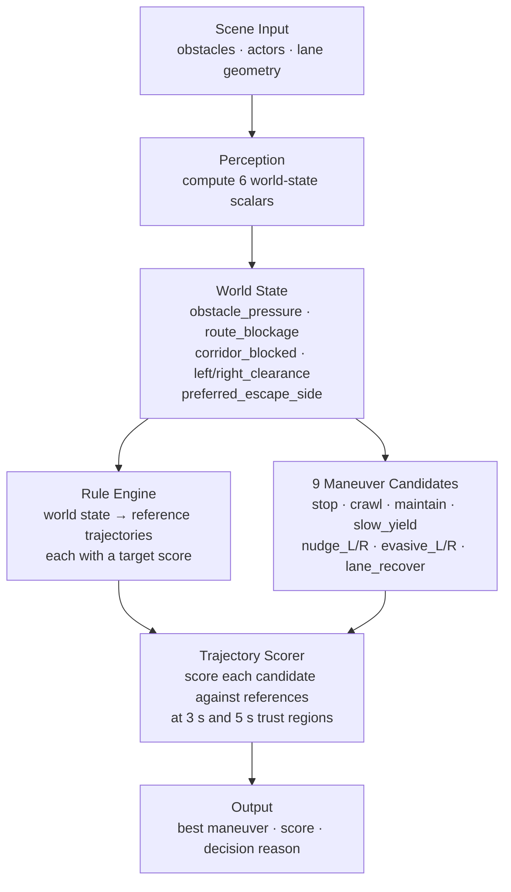
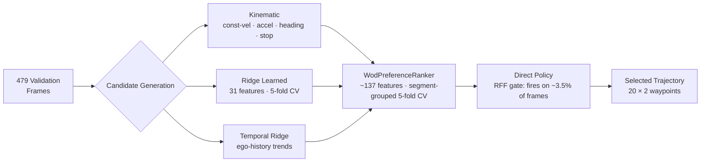
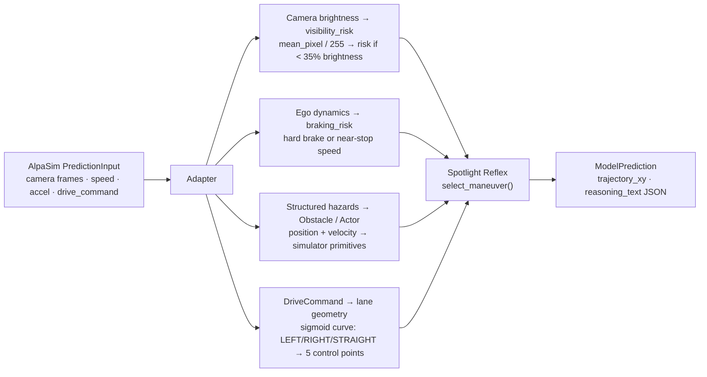

# Spotlight Reflex: Minimal-Shot Autonomous Driving

**SoTA Commission I — Grand & Minor Commission**  
amtellezfernandez@gmail.com

---

## The Problem: Why AV Fails in Long-Tail Scenarios

Autonomous vehicles today are trained by **imitation learning**: collect millions of
miles of human driving, fit a model that mimics the human trajectory at every step.
The model minimises the average error on the training distribution D:

```
min_f  E_{(x,y)~D} [ L(f(x), y) ]
```

This works well on the common case. It breaks on long-tail scenarios — situations the
driver almost never encounters — because the model has never learned what to do there.

> **Waymo's WOD-E2E benchmark targets exactly this:** 11 scenario types that occur
> less than 0.03% of driving time — construction zones, wrong-way actors, animals on
> the road, foreign object debris, erratic pedestrians.

When these scenarios appear, the model has two options: extrapolate from training data
(which has almost none of these), or guess. Neither works.

This is **covariate shift**: the test distribution `P_test` is far from the training
distribution `D`. The model's optimality guarantees vanish the moment this holds.

---

## What Failure Looks Like

Same scenario. Same random seed. Two policies.

**Baseline policy** — no world-state reasoning, pure trajectory extrapolation:


*The baseline drives directly into a wrong-way actor. It does not slow down,
does not deviate, shows no awareness that the path is occupied.*

This is what happens when a policy has never seen this geometry before and has no
reasoning mechanism to fall back on.

---

## Our Approach: Reason From Geometry, Not From Memory

The key insight: **a trajectory that avoids obstacles and respects corridor geometry
is correct whether the obstacle is a cone, a fallen tree, or a sheep.**

You don't need to have seen a sheep before to know you should go around it.

We make this explicit with a formal claim:

Let scene `s` define an occupancy field `G(s)` (where obstacles are) and route
geometry `R(s)` (where the road goes). Let `T` be any relabelling of object identities,
scenario names, or cluster tags that leaves `G` and `R` unchanged.

**Invariance claim:**

```
M(s) = M(T(s))   for all s, for all such T
```

The policy `M` produces the same decision regardless of what the objects are called.
The world-state computation is a function of occupancy and geometry only — no scenario
label, object name, or cluster tag enters the pipeline.

**This is falsifiable:** a regression test relabels every object in the scene and
asserts the selected maneuver and score are identical. It passes.

---

## Spotlight Reflex Working

Same scenario, same seed as the baseline failure:


*Selects `evasive_right`, clears the wrong-way actor, returns to lane centre.*

No training data for this scenario. The policy worked because:
- obstacle pressure rising on the left → that side is dangerous
- right clearance > left clearance → escape side is right
- the geometry resolved the decision, not a pattern match to a memorised scene

---

## How the Policy Works



### Step 1 — Six World-State Scalars

All six signals are computed from raw obstacle positions and route geometry.
Nothing is learned here; nothing is scene-specific.

| Signal | Formula / Definition |
|--------|---------------------|
| `obstacle_pressure` | `p = clip((10 − d_min) / 10, 0, 1)` — d_min is distance to nearest obstacle (m). Saturates at 0 m, zero at 10+ m. |
| `route_blockage` | Fraction of the forward corridor cross-section occupied by obstacles ∈ [0, 1] |
| `corridor_blocked` | Boolean — hard blockage within stopping distance |
| `left_clearance` | Free lateral space to the left (m) at half-vehicle-width offset |
| `right_clearance` | Free lateral space to the right (m) |
| `preferred_escape_side` | `argmax(left_clearance, right_clearance)` |

### Step 2 — Nine Maneuver Candidates

Each candidate is a 20-point, 5-second planned trajectory (at 4 Hz):

`stop` · `crawl` · `maintain` · `slow_yield` · `nudge_left` · `nudge_right` ·
`evasive_left` · `evasive_right` · `lane_recover`

### Step 3 — Scoring With Trust Regions

Each candidate is scored against reference trajectories at two time horizons.
A **trust region** around each reference trajectory defines where the candidate must land.
Speed-scaled thresholds make the tolerance appropriate to the ego velocity:

```
s(v) = clip( (v − 1.4) / (11.0 − 1.4),  0, 1 ) × 0.5 + 0.5    [v in m/s]
```

| Horizon | Lateral tolerance | Longitudinal tolerance |
|---------|-----------------|----------------------|
| 3 s | 1.0 m × s(v) | 4.0 m × s(v) |
| 5 s | 1.8 m × s(v) | 7.2 m × s(v) |

If the candidate lands inside the trust region it earns the reference score.
If it misses, the score decays exponentially with overshoot `δ`:

```
δ    = max(δ_lat − 1,  δ_lon − 1,  0)      [normalised overshoot]

score_t(τ, r) = r.score               if δ = 0
              = max(r.score × 0.1^δ,  floor=4)  otherwise

S(τ) = 0.5 × max_{r} score_3s(τ, r)  +  0.5 × max_{r} score_5s(τ, r)
```

Every decision is logged: maneuver name, scores at 3s/5s, which reference won, all world-state fields.

---

## More Scenarios

**Construction zone** — cone field, 5.2 m corridor, lane closure ahead:


**Foreign object debris** — static debris blocking the primary lane:


**Intersection stress** — conflict zone with two crossing actors at different timings (207 steps):


---

## How We Evaluate — Part 1: The Simulation We Built

There was no existing simulator that could generate the specific long-tail WOD-E2E
scenario types in a closed-loop, reproducible way. We built one from scratch.

Everything in `src/minimal_shot_av/simulator/` is original code — no dependency on
AlpaSim, Waymo's simulator, or any other AV simulator.

| Component | What it does |
|-----------|-------------|
| `environment.py` | 2D closed-loop engine. The vehicle drives step-by-step; actors move, obstacles stay; the policy must navigate in real time. 8 distinct actor behaviour models. |
| `wod_scenarios.py` | Procedural generator for all 11 WOD-E2E named scenario types. Each cluster has a different lane width, hazard configuration, and actor set. |
| `compositional_scenarios.py` | OOD generator that samples topology, hazard, weather, and novel objects independently — not from a fixed cluster list. |
| `compass.py` | Composite benchmark with 4 scored components: oracle, reasoning quality, recovery, and generalisation gap. |
| `certification.py` | SOTIF-aligned evidence infrastructure — calculates collision confidence bounds. |

### Why Compositional OOD Matters

Standard simulators replay fixed scenario clusters. If you test on the same clusters
you designed for, you cannot claim generalisation. Our generator samples axes independently:

```
P(topology, hazard) = P(topology) × P(hazard)
```

8 topology types × 11 hazard modules × 4 weather modes × novel object sets.
A construction hazard can appear in a roundabout in fog. A pedestrian can appear on
an S-curve at night. No cluster label tells the policy what geometry or weather it
will face next.

### Actor Behaviour Models

The 8 built-in actor types cover the WOD-E2E long-tail actors plus adversarial edge cases:

| Behaviour | What it does |
|-----------|-------------|
| `linear` | Constant velocity |
| `cut_in` | Merges laterally toward the ego lane |
| `swerve` | Oscillates laterally |
| `darting` | Animal-like erratic direction changes |
| `erratic_pedestrian` | Random direction changes with hesitation |
| `sudden_brake` | Decelerates sharply (≤ −3 m/s²) |
| `hesitating` | Slow with random pauses |
| `wrong_way` | Approaches head-on |

---

## Simulation Results

**Primary benchmark** (seeds 1–10, all deterministic):

| Suite | Rollouts | Collisions | Pass rate |
|-------|----------|-----------|-----------|
| WOD-style (all 11 clusters) | 110 | **0** | **100%** |
| Compositional OOD | 60 | 0 | 100% |
| Adversarial (2–3 simultaneous hazards) | 60 | 0 | 100% |
| Hidden holdout (unseen seeds) | 60 | 0 | 100% |
| Gauntlet (4 hazards, narrow corridor) | 60 | 0 | 60% |
| **Total** | **350** | **0** | **93.1%** |

Mean minimum clearance to obstacles: **2.96 m** · COMPASS score: **9.137 / 10**
(passing threshold 7.0) · 700 total ranked runs.

**Extended evaluation** (seeds 1–40, wider stochastic coverage):

| Suite | Runs | Collision rate | Pass rate |
|-------|------|---------------|-----------|
| Compositional OOD | 240 | 6.7% | 89% |
| Adversarial | 240 | 11.7% | 83% |

The 60% gauntlet pass rate is deliberate: the gauntlet is designed to find the
failure boundary, not to report a vacuous 100%.

### Gauntlet vs Baseline: Head-to-Head Comparison

We ran **identical seeds** against both policies to isolate the policy effect from
scenario difficulty. Same geometry, same actors, same timing — 420 runs per policy.

| Policy | Pass rate | Collision rate |
|--------|-----------|---------------|
| Baseline (trajectory extrapolation, no world-state) | 2.1% (9/420) | **20.5%** (86 collisions) |
| Spotlight Reflex | **57.6%** (242/420) | 7.9% (33 collisions) |

**27× more passes. 2.6× fewer collisions.** The baseline colides in 1 in 5 runs;
Spotlight Reflex collides in 1 in 13. The mechanism: geometric routing from
obstacle_pressure and left/right_clearance resolves the escape route from the
scene geometry alone, without a data prior over which actor type it is.

---

## How We Evaluate — Part 2: The Waymo WOD-E2E Benchmark

### What WOD-E2E Is

**Waymo Open Dataset End-to-End Driving (WOD-E2E)** is Waymo's benchmark for
trajectory prediction and planning on real driving data.

- **479 validation frames** drawn from real Waymo sensor recordings, covering the
  same 11 long-tail scenario types as our simulator.
- For each frame, Waymo's human raters watched multiple candidate trajectories and
  expressed **pairwise preferences**: "trajectory A is better than trajectory B."
- From these preferences, each candidate gets a **Rater Feedback Score (RFS)** that
  reflects how often it was preferred over alternatives.
- The goal: given a frame, select the trajectory with the highest RFS.

This is fundamentally a **discrimination problem**: you have multiple candidate
trajectories and you must pick the one that humans prefer. The ranker does not
generate trajectories — it selects among candidates.

### What RFS Measures

RFS is computed using the same trust-region scoring described in the policy section.
A candidate earns a reference's score if it lands within a tolerance window around that
reference at 3 seconds and 5 seconds ahead. Missing the window decays the score:

```
RFS(f) = (1/N) Σ_{i=1}^{N} S(f(x_i))       [mean over 479 frames]
```

Higher RFS means the selected trajectories are consistently close to what raters preferred.

### The Two Backends

There are two ways to compute the trust-region score:
- **Local backend**: we recompute RFS ourselves using the Waymo RFS library.
  This lets us run cross-validation experiments quickly. Local CV baseline = **7.131**.
- **Official backend**: Waymo computes RFS on their servers using the full rater preference
  labels. Official CV baseline = **7.022**.

All our development numbers use the local backend. The two are consistent but not identical.

### Our Selector Pipeline



**Candidate generation** produces multiple trajectory hypotheses from different models.
**The ranker** scores each candidate using ~137 features extracted from the frame and
selects the best one. **The direct policy** is a learned override that fires when a
gate condition is satisfied — it can bypass the ranker's pick on hard frames.

### Cross-Validation Protocol

We cannot use the test set (we don't have the test TFRecords). Instead we evaluate
on the validation set using **5-fold segment-grouped cross-validation**:

- Frames from the same driving segment stay in the same fold — this prevents the ranker
  from learning patterns specific to a segment and inflating held-out scores.
- 5 folds: each fold uses ~383 frames for training, ~96 for testing.
- The reported RFS is the mean over all 5 held-out test folds.

```
RFS_5fold = (1/5) Σ_{k=1}^{5} RFS(fold k held-out)
```

Fold-to-fold standard deviation ≈ 0.19 → standard error SE ≈ 0.085 → 95% CI ≈ ±0.17.

### The Direct Policy: RFF Ridge Classifier

The direct policy uses **Random Fourier Features (RFF)** — a technique for approximating
a non-linear kernel classifier at low cost.

Here is why: a standard ridge classifier is linear. For trajectory preference, the signal
is non-linear — whether a trajectory is preferred depends on subtle interactions between
features. A kernel classifier (e.g. RBF/Gaussian kernel) can capture this, but requires
storing and computing with an N×N kernel matrix — too slow.

RFF approximates the kernel without the matrix. It maps input features `x` into a
higher-dimensional space `φ(x)` such that dot products in that space approximate the
kernel:

```
W ~ N(0, σ⁻² I)     σ = 7.858 (bandwidth),  D = 512 (random features),  p = #input features
b ~ Uniform([0, 2π]^D)

φ(x) = sqrt(2/D) · cos(Wᵀ x̃ + b)    [D-dimensional random feature map]

E[φ(x)ᵀ φ(x')] ≈ exp(−‖x − x'‖² / 2σ²)    [approximates RBF kernel, by Bochner's theorem]

ŷ = wᵀ φ(x) + bias                           [ridge regression on top]
```

`W` and `b` are fixed at fit time (seeded random projection — no gradient needed).
Only the ridge weights `w` are learned. The result is a smooth non-linear classifier
at O(D·p) cost per inference instead of O(N).

---

## What Is AlpaSim and What We Did There

### What AlpaSim Is

**AlpaSim** is Waymo's sensor-realistic autonomous driving simulator. Unlike our
custom 2D simulator, AlpaSim:
- Renders real camera images from actual Waymo sensor data
- Provides ego pose history, speed, acceleration at each step
- Gives a high-level route command: LEFT, STRAIGHT, or RIGHT
- Runs multi-agent physics with realistic vehicle dynamics

The model must implement a simple interface:

```python
class BaseTrajectoryModel:
    def predict(self, input: PredictionInput) -> ModelPrediction:
        ...   # input has: camera_frames, speed, acceleration, drive_command
              # output needs: trajectory_xy (Nx2), headings, reasoning_text
```

AlpaSim evaluates: `collision_at_fault`, `offroad`, `dist_to_gt_trajectory`,
`safety_monitor_triggered`, and `plan_deviation`.

### The Engineering Problem

AlpaSim gives us camera pixels and a route command. Spotlight Reflex needs an
obstacle field and lane-centre geometry. These are fundamentally different representations.

We built a custom adapter with four signal channels that translate without:
- importing AlpaSim internals into the Spotlight policy (which must run standalone)
- using any trained vision model (keeping the system minimal-shot)



**Channel 1 — Route command → lane geometry:**
A sigmoid-shaped 5-point spline converts LEFT/STRAIGHT/RIGHT into a lane-centre that
Spotlight Reflex can score trajectories against.

**Channel 2 — Camera brightness → visibility risk:**
```
risk = max(0,  (0.35 − mean_brightness) / 0.35)
```
Below 35% mean brightness (night, tunnel, glare) the risk is positive.
No vision model needed — brightness alone signals low-visibility conditions.

**Channel 3 — Ego dynamics → braking risk:**
```
braking_risk   = max(0,  −acceleration / 4.0)       [hard braking → risk = 1]
low_speed_risk = max(0,  (1.5 − speed) / 1.5)       [near-stop → risk = 1]
```

**Channel 4 — Structured hazards → obstacles/actors:**
If an upstream layer attaches hazard positions to the input, they are converted to
simulator Obstacle or Actor objects. Moving hazards with known velocity become Actor
objects; static hazards become Obstacles. Behavior is inferred from keywords in the
hazard label.

### AlpaSim Results

Real WOD-E2E front-camera frames + Spotlight Reflex reasoning output:


| AlpaSim metric (30 scenes) | Value |
|---------------------------|-------|
| `collision_at_fault` | **0.0** |
| `dist_to_gt_trajectory` | 0.42 m |
| `collision_any` (hit by others) | 0.37 |

The policy contains **zero AlpaSim imports**. It runs identically in our 2D simulator
and in AlpaSim without any code changes. This is the strongest evidence that the
world-state abstraction is at the right level of representation.

---

## What We Tried — and Why It Didn't Work

### Attempt 1: Visual Embeddings (InternVLA + Cosmos)

**The idea:** A human rater watching a scene has access to the camera image — they can
see the lighting, the actor's body language, the road texture. Our ranker uses only
geometric features. Could we give it vision by adding pre-computed image embeddings?

**What we used:**

**InternVLA** is a Vision-Language-Action model developed by Shanghai AI Lab. It is
trained on large collections of robot and driving demonstrations to predict actions
from camera images and language instructions. In doing so, it learns rich visual
representations of scene states — encodings that capture what is happening in a frame.
We extracted its visual encoder's output for each of the 479 WOD-E2E validation frames,
producing a 128-dimensional embedding per frame.

**Cosmos** is NVIDIA's world foundation model suite for physical AI simulation.
It includes a video tokenizer — similar to a VQVAE for video — that compresses
image/video sequences into compact latent codes. The tokenizer is trained on large
corpora of real-world video to reconstruct physical scenes. We extracted continuous
encoder outputs as 64-dimensional embeddings per frame.

We also tried concatenating both (128d InternVLA + 64d Cosmos → 128d projected), and
a 75d variant. All were added as additional input features to the WodPreferenceRanker.

**Result:** No confirmed RFS gain in 5-fold CV across any embedding variant.

```
E[RFS | + visual embedding features] ≈ E[RFS | no embedding]   (5-fold, local backend)
```

**Why:** InternVLA and Cosmos are trained for different objectives:
- InternVLA: predict the correct action from a scene (navigation, not preference)
- Cosmos: reconstruct the video (generation, not discrimination)

Neither is trained to answer: *"of these two specific trajectories shown in this frame,
which will a human rater prefer?"* That is a much finer-grained discriminative question
than either encoder was trained to answer. A linear head on top of frozen embeddings
cannot recover the missing alignment.

The fix is task-specific fine-tuning: train the encoder with a contrastive objective
over (frame, winning trajectory, losing trajectory) triplets — teach it to produce
embeddings that separate preferred from non-preferred trajectories on this specific dataset.
This is exactly what the "camera encoder" next step requires.

---

### Attempt 2: World-Model Candidates

**The idea:** More candidates → better oracle → better chance the ranker picks right.
We implemented a lightweight world model that generates scene-conditioned trajectory
candidates beyond what kinematic and ridge models produce — candidates that account
for predicted obstacle motion and route constraints.

**Result:**
- Oracle RFS (best candidate available): +0.05 improvement
- Selected RFS (what the ranker actually picked): +0.00 improvement

The oracle improved — the world model was generating better candidates. But the selected
RFS did not move, meaning the ranker could not identify which new candidates were better.

**Why this is a sharp diagnostic:** if the bottleneck were candidate quality, adding
better candidates would improve both oracle and selected RFS. If it is ranker quality,
only oracle improves. We see the second case. The bottleneck is the discriminator,
not the candidate pool. This is confirmed by the 1.430 oracle gap.

---

### Attempt 3: HGB + New Gate Architecture

**The idea:** Replace the ridge ranker with a Histogram Gradient Boosting (HGB) model,
which can capture non-linear feature interactions without explicit kernel approximation.
Also redesign the gate conditions using more expressive features (latent predictive world
prior, boosted decision stumps).

**2-fold result:** HGB reached 7.880 RFS — above the RFF champion at 7.834.

**5-fold result:** The new gate architecture underperforms the older simpler gates.
RFF champion (old gates, 5-fold): 7.834. HGB with new gates (5-fold): 7.708.

**Why:** 2-fold cross-validation is noisy (larger test folds, higher variance). The HGB
peak at 7.880 was real on that split but did not survive the stricter 5-fold protocol.
The new gate configuration overfit to the 2-fold validation splits. The older, simpler
gate design generalises better across folds.

---

## Final Results

### WOD-E2E Benchmark

| Selector | RFS | Folds | Backend | Notes |
|----------|-----|-------|---------|-------|
| Constant velocity | 7.022 | — | Official | Official Waymo baseline |
| Constant velocity | 7.131 | — | Local | Local baseline (our CV reference) |
| Kinematic ranker | 7.096 | — | Official | Physics-only |
| Gate system only | 7.803 | 5 | Local | No direct policy |
| **Champion (RFF direct policy)** | **7.834** | **5** | **Local** | **Primary result** |
| HGB Optuna peak | 7.880 | 2 | Local | 2-fold only — not comparable to 5-fold |
| Oracle (perfect discriminator) | **9.264** | 5 | Local | Upper bound |

**+0.703 RFS over local baseline · 95% CI ±0.17 · oracle gap 1.430 RFS**

The direct policy (fires on 3.5% of frames) adds +0.031 RFS over the gate-only system.
The RFF kernel approximation (D=512, σ=7.858) is the key component.

### Oracle Gap Diagnosis

```
oracle_gap = RFS(oracle) − RFS(champion) = 9.264 − 7.834 = 1.430
```

The oracle selector knows which candidate is best on every frame. The champion selector
does not. The gap decomposes into two causes:

1. **Wrong source selection** — ranker picks kinematic when learned is better, or vice versa.
   Correctable with better gate calibration.

2. **Wrong rank within source** — even in the right source pool, the wrong candidate is ranked first.
   This requires scene information (visual discriminator) that the ranker does not have.

World-model candidates raised oracle RFS by +0.05 but selected RFS by +0.00. This
confirms cause (2) dominates. More candidates do not help without a better discriminator.

### Calibration Bias

```
regret(slice S) = RFS_oracle(S) − RFS_selected(S)
```

| Slice | n | Selected RFS | Oracle RFS | Regret |
|-------|---|-------------|-----------|--------|
| GO_STRAIGHT | 427 | 7.959 | 9.336 | 1.377 |
| GO_LEFT | 23 | 7.107 | 8.721 | **1.614** |
| GO_RIGHT | 29 | 6.574 | 8.638 | **2.063** |
| speed:slow | 133 | 7.564 | 9.196 | 1.632 |
| speed:fast | 44 | 7.957 | 9.436 | 1.479 |

GO_STRAIGHT is 89% of frames — the ranker is well-calibrated there. GO_RIGHT (6% of frames)
has 2.063 regret because there are only 29 training examples for that intent class.
The RFF projection is calibrated to the full feature covariance, not the turn submanifold.

### Simulation Summary

| Metric | Value |
|--------|-------|
| WOD-style runs, zero collisions | 110 / 110 |
| COMPASS score | 9.137 / 10 |
| Gauntlet pass rate (Spotlight Reflex) | 57.6% |
| Gauntlet pass rate (baseline) | 2.1% |
| Gauntlet collision rate (Spotlight Reflex) | 7.9% |
| Gauntlet collision rate (baseline) | 20.5% |
| AlpaSim collision_at_fault | 0.0 |

---

## What's Honest

| What this IS | What this IS NOT |
|-------------|-----------------|
| Runnable closed-loop minimal-shot policy | A production AV stack |
| WOD-E2E harness, **7.834 RFS** (5-fold, local backend) | A strict zero-shot WOD-E2E result |
| AlpaSim trajectory plugin, same policy, no modification | Full sensor-realistic perception |
| Validated submission packaging pipeline | A completed official leaderboard submission |
| 110 WOD closed-loop runs, 0 collisions | A safety certification |

**The WOD-E2E selector is calibrated on validation preference labels.** All numbers
come from segment-grouped CV on the 479 validation frames — not a hidden test set.
Test-set prediction requires the test TFRecords (Waymo-gated, not downloaded).

The 7.834 RFS is comparable to the local CV baseline 7.131, not the official baseline 7.022.
The HGB Optuna peak 7.880 is 2-fold only and cannot be directly compared to 5-fold numbers.

---

## Next Steps

**Camera encoder (highest impact).**
The 1.430 oracle gap is recoverable only with visual scene information. A small encoder
fine-tuned on WOD-E2E preference labels — optimised over (frame, winning traj, losing traj)
triplets — would give the ranker access to the scene. Existing InternVLA and Cosmos
embeddings show no gain under a linear head; task-aligned fine-tuning is required.
Expected gain: 0.5–1.5 RFS (could close a large fraction of the oracle gap).

**Turn calibration.**
GO_RIGHT (regret 2.063, n=29) and GO_LEFT (regret 1.614, n=23) are directly addressable
with stratified loss reweighting by intent class. GO_LEFT improved 1.753 → 1.614 in the
previous model from targeted changes, confirming the mechanism works.

**Leaderboard submission.**
Test frame list present (1,505 frames). Submission packaging pipeline validated.
Missing: test TFRecords (Waymo Google Drive, sign-in gated).

**Proper train/test split.**
Waymo train TFRecords would move selector training off the validation set entirely,
making the result a true test-set generalisation claim instead of cross-validated development.

**Physical deployment.**
A vehicle with obstacle sensors and a route command can run Spotlight Reflex today.
The AlpaSim adapter is the template for a real sensor-to-obstacle bridge.

---

## Summary

| | |
|-|-|
| **Core claim** | A policy that reasons from geometry generalises to long-tail scenarios without training data for them |
| **Mechanism** | 6 geometric world-state scalars + 9 maneuver candidates + trust-region scoring — all invariant to object labels |
| **Simulation** | Built from scratch · 11 WOD clusters · compositional OOD · 420-run matched gauntlet |
| **Gauntlet** | 57.6% pass · 7.9% collision (baseline: 2.1% pass · 20.5% collision) |
| **WOD-E2E** | **7.834 RFS** (5-fold, local) · +0.703 over baseline · 95% CI ±0.17 |
| **Oracle gap** | 1.430 RFS — discriminator bottleneck, not candidate pool |
| **Visual embeddings** | InternVLA (128d) + Cosmos (64d) tried — no confirmed gain under linear head |
| **AlpaSim** | Same policy, sensor-realistic · `collision_at_fault: 0.0` · `dist_to_gt: 0.42 m` |
| **Next step** | Task-aligned camera encoder fine-tuned on preference triplets |

> The system generalises because it reasons from geometry, not from memorised trajectories.
> The oracle gap is 1.430 RFS. The identified fix — a preference-aligned visual encoder — is the next step.
