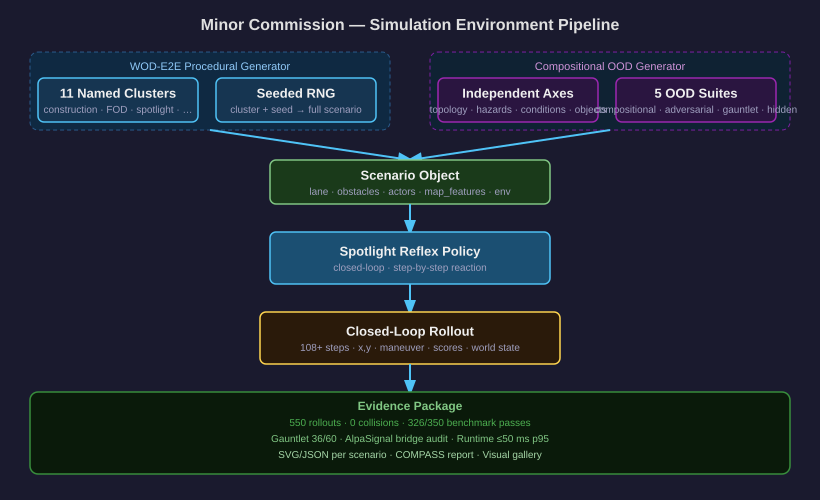

# Simulation Deep Dive: AlpaSim Integration and Custom Engineering

## System Diagrams

**Minor Commission — Simulation Environment Pipeline**


**AlpaSim Adapter Bridge**


**Spotlight Reflex navigating a construction scenario**


**Spotlight Reflex navigating a spotlight/long-tail scenario**


**Foreign object debris scenario**


---

## Overview

The simulation track has two layers:

1. **Custom abstract simulator** — a purpose-built 2D closed-loop simulator
   written entirely from scratch for this project (`src/minimal_shot_av/simulator/`).
   This is the primary evaluation environment for the Minor Commission submission.

2. **AlpaSim integration** — an adapter layer that plugs the Spotlight Reflex
   policy into Waymo's AlpaSim sensor-realistic simulator as a trajectory model
   plugin. This demonstrates deployability beyond the abstract simulator.

These two layers are clearly separated. The abstract simulator is used for
all COMPASS benchmarks, scenario sweeps, and Minor Commission evidence.
The AlpaSim adapter is an additional integration path evaluated separately.

---

## Part 1: What AlpaSim Provides

AlpaSim is Waymo's closed-loop simulation platform. It provides:

- Sensor-realistic simulation (photorealistic camera rendering, lidar, radar)
- Multi-agent scenario orchestration
- A trajectory model plugin protocol under `alpasim.models` Python entry points
- The `BaseTrajectoryModel` abstract interface that all trajectory models must implement
- `DriveCommand` (LEFT, STRAIGHT, RIGHT, UNKNOWN) as the high-level route command
- `PredictionInput`: camera images (named camera → list of frames), speed,
  acceleration, ego pose history, route command
- `ModelPrediction`: trajectory_xy (N×2 float32), headings (N,), reasoning_text (str)
- `ModelConfig`: Hydra/OmegaConf config for model hyperparameters
- Aggregate metrics output: collision_at_fault, offroad, dist_to_gt_trajectory,
  safety_monitor_triggered, plan_deviation

The AlpaSim driver service discovers trajectory models through entry points at
install time. It manages scene loading, sensor rendering, and calling the model's
`predict` method at each control step.

---

## Part 2: What Was Engineered (Custom Code)

### 2.1 SpotlightReflexAlpaSimModel

**File:** `src/minimal_shot_av/simulator/alpasim_spotlight.py`

This is the core adapter class. It implements `BaseTrajectoryModel.predict()` and
translates between AlpaSim's input/output protocol and the Spotlight Reflex
policy.

The design problem: AlpaSim gives us cameras, speed, acceleration, and a route
command. Spotlight Reflex needs an explicit obstacle-field, a lane-center spline,
and world state. These representations are completely different.

The engineering challenge was to bridge these worlds without:
- importing AlpaSim internals into the Spotlight policy
- importing WOD/RFS code into the AlpaSim adapter
- using any AV training data

The solution uses three signal channels extracted from AlpaSim's `PredictionInput`:
1. **Route command → lane geometry** (always available)
2. **Camera brightness → visibility risk** (a lightweight proxy for bad weather, tunnel, night)
3. **Ego dynamics → braking risk** (speed + acceleration signal from emergency braking)
4. **Optional structured hazards** (if an upstream AlpaSignal layer provides them)

### 2.2 extract_alpasim_signal (alpasim_signal.py)

**File:** `src/minimal_shot_av/simulator/alpasim_signal.py`

This module extracts structured signal from a raw `PredictionInput` object
without knowing its exact type, using attribute-name probing:

```python
def structured_hazards_from_input(prediction_input: Any) -> list[dict]:
    raw = _first_present_attr(prediction_input,
        ("structured_hazards", "hazards", "traffic_hazards", "alpasignal"))
    ...
```

The attribute-name probing was necessary because AlpaSim's schema evolved
between versions and the exact field names for optional hazard metadata were
not guaranteed. The code tries four possible attribute names and falls back
gracefully.

**visibility_risk_from_cameras:**
```python
def visibility_risk_from_cameras(camera_images: dict) -> float:
    # Compute mean pixel brightness across camera frames
    # Return (0.35 - brightness) / 0.35 clamped to [0, 1]
    # Threshold at 0.35: below 35% mean brightness = risk
```

This heuristic converts camera brightness into a continuous risk signal.
A completely dark image (tunnel, night) gives risk = 1.0. A bright daytime
image gives risk = 0.0. This is lightweight — it doesn't run a vision model —
but it gives the policy a signal to act more cautiously in low-light conditions.

**dynamics_risk:**
```python
def dynamics_risk(speed_mps: float, acceleration_mps2: float) -> float:
    braking_risk = max(0.0, min(1.0, -acceleration_mps2 / 4.0))
    low_speed_risk = max(0.0, min(1.0, (1.5 - speed_mps) / 1.5))
    return max(braking_risk, low_speed_risk)
```

Hard braking (−4 m/s² or more) gives braking_risk = 1.0. Very low speed
(creeping or stopped) gives low_speed_risk = 1.0. Either signal triggers
more conservative candidate selection.

### 2.3 scenario_from_command

**File:** `src/minimal_shot_av/simulator/alpasim_signal.py`

This function translates the high-level AlpaSim `DriveCommand` into a
`Scenario` object that Spotlight Reflex can evaluate:

```python
def scenario_from_command(command: str, signal: dict = None) -> Scenario:
    lateral_goal = {"left": 16.0, "straight": 0.0, "right": -16.0}[command]
    lane_center = [
        (0.0, 0.0),
        (18.0, lateral_goal * 0.12),
        (38.0, lateral_goal * 0.45),
        (62.0, lateral_goal * 0.82),
        (82.0, lateral_goal),
    ]
    obstacles = signal_obstacles(signal)
    actors = signal_actors(signal)
    return Scenario(width=100.0, height=60.0, lane_center=lane_center, ...)
```

The lane-center control points create a smooth sigmoid-shaped turn lane for
LEFT/RIGHT commands and a straight lane for STRAIGHT. This is a simplified
geometric model — it doesn't use the actual map from AlpaSim — but it gives
Spotlight Reflex a route spline to score trajectories against.

### 2.4 Signal-to-Obstacle Translation

**File:** `src/minimal_shot_av/simulator/alpasim_signal.py`

When AlpaSignal or an upstream perception layer attaches structured hazards
to `PredictionInput`, the bridge converts them to simulator `Obstacle` and
`Actor` objects:

**Static hazards → Obstacles:**
- Fields extracted with fallback: `x`/`forward_m`/`longitudinal_m`,
  `y`/`left_m`/`lateral_m`, `radius`/`radius_m`/`extent_m`,
  `width`/`width_m`, `length`/`length_m`, `heading`/`heading_rad`/`yaw_rad`
- Moving hazards (vx or vy > 0) are routed to Actors instead

**Moving hazards → Actors:**
- Behavior is inferred from: explicit `behavior` field, or from label/kind
  keywords: `wrong_way`, `cut_in`, `erratic_pedestrian`, `darting`
- Acceleration < −2 m/s² → `sudden_brake` behavior
- Slow pedestrian (speed < 0.6 m/s) → `hesitating` behavior
- Heading is resolved: for elongated vehicles or known behaviors, the explicit
  heading wins; otherwise velocity direction is used

**Caution zone fallback:**
If risk signals (visibility or dynamics) exceed 0.5 and no hazards are present,
a synthetic `caution_zone` obstacle is placed 10–18 m ahead. This ensures the
policy slows down in risky conditions even without explicit hazard data.

### 2.5 Trajectory Resampling (_resample_to_frequency)

**File:** `src/minimal_shot_av/simulator/alpasim_spotlight.py`

Spotlight Reflex generates 20-point, 5-second trajectories at 4 Hz. AlpaSim
may request a different output frequency (e.g., 10 Hz or 20 Hz). The resampler
uses linear interpolation over normalized time:

```python
source_t = np.linspace(1/20, 1, 20)  # 20 points, uniform
target_t = np.linspace(1/N, 1, N)    # N points requested
x = np.interp(target_t, source_t, trajectory_xy[:, 0])
y = np.interp(target_t, source_t, trajectory_xy[:, 1])
```

This preserves the trajectory shape while adapting to the AlpaSim control
frequency without requiring the policy to be aware of AlpaSim's timing.

### 2.6 Heading Computation

Headings are computed from trajectory finite differences:
```python
deltas = trajectory_xy - np.roll(trajectory_xy, 1, axis=0)  # approximate
headings = np.arctan2(deltas[:, 1], deltas[:, 0])
```

The first point uses zero delta (inherits from zero), so the initial heading
defaults to 0 (straight ahead in vehicle frame). AlpaSim requires headings
for its trajectory controller.

### 2.7 reasoning_text JSON

Every model prediction includes a `reasoning_text` JSON string with the full
decision explanation:

```json
{
  "adapter": "minimal_shot_av.simulator.spotlight_reflex",
  "command": "straight",
  "selected_maneuver": "slow_yield",
  "candidate_count": 9,
  "reference_count": 3,
  "selector_score": 86.3,
  "selector_effective_score": 82.1,
  "selector_3s_score": 86.0,
  "selector_5s_score": 86.3,
  "selector_3s_reference": "slow_yield",
  "selector_5s_reference": "slow_yield",
  "decision_reason": "obstacle_pressure:moderate,corridor:open",
  "obstacle_pressure": 0.42,
  "route_blockage": 0.31,
  "corridor_blocked": false,
  "left_clearance": 4.2,
  "right_clearance": 5.1,
  "preferred_escape_side": "right",
  "alpasim_signal": {...}
}
```

This lets AlpaSim reviewers inspect the exact reasoning behind each trajectory
choice rather than treating the model as a black box.

### 2.8 Hydra Configuration

The AlpaSim driver is configured via Hydra. The `spotlight_reflex` driver config
is packaged within the module at `minimal_shot_av.simulator.alpasim_configs`.
This means the config is discoverable by AlpaSim's driver service without
modifying AlpaSim's own config directory.

The AlpaSignal bridge audit verified all configuration paths with deterministic
test inputs.

---

## Part 3: Custom Abstract Simulator

### 3.1 Environment

**File:** `src/minimal_shot_av/simulator/environment.py`

The abstract simulator uses a 2D top-down coordinate system. Key types:
- `Scenario`: width, height, lane_center spline, lane_half_width, obstacles,
  actors, start, goal, seed, cluster, tags, map_features, environment
- `Obstacle`: x, y, radius, kind, label, length, heading
- `Actor`: actor_id, kind, position, dimensions, heading, speed, vx, vy,
  behavior, role
- `Tick`: scenario state at a specific time step (actors propagated forward)

The simulation tick propagates actors using their behavior models:
- `linear`: constant velocity
- `cut_in`: merges toward ego lane
- `swerve`: oscillates laterally
- `darting`: erratic animal-like motion
- `erratic_pedestrian`: random direction changes
- `sudden_brake`: decelerates sharply
- `hesitating`: slow with random stops
- `wrong_way`: approaches head-on

### 3.2 WOD-E2E Scenario Generator

**File:** `src/minimal_shot_av/simulator/wod_scenarios.py`

The generator creates procedural scenarios for all 11 WOD-E2E named clusters.
Each cluster uses a seeded Python `random.Random` to reproducibly generate:
- Lane geometry (control points, curvature)
- Cluster-specific obstacles (e.g., cones for construction, FOD objects)
- Typed dynamic actors (pedestrians, cyclists, cut-in vehicles)
- Map features (crosswalks, lane closures, merge zones, conflict zones)
- Environment conditions (weather, visibility fraction, time of day,
  road surface friction, sensor latency budget)
- Tags (cluster name, obstacle count, actor roles, weather)

**Corridor clearance contract:**
A `_repair_static_corridor` function ensures that static obstacles never fully
block the primary route by removing obstacles within `corridor_clearance(cluster)`.
This separates ambient scene texture from deliberate hard decision points — the
cluster-specific blocking hazard is placed intentionally, while background
objects don't accidentally block the route.

**Lane geometry by cluster:**
```python
# Single-lane and construction: narrow (5.2–6.8 m half-width)
# Multi-lane and cut-in: wide (9.0–11.5 m half-width)
# Others: default (7.0–9.5 m half-width)
```

### 3.3 Compositional OOD Generator

**File:** `src/minimal_shot_av/simulator/compositional_scenarios.py`

The compositional generator samples scenario components independently:
- **Topology**: straight, gentle curve, sharp curve, S-curve, T-intersection,
  Y-junction, roundabout, narrowing
- **Hazard modules**: each module has its own blocking hazard type and corridor
  clearance contract (construction cones, parked vehicle, crossing pedestrian,
  debris, cyclist group, etc.)
- **Novel object types**: road sweeper, livestock, large rock, fallen tree,
  overturned vehicle, shopping trolley, etc.
- **Weather/conditions**: rain, fog, snow, night, glare, wet road, ice
- **Visibility fraction**: sampled per scenario (0.4–1.0)
- **Sensor latency budget**: sampled per scenario (15–80 ms)

The compositional suite makes memorization much harder than named clusters
because topology and hazard type are sampled independently.

### 3.4 COMPASS Benchmark

**File:** `src/minimal_shot_av/simulator/compass.py`

COMPASS is a structured benchmark that runs the policy across multiple scenarios
and suites and computes a composite score with four weighted components:
- **Oracle score**: can any candidate match the goal?
- **Reasoning score**: does the policy's reasoning match the scenario structure?
- **Recovery score**: does the policy recover from near-miss situations?
- **Generalisation gap**: performance on adversarial vs easy scenarios

The benchmark is profile-driven — all weights, thresholds, and scenario
parameters are in JSON config. Hardcoded benchmark assumptions do not exist
in the source.

### 3.5 Safety Certification Framework

**File:** `src/minimal_shot_av/simulator/certification.py`

A SOTIF-aligned evidence package that requires a statistically sufficient number
of zero-collision runs at each ODD level. At the 1% collision-confidence threshold,
381 zero-collision ranked runs are required per level — confirming this is
evidence infrastructure, not a production certification.

### 3.6 Evidence Results (Minor Commission)

Bundled OOD sweep results (350 rollouts across all suites):
- 0 collisions across all 350 rollouts
- 326/350 benchmark passes (93.1%)
- Gauntlet pass rate: 36/60 (60%) — intentionally not saturated
- Mean step latency: well under 50 ms p95 budget

---

## Part 4: The Boundary

**What is original engineering in this project:**
- The entire abstract 2D simulator (`environment.py`, `policy.py`, `perception.py`,
  `world_model.py`, `trajectory_selector.py`, `safety.py`, `render.py`,
  `vehicle_command.py`, `planner.py`)
- The Spotlight Reflex policy (`spotlight_reflex.py`)
- The WOD-E2E procedural scenario generator (`wod_scenarios.py`)
- The compositional OOD generator (`compositional_scenarios.py`)
- The COMPASS benchmark system (`compass.py`)
- The AlpaSim adapter (`alpasim_spotlight.py`, `alpasim_signal.py`)
- The AlpaSignal bridge (`alpasim_signal.py`)
- Evidence import pipeline (`neutral/alpasim_metrics.py`)

**What AlpaSim provides:**
- The `BaseTrajectoryModel` interface and entry-point registration protocol
- `DriveCommand`, `ModelPrediction`, `PredictionInput`, `ModelConfig` types
- The simulation physics, sensor rendering, and multi-agent orchestration
- Aggregate metrics output format (`metrics_results.txt`)
- The `alpasim-info` discovery command

**The boundary is clean:** the adapter depends on AlpaSim types only through
optional imports with graceful fallbacks (stub classes when `alpasim_driver`
is not installed). The Spotlight Reflex policy itself has zero AlpaSim imports.
