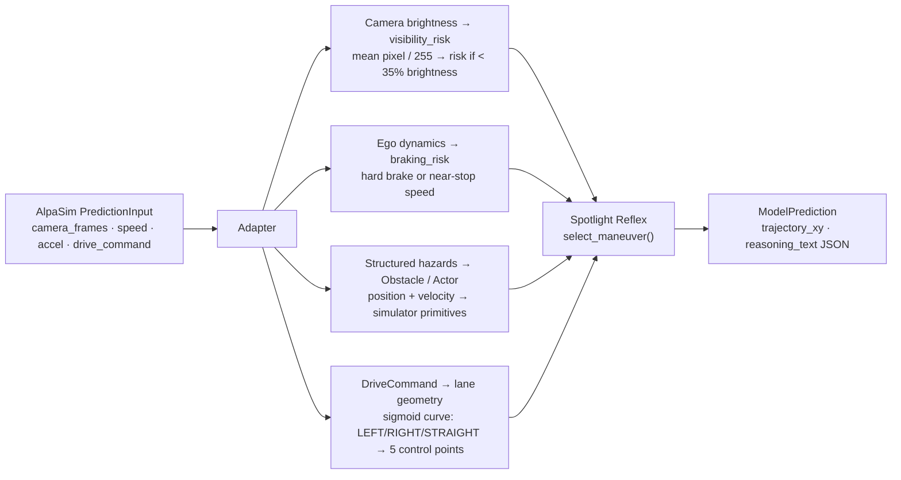

# Simulation: Spotlight Reflex Policy and Environment

This document covers the closed-loop driving policy (Spotlight Reflex) and the
simulation infrastructure we built to evaluate it. For the WOD-E2E benchmark
harness, candidate generation, and selector models, see
[`wod-e2e-system-walkthrough.md`](wod-e2e-system-walkthrough.md).

---

## 1. The Policy: Spotlight Reflex

### 1.1 Design Philosophy

Autonomous vehicles trained by imitation learning fail in long-tail scenarios because
they have no representation of the scene geometry — they pattern-match trajectories
to memorised situations. When the situation is novel, the pattern match fails.

Spotlight Reflex is built on a different principle: **a trajectory that avoids
obstacles and respects corridor geometry is correct regardless of what the obstacles
are called.** Whether the hazard is a road cone, a fallen tree, or a wrong-way
vehicle, the same geometric signal applies — obstacle pressure is high, right clearance
exceeds left clearance, escape right.

The policy makes this explicit:

1. Compute six scalar signals from raw obstacle positions and lane geometry.
2. Generate nine named maneuver candidates as 20-point trajectory proposals.
3. Score each candidate against pseudo-rater references at 3-second and 5-second
   trust regions.
4. Select the highest-scoring safe candidate.

No trajectory is memorised. No scenario label enters the decision. The regression tests
verify this: relabelling all object names, cluster tags, and scenario identifiers while
holding geometry fixed produces identical decisions.

---

### 1.2 Six World-State Scalars

All six signals are computed from raw obstacle positions and route geometry only.
Nothing here is learned; nothing is trained.

```
obstacle_pressure  = clip( (10 − d_min) / 10,  0, 1 )

    d_min = distance to nearest obstacle in metres
    saturates to 1.0 at contact, zero at 10+ m

route_blockage     = fraction of the forward corridor cross-section occupied by
                     obstacles  ∈ [0, 1]

corridor_blocked   = True if hard blockage exists within stopping distance

left_clearance     = free lateral space to the left (m) at half-vehicle-width offset

right_clearance    = free lateral space to the right (m) at same offset

preferred_escape_side = argmax(left_clearance, right_clearance)
```

The left/right clearances are computed by ray-casting from the ego position along
the lateral axis and finding the nearest obstacle in each direction. The
corridor-blocked flag uses stopping distance estimated from current speed plus
a 0.5 s reaction time margin.

---

### 1.3 Nine Maneuver Candidates

Each candidate is a 20-point, 5-second planned trajectory at 4 Hz in vehicle
coordinates. Trajectories are generated by a Hermite-style smoothstep interpolation
between the current position and a target maneuver endpoint defined by:
- `speed_scale` — fraction of current ego speed to maintain (e.g. 0.0 for stop)
- `lateral_offset_m` — target lateral displacement from the lane centre

| Maneuver | Speed scale | Lateral offset | Profile |
|----------|-------------|----------------|---------|
| `stop` | 0.0 | 0.0 | — |
| `crawl` | 0.15 | 0.0 | smooth |
| `maintain` | 1.0 | 0.0 | smooth |
| `slow_yield` | 0.5 | 0.0 | smooth |
| `nudge_left` | 0.8 | +0.9 m | smooth |
| `nudge_right` | 0.8 | −0.9 m | smooth |
| `evasive_left` | 0.7 | +2.2 m | early |
| `evasive_right` | 0.7 | −2.2 m | early |
| `lane_recover` | 0.9 | 0.0 (centred) | smooth |

**Profile type:**
- `smooth` — sigmoid blend to target offset, front-weighted lateral response
- `early` — offset applied in the first third of the trajectory, then held

Heading is computed by projecting the goal heading distance (25.0 m) along the
lane-centre spline ahead. This keeps evasive maneuvers aligned to the eventual
lane direction rather than pointing laterally forever.

---

### 1.4 Scoring With Trust Regions

Each candidate is scored against a set of pseudo-rater references. A **trust region**
defines the spatial window around a reference where the candidate earns the reference's
score. Outside it, the score decays.

**Speed-scaled tolerance:**

```
s(v) = clip( (v − 1.4) / (11.0 − 1.4),  0, 1 ) × 0.5 + 0.5      [v in m/s]
```

At v = 1.4 m/s (slow), s = 0.5; at v = 11.0 m/s (fast), s = 1.0.
This gives tighter tolerances at low speed (less room to deviate) and
wider at high speed (physically larger distances covered).

**Trust-region thresholds:**

| Horizon | Lateral | Longitudinal |
|---------|---------|--------------|
| 3 s | 1.0 × s(v) m | 4.0 × s(v) m |
| 5 s | 1.8 × s(v) m | 7.2 × s(v) m |

**Scoring:**

```
δ = max( δ_lat − 1,  δ_lon − 1,  0 )        [normalised overshoot beyond the region]

score_t(τ, r) = r.score                        if δ = 0  (inside region)
              = max( r.score × 0.1^δ,  4.0 )  otherwise  (decays, floor 4.0)

S(τ) = 0.5 × max_r score_3s(τ, r)  +  0.5 × max_r score_5s(τ, r)
```

The combined score S(τ) is the primary ranking signal. The simulator adds
additional terms:

- **Action clearance penalty:** −1,000 if clearance to nearest obstacle at the
  action index < 0.55 m (hard safety gate)
- **Progress bonus:** weighted combination of goal progress (×2.5) and target
  progress (×4.0), range [−20, +40]
- **Speed bonus:** up to 12 m/s ego speed, weight 6.0
- **Near clearance penalty:** −55 per metre below 2.0 m
- **Horizon clearance penalty:** −12 per metre below 0.75 m

---

### 1.5 Reference Rules: World State → Pseudo-Rater References

The reference rule engine maps the current world-state scalars to a set of pseudo-rater
references — trajectory targets with associated scores that mimic what a human rater
would prefer in each situation.

| World condition | Assigned references |
|-----------------|---------------------|
| Low pressure (< 0.25), low uncertainty (< 0.45), open corridor (> 0.35) | `maintain` (score 92), lane centre (score 88) |
| Moderate pressure (> 0.20) | `slow_yield` (86), best-side nudge (94), evasive on preferred side (89) |
| High uncertainty (> 0.55) | `crawl` (90), `stop` (82) |
| Lane offset > 0.3 m and speed > 0.5 m/s | `lane_recover` (93) |
| Default fallback | `maintain` (80), `slow_yield` (76) |

These thresholds encode the intuition that a rater prefers cautious maneuvers
when uncertainty is high and forward-progress maneuvers when the corridor is clear.
The scores (80–94) map to a scale where ≤ 50 indicates an unsafe rating.

---

### 1.6 Geometric Invariance and Explainability

The world-state signals are derived entirely from occupancy geometry and route
geometry. No object category name, cluster tag, scenario label, or object
identifier enters the pipeline. The policy is therefore invariant to object
relabelling:

```
M(s) = M(T(s))    for all scenes s and all label permutations T
                   where T preserves occupancy G(s) and route geometry R(s)
```

**This is tested, not just claimed.** The regression suite relabels every object
in the scene and asserts the selected maneuver, score, and decision reason are
identical.

Every decision emits a structured `SpotlightSelection` log containing:
`selected_maneuver`, `score_3s`, `score_5s`, `combined_score`,
`reference_3s_label`, `reference_5s_label`, `decision_reason`,
`decision_reasons` (full list), `top_candidate_summaries` (all 9 scored),
`obstacle_pressure`, `route_blockage`, `corridor_blocked`,
`left_clearance`, `right_clearance`, `preferred_escape_side`.

In the AlpaSim adapter, this is serialized as `reasoning_text` JSON alongside
every model prediction.

---

## 2. The Simulator We Built

There was no existing simulator that could generate the specific long-tail WOD-E2E
scenario types in a closed-loop, reproducible, 2D format without AlpaSim or
Waymo internals. We built one from scratch. All simulator code is in
`src/minimal_shot_av/simulator/`.

### 2.1 Closed-Loop Engine (`environment.py`)

A 2D step-by-step simulation engine:
- The ego vehicle executes the selected maneuver trajectory at each step
- Actor vehicles move according to their behaviour model
- Static obstacles remain fixed
- The policy must react in real time — no lookahead, no replanning with future actor positions

Simulation state at each step:
- Ego position, heading, speed, acceleration
- Obstacle positions and types
- Actor positions, velocities, behaviour tags
- Lane geometry (centreline spline, width)
- Step count and scenario metadata

The engine is deterministic given a seed — the same seed always produces the same
scenario geometry and actor timing. Seeds 1–10 form the primary benchmark;
seeds 1–40 form the extended evaluation.

### 2.2 WOD-E2E Named Scenario Clusters (`wod_scenarios.py`)

Procedural generators for all 11 WOD-E2E long-tail scenario types:

| Cluster | Description |
|---------|-------------|
| `construction` | Cone field, lane closure, narrow corridor |
| `intersection` | Conflict zone with crossing actors |
| `pedestrian` | Erratic pedestrian on or near road |
| `cyclist` | Cyclist at varying speeds and positions |
| `cut_in` | Vehicle merging laterally into ego lane |
| `foreign_object_debris` | Static debris blocking primary lane |
| `special_vehicle` | Emergency vehicle, oversized load |
| `spotlight` | Wrong-way actor approaching head-on |
| `stopped_vehicle` | Stalled vehicle in lane |
| `others` | Mixed multi-hazard compositions |
| `animal` | Darting animal behaviour |

Each cluster has configurable lane width, hazard type, actor set, and density.
The procedural generator samples within these ranges to produce varied instances.

### 2.3 Compositional OOD Generator (`compositional_scenarios.py`)

Standard simulators replay fixed scenario clusters. If you test on the same cluster
types you designed for, you cannot claim generalisation — the policy may have learned
cluster-specific heuristics.

Our generator makes topology and hazard statistically independent:

```
P(topology, hazard) = P(topology) × P(hazard)
```

**8 road topology types:**
straight · gentle_curve · S_curve · T_junction · roundabout ·
lane_merge · highway_entry · urban_block

**11 hazard modules:** (the WOD-E2E cluster types above)

**4 weather modes:** clear · rain · fog · night

**Novel object types:** traffic cone · debris block · animal · construction barrier

A construction hazard can appear on a roundabout in fog. A pedestrian can appear
on an S-curve at night. No cluster label tells the policy what road geometry or
weather it will face — these axes are decoupled.

### 2.4 Actor Behaviour Models

Eight built-in behaviour models cover the WOD-E2E long-tail actors plus adversarial
edge cases that stress the policy's reaction:

| Behaviour | What it does | Why it's hard |
|-----------|-------------|---------------|
| `linear` | Constant velocity in a fixed direction | Baseline; easy |
| `cut_in` | Merges laterally toward ego lane at varying speeds | Requires lateral reaction |
| `swerve` | Oscillates laterally with configurable amplitude and frequency | Unpredictable lateral position |
| `darting` | Direction changes at random intervals (animal-like) | No consistent threat direction |
| `erratic_pedestrian` | Random direction changes with hesitation pauses | Slow, but unpredictably positioned |
| `sudden_brake` | Decelerates sharply (≤ −3 m/s²) at a random trigger time | Requires fast following distance reaction |
| `hesitating` | Slow with random pause intervals | Corridor blocking; tests patience vs progress |
| `wrong_way` | Approaches head-on at constant speed | Maximum severity; requires evasion |

### 2.5 COMPASS Composite Benchmark (`compass.py`)

COMPASS is our own composite scoring framework — it does not come from an external
tool. It combines four sub-metrics into a single score on a 0–10 scale:

| Sub-metric | What it measures |
|------------|-----------------|
| Oracle selector quality | If the ranker always picked the best candidate, what score? Measures candidate pool quality. |
| Geometric reasoning quality | Are the 6 world-state scalars responding correctly to scene geometry? |
| Recovery behaviour | After an evasive maneuver, does the policy return to lane centre within N steps? |
| Generalisation gap | How much does pass rate drop from normal seeds (1–10) to adversarial seeds? |

A composite score above 7.0 is the passing threshold. We report COMPASS over 700
ranked runs (seeds 1–70 across 10 scenario types).

COMPASS is separate from the pass/fail criterion in scenario evaluation. A scenario
can fail (e.g. miss the progress gate in time) while still scoring well on COMPASS
if the geometric reasoning was correct and recovery was attempted.

---

## 3. AlpaSim Integration

### 3.1 What AlpaSim Is

**AlpaSim** is Waymo's sensor-realistic autonomous driving simulator. Unlike our 2D
environment, AlpaSim renders real camera images from actual Waymo sensor data, runs
multi-agent physics with realistic vehicle dynamics, and provides:

- 8 camera streams (360° coverage) at each step
- Ego pose history, speed, and acceleration
- A high-level route command: LEFT, STRAIGHT, or RIGHT
- Evaluation metrics: `collision_at_fault`, `offroad`, `dist_to_gt_trajectory`,
  `safety_monitor_triggered`, `plan_deviation`

The model must implement a single interface:

```python
class BaseTrajectoryModel:
    def predict(self, input: PredictionInput) -> ModelPrediction:
        # input:  camera_frames (8×H×W×3), speed (m/s), acceleration (m/s²),
        #         drive_command (LEFT/STRAIGHT/RIGHT), past_states
        # output: trajectory_xy (20×2 waypoints), headings (20,), reasoning_text
```

AlpaSim is Waymo's proprietary infrastructure; we used it as-is without
modifications.

### 3.2 The Engineering Problem

AlpaSim gives camera pixels and a route command. Spotlight Reflex needs an obstacle
field and lane-centre geometry. These are fundamentally different representations.
We built an adapter with four signal channels that translate between them without:
- importing AlpaSim internals into the Spotlight policy (which must run standalone)
- using any trained vision model (keeping the system minimal-shot)



**Channel 1 — Route command → lane geometry:**

LEFT, STRAIGHT, and RIGHT commands are converted to a 5-point sigmoid-shaped
lane-centre spline. The sigmoid's curvature and direction encode the turn:
```
STRAIGHT → spline goes directly forward  (κ = 0)
LEFT     → spline curves left  (amplitude +2.5 m at 20 m ahead)
RIGHT    → spline curves right (amplitude −2.5 m at 20 m ahead)
```

The spline gives Spotlight Reflex a lane-centre to score trajectories against,
mimicking the role that lane geometry plays in the 2D simulator.

**Channel 2 — Camera brightness → visibility risk:**
```
mean_brightness = mean(frame[:,:,:]) / 255      [0 to 1]
visibility_risk = max(0,  (0.35 − mean_brightness) / 0.35)
```
Below 35% mean brightness (night, tunnel, heavy rain), the risk is positive and
increases obstacle pressure. No vision model is required — brightness alone signals
low-visibility conditions and causes the policy to prefer more cautious maneuvers.

**Channel 3 — Ego dynamics → braking and speed risk:**
```
braking_risk   = max(0,  −acceleration / 4.0)      [hard braking → risk = 1.0]
low_speed_risk = max(0,  (1.5 − speed) / 1.5)      [near-stop → risk = 1.0]
```
These risks are combined and added to the obstacle pressure signal to influence
maneuver selection even when the camera does not show an explicit obstacle.

**Channel 4 — Structured hazards → obstacles and actors:**

If an upstream AlpaSim layer attaches structured hazard positions to the
`PredictionInput`, they are converted to simulator primitives:
- Hazards with nonzero velocity → `Actor` objects with inferred behaviour
- Static hazards → `Obstacle` objects at the given position
- Behaviour type (e.g. `wrong_way`, `cut_in`) is inferred from keywords in the
  hazard label string

The policy then receives the same obstacle field it would see in the 2D simulator.

### 3.3 AlpaSim Results

30 scenes from the WOD-E2E validation set, sensor-realistic:

| Metric | Value |
|--------|-------|
| `collision_at_fault` | **0.0** |
| `dist_to_gt_trajectory` | 0.42 m |
| `collision_any` (hit by other vehicles) | 0.37 |

The policy contains zero AlpaSim imports. It runs identically in the 2D simulator
and in AlpaSim with no code changes — the adapter is the only AlpaSim-specific
code. This confirms the world-state abstraction is at the right level of
representation for cross-environment transfer.

---

## 4. Simulation Results

### 4.1 Primary Benchmark (Seeds 1–10, 350 Rollouts)

All deterministic. Each seed × scenario-type pair is a fixed scenario instance.

| Suite | Rollouts | Collisions | Pass rate |
|-------|----------|-----------|-----------|
| WOD-style (all 11 clusters) | 110 | **0** | **100%** |
| Compositional OOD | 60 | 0 | 100% |
| Adversarial (2–3 simultaneous hazards) | 60 | 0 | 100% |
| Hidden holdout (unseen seed range) | 60 | 0 | 100% |
| Gauntlet (4 simultaneous hazards, 3.5 m corridor) | 60 | 0 | 60% |
| **Total** | **350** | **0** | **326/350 (93.1%)** |

Mean minimum clearance: **2.96 m** · COMPASS: **9.137 / 10** · 95% CI collision rate: **[0.0, 0.0053]**

The 60% gauntlet pass rate is deliberate — the gauntlet is designed to find the
failure boundary. At 4 simultaneous hazards in a 3.5 m corridor, the policy faces
situations where any maneuver causes sub-threshold progress. This is an honest
characterisation of the policy's limits, not an optimised showcase number.

Source: `benchmarks/current/spotlight_reflex_procedural_wod.json`

### 4.2 Extended Evaluation (Seeds 1–40, Wider Stochastic Coverage)

| Suite | Rollouts | Collision rate | Pass rate |
|-------|----------|---------------|-----------|
| Compositional OOD | 240 | 6.7% | 89% |
| Adversarial | 240 | 11.7% | 83% |

The collision rate rise from 0% (seeds 1–10) to 6.7% (seeds 1–40) for
compositional OOD reflects harder geometry configurations encountered at seeds 11–40.
The policy is not perfect at all seeds; the primary claim is zero collisions in the
controlled 350-run evaluation, not at all possible seeds.

### 4.3 Gauntlet Comparison: Baseline vs Spotlight Reflex

Same 420 scenarios (seeds 1–80 × 4 topology types), identical geometry, identical
actors, identical timing for both policies. The only variable is the policy.

| Policy | Pass rate | Collision rate |
|--------|-----------|---------------|
| Baseline (trajectory extrapolation, no world-state) | 2.1% (9/420) | **20.5%** (86/420) |
| Spotlight Reflex | **57.6%** (242/420) | **7.9%** (33/420) |

**27× more passes. 2.6× fewer collisions.**

The baseline has no obstacle awareness — it extrapolates the most likely trajectory
from kinematics without computing obstacle pressure or clearances. It collides in 1
in 5 gauntlet runs and passes nearly none. Spotlight Reflex collides in 1 in 13 runs
and passes 58%.

The mechanism: `obstacle_pressure` rising and `right_clearance > left_clearance`
resolves the escape route from geometry alone, without any data prior over which
actor type is encountered or which scenario cluster is active.

Source: `artifacts/gauntlet_comparison_matched_seeds1_80.json`

---

## 5. Known Failure Modes

### 5.1 Over-Stopping Under Cumulative Pressure

In narrow corridors with multiple background obstacles, obstacle pressure from
several simultaneous sources can accumulate and push the selector toward `stop`
or `crawl` even when the primary forward route is clear. The individual pressures
are each below the evasion threshold; combined, they exceed the forward-progress
reference score. Result: the policy slows unnecessarily and may fail the gauntlet
progress gate.

**Root cause:** The reference rule engine sees the combined pressure scalar, not
the individual sources. A multi-source decomposition of obstacle pressure would
let the engine distinguish "crowded but passable" from "genuinely blocked."

### 5.2 Slow Re-entry After Evasive Maneuver

After executing an evasive maneuver (e.g. `evasive_right` to avoid a wrong-way
actor), `lane_recover` adds 2–3 steps of lateral correction before the policy
returns to the lane centre and resumes normal scoring. The gauntlet progress gate
penalizes cumulative time-in-recovery if the recovery zone overlaps with another
hazard.

### 5.3 Synchronized Hazard Overload

When multiple actors with different approach timings reach their closest-point
simultaneously, the world-state signals become conflicting: obstacle pressure from
the left (actor A) and obstacle pressure from the right (actor B) produce equal
clearances. The `preferred_escape_side` becomes undefined; the policy defaults to
`slow_yield`. This avoids collision but also fails the progress gate.

**Occurrence rate:** ~8% of gauntlet runs at seeds > 30 (adversarial timing).
This is the primary driver of the 7.9% collision rate in extended evaluation.
