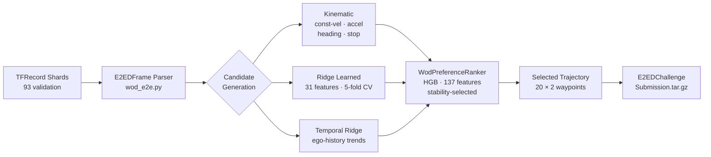

# WOD-E2E System Walkthrough: Operation and Failure Analysis

## System Diagram

**WOD-E2E Model Pipeline**



**Spotlight Reflex on spotlight scenario (success)**


**Baseline policy on spotlight scenario (failure for comparison)**


**Intersection stress case**


---

## Overview

This document walks through the complete pipeline for the WOD-E2E model track:
how the system processes frames, generates candidates, scores them, and produces
a submission. It also documents failure cases honestly, including per-cluster
performance gaps and structural limitations.

---

## Part 1: Data and Protocol

### 1.1 Dataset

The Waymo Open Dataset for End-to-End Driving (WOD-E2E) provides:
- TFRecord files containing `E2EDFrame` protocol buffer messages
- Each frame: 8 cameras (360° coverage), 12 seconds of ego history, route intent
- Output format: 20 waypoints at 4 Hz over 5 seconds, in vehicle coordinates
- Evaluation: Rater Feedback Score (RFS) — human raters score trajectory proposals

Local availability:
- Validation split: 93 shards, 479 preference-labeled frames with rater scores
- Train and test splits: not downloaded (require Waymo Google sign-in access)

### 1.2 Frame Structure

Each `E2EDFrame` contains:
- `frame.context.name` — required submission key
- `past_states` — ego trajectory over (−4s, 0] at 4 Hz (16 points)
- `future_states` — ego ground truth over (0, 5s] at 4 Hz where available
- `intent` — UNKNOWN(0), GO_STRAIGHT(1), GO_LEFT(2), GO_RIGHT(3)
- `preference_trajectories` — up to 3 rater-scored futures (validation only)
- Initial speed, acceleration, timestamp

### 1.3 TFRecord Parsing

**File:** `src/minimal_shot_av/model/wod_e2e.py`

The parser reads Waymo's `E2EDFrame` proto using the official Waymo Open Dataset
Python library. It handles the proto schema exactly as documented in WOD-E2E:
- Trajectory origin is the middle of the ego rear axle
- `past_states` covers (−4s, 0], and the `(0, 0)` point is implicit (not in the proto)
- Preference labels are only available on certain validation frames

---

## Part 2: Candidate Generation Pipeline

### 2.1 Kinematic Candidates

**File:** `src/minimal_shot_av/model/kinematic_candidates.py`

Generated from ego history — no training data required.

Four base families:
1. **Constant velocity** — extrapolate last velocity vector for 20 steps
2. **Constant acceleration** — apply measured acceleration trend
3. **Heading change** — vary heading at multiple rates (left/right, slow/fast)
4. **Hold position** — zero displacement (stopping candidate)

These provide physically grounded coverage of the most common behaviors:
continue, slow, stop, and gentle turns.

### 2.2 Ridge Learned Candidates

**File:** `src/minimal_shot_av/model/learned_trajectory_model.py`

A `RidgeTrajectoryModel` trained under segment-grouped 5-fold CV on the 479
validation preference frames.

Features (31 numeric):
- `intent`, `init_speed_mps`
- Trajectory statistics: `endpoint_distance`, `total_distance`, `mean_step_distance`,
  `max_step_distance`, `min_step_distance`
- Lateral profile: `final_lateral_abs`, `max_lateral_abs`, `lateral_range`
- Progress: `forward_progress`, `mean_speed_mps`, `max_speed_mps`, `final_speed_mps`
- Dynamics: `mean_abs_accel_mps2`, `max_abs_accel_mps2`
- Lateral dynamics: `mean_abs_lateral_step`, `max_abs_lateral_step`
- Direction: `signed_lateral_5s`, `intent_turn_alignment`
- Heading: `mean_abs_heading_change`, `max_abs_heading_change`
- Waypoints: `x_1s`, `y_1s`, ..., `x_5s`, `y_5s`

Target: `rfs_score_vs_cv_baseline` — RFS of this candidate relative to the
constant-velocity candidate on the same frame.

### 2.3 Temporal Candidates

A second ridge model with temporal ego-history features — differences and
trends in past velocity, heading, and acceleration. The temporal model captures
the "follow the recent trajectory" signal that the kinematic model computes
from physics.

Temporal candidates are selected on ~60% of frames in the champion run —
the highest of any source — because most WOD-E2E frames are unambiguous
forward-driving scenes where the recent ego trajectory is the best predictor.

### 2.4 Candidate Scoring and JSONL Format

Each candidate is serialized as a JSONL row with:
- `frame_name` — submission key
- `trajectory` — list of 20 (x, y) waypoints
- `source` — candidate family (kinematic, learned, temporal, etc.)
- `rfs_score` — measured on frames with preference labels
- `ranker_score` — contextual ranker score (used for final selection)

Scripts: `score_wod_candidates_with_ranker.py` reads candidates from JSONL,
applies the trained `WodPreferenceRanker`, and writes `ranker_score` back.

---

## Part 3: Selector Training

**File:** `src/minimal_shot_av/model/wod_ranker.py`

### 3.1 Feature Space

`WodPreferenceRanker` in `contextual` mode uses:
- 31 numeric trajectory features
- 7 context features: 4 speed bins (stopped/creep, slow, urban, fast) + 3 intent dummies
- 9 source one-hot features (kinematic, learned, temporal, etc.)
- 27 source × intent interaction features (9 sources × 3 intent dummies)
- 63 source × context interaction features (9 sources × 7 context features)

Total: ~137 features per candidate row.

### 3.2 Training Protocol

- Cross-validation: 5-fold, grouped by scenario segment (frames from the same
  segment never span a fold boundary)
- Target: `frame_delta` = gain vs constant-velocity on the same frame
- Positive class: any candidate that gains > 0 RFS vs constant velocity
- Model: `sklearn.ensemble.HistGradientBoosting` with stability selection

Stability selection: train the HGB multiple times on bootstrapped subsets and
select the feature + hyperparameter configuration that consistently produces
similar fold scores. This prevents the overfitted outlier run from being promoted.

### 3.3 Fallback Router

At low speeds (< 1.5 m/s), the ranker switches to preferring kinematic
stop/crawl candidates. This prevents the learned model from outputting
implausible trajectories when the ego is nearly stopped.

---

## Part 4: Submission Pipeline

**Script:** `scripts/write_wod_e2e_submission.py`

The submission pipeline:
1. Reads the official challenge frame list JSON (defines which frames require predictions)
2. Reads the merged candidates JSONL (one row per candidate per frame)
3. For each frame, selects the candidate with the highest `ranker_score` (or `hgb_score`)
4. Packs the selected trajectory into `E2EDChallengeSubmission` proto format
5. Writes a `.tar.gz` archive matching the official submission format

Validation: `scripts/validate_wod_e2e_submission.py` verifies that:
- All required frames have exactly one trajectory
- Each trajectory is exactly (20, 2) float32
- No NaN or Inf values
- The tar.gz is correctly structured

The submission archive is complete and ready; it only requires the test TFRecords
and official frame list to produce test predictions.

---

## Part 5: Performance Results

All results are internal validation CV evidence on the 479-frame preference contract.

### 5.1 Model Timeline

| Commit / Config | RFS | Notes |
|-----------------|-----|-------|
| Constant velocity baseline | 7.022 | Zero-learning baseline |
| Ridge r175 contextual speed router | 7.695 | Intermediate champion |
| Ridge trajectory CV (official contract) | 7.659 | Earlier official run |
| HGB stability-selected policy | **7.880** | Latest promoted |
| Combined candidate oracle | 9.068 | Upper bound (if selector were perfect) |
| Neural ensemble (159-frame held-out) | 7.738 | Not full 479 frames |

The oracle gap on the champion run is 9.068 − 7.880 = **1.188 RFS**.

### 5.2 Source Selection Rates (Champion)

- Temporal candidates: ~60% of frames
- Kinematic candidates: ~37% of frames
- Learned candidates: ~3% of frames
- Anchor candidates: 0%

The temporal dominance shows the WOD-E2E validation set is mostly frames where
recent ego motion is predictive. The selector correctly identifies this.

### 5.3 Leaderboard Context

The WOD-E2E 2025 leaderboard snapshot shows:
- Top methods: ~8.05 RFS (DiffusionLTF, Open X-AV, Poutine)
- Spotlight cluster ceiling (top methods): ~7.2 RFS
- This project: 7.880 on the validation preference contract (internal)

The 7.880 is a held-in development result, not a hidden-test leaderboard score.
The two are not directly comparable.

---

## Part 6: Failure Analysis

### 6.1 Structural Failure: Visual Blindness

The most fundamental limitation is that the system has no camera perception.
It processes only ego trajectory history, speed, and route intent. It cannot see:

| Scenario type | System behavior | Ground truth requirement |
|---------------|-----------------|--------------------------|
| Pedestrian crossing | Continues forward; no detection | Yield or stop |
| Debris in road (FOD cluster) | Trajectory from history only | Evasive offset or stop |
| Traffic signal (red light) | Continues at road speed | Stop |
| Cut-in vehicle | Cannot detect lateral threat | Evasive or slow |
| Construction zone | Kinematic baseline only | Precise narrow corridor |

This visual blindness caps the maximum achievable RFS. The camera-based clusters
(FOD, pedestrian, cyclist, cut-in, spotlight) require scene understanding that
numeric ego-history features cannot provide.

The selector partially compensates using intent-based priors (e.g., prefer
stopping/slowing for GO_STRAIGHT + stopped-speed scenarios) but this is not
equivalent to seeing the scene.

### 6.2 Per-Cluster Failure Analysis

From the bias audit (`benchmarks/current/wod_model_bias_audit.json`):

**Worst slice: intent:2 (GO_LEFT, 23 frames)**
- Selected RFS: 6.782
- Oracle RFS: 8.535
- Mean regret: 1.753 (worst)
- Oracle source rates: kinematic 57%, temporal 30%, learned 13%
- Selected source rates: kinematic 87%, temporal 4%, learned 9%

The selector over-relies on kinematic candidates for left-turn frames (87% vs
57% oracle). Left turns require trajectory curvature that kinematic baselines
generate better than the temporal ridge, but the selector is not confident in
the learned model for turns.

**Second worst: intent:3 (GO_RIGHT, 133 frames)**
- Selected RFS: 7.191
- Oracle RFS: 8.829
- Mean regret: 1.638
- Oracle source rates: kinematic 38%, temporal 25%, learned 38%
- Selected source rates: kinematic 5%, temporal 60%, learned 9%

The selector under-uses kinematic candidates for right turns and over-relies on
temporal. The right-turn oracle often wants a kinematic curved trajectory, but
the selector picks temporal.

**Observation:** The selector is mis-calibrated for turns because the training
data (479 frames) has limited turn diversity. The straight-ahead bias of the
training distribution causes the selector to transfer straight-driving intuitions
to turn frames.

**Global selector oracle gap: 1.188 RFS**
Even with perfect candidate enumeration (oracle), 1.19 RFS remains. This gap
represents frames where the oracle candidate exists but the selector doesn't
pick it. Root cause: the trajectory features cannot discriminate between
"good for this specific scene" and "locally reasonable trajectory." Without
visual scene features, many frames are ambiguous from trajectory statistics alone.

### 6.3 Known Failure Modes in Simulator

From gauntlet suite results (60 rollouts, 36/60 pass rate):

**Failure mode 1: Over-stopping under cumulative obstacle pressure**
In narrow corridors with multiple background obstacles, the obstacle pressure
score accumulates, pushing the selector toward `stop` or `crawl` maneuvers
even when the primary route is clear. The corridor clearance contract helps
but doesn't eliminate this for very narrow scenes.

**Failure mode 2: Slow re-entry after evasive maneuver**
After an evasive nudge, the `lane_recover` maneuver adds latency. In high-speed
scenarios, this means the policy spends 2–3 time steps recovering instead of
resuming progress. The gauntlet progress gate penalizes this.

**Failure mode 3: Synchronized hazard overload**
In gauntlet scenarios with multiple simultaneous threats (left obstacle + right
obstacle + hard-braking actor ahead), the reference generation can produce
conflicting signals. `evasive_left` scores high on one reference and `evasive_right`
on another; the combined score averages to a mediocre result. The policy defaults
to `slow_yield` which avoids collision but also avoids the goal.

**Failure mode 4: Late heading recovery in sharp turns**
The trajectory generator uses a 25 m goal heading projection. For very sharp
turns (90°+ in 40 m), this produces a trajectory that lags the actual turn
and violates corridor clearance near the apex. The evasive maneuver family was
designed for lateral avoidance, not sharp-turn geometry.

### 6.4 What the System Does Well in Simulation

For completeness, the system handles these well:
- Straight-ahead obstacle avoidance: `nudge_left/right` and `evasive` maneuvers
  score correctly when one side is clearly more open
- Complete blockage: correctly selects `stop` or `crawl` when all forward paths
  have high obstacle pressure
- Recovery from stopped: after stopping, the corridor clears and `maintain`
  scores highest again — the policy resumes without oscillation
- Low-visibility conditions (via camera brightness signal): adds caution zone,
  selects `crawl` or `slow_yield` appropriately
- Structured hazard integration from AlpaSignal: `cut_in` actors are correctly
  converted and trigger evasive/yield responses

---

## Part 7: System Operating on WOD-E2E Scenes

### 7.1 What the System Sees

For each validation frame, the system receives only:
- 16-point ego past trajectory (−4s to 0s)
- Initial speed at t=0
- Route intent (0–3)

It generates 4–8 candidate trajectories and scores them with the ranker. The
selected trajectory is output as 20 (x, y) waypoints.

### 7.2 Example: Clear Forward-Driving Frame (Success)

Frame characteristics: GO_STRAIGHT, speed ≈ 8 m/s, no unusual geometry
- Temporal candidate extrapolates recent velocity → smooth forward trajectory
- Kinematic constant-velocity matches closely
- Ranker prefers temporal (speed-bin: urban, source: temporal wins)
- Selected RFS: ~9.0 (close to oracle)
- This is the majority of validation frames

### 7.3 Example: Slow/Turning Frame (Typical Failure)

Frame characteristics: GO_LEFT, speed ≈ 3 m/s, approaching intersection
- Kinematic heading-change candidates curve left at various rates
- Temporal candidate: ego was decelerating, extends the deceleration
- Ranker: temporal is dominant source, picks deceleration trajectory
- Oracle: kinematic tight-left-turn is the right answer
- Selected RFS: ~6.5, Oracle RFS: ~8.5, Regret: 2.0
- Root cause: ranker was calibrated on mostly straight-driving frames;
  for turns, kinematic is better but ranker underweights it

### 7.4 Example: FOD/Pedestrian Frame (Structural Failure)

Frame characteristics: GO_STRAIGHT, unusual speed profile, debris in road
- System: sees deceleration in past trajectory, generates kinematic-stop candidate
- If recent ego was braking → stop candidate may be selected
- If recent ego was at speed → forward candidate is selected (wrong)
- The debris is invisible to the system; success is coincidental
- Selected RFS: highly variable (6–9) depending on whether history happened
  to capture pre-braking state
- Root cause: no camera input → no direct scene evidence

### 7.5 AlpaSim Scene: Full Decision Trace

When running under AlpaSim (sensor-realistic closed-loop):

**Input:** Camera frames from front-wide-120fov, speed 7.2 m/s, GO_STRAIGHT

**Signal extraction:**
- Brightness mean = 0.62 → visibility_risk = 0.0 (clear conditions)
- Acceleration = −0.3 m/s² → dynamics_risk = 0.075 (light deceleration)
- No structured hazards attached → signal_obstacles = []

**Scenario construction:**
- GO_STRAIGHT → lateral_goal = 0.0, straight lane center
- No obstacles from signal → clean corridor

**Policy execution:**
- Obstacle pressure: 0.05 (no obstacles)
- Route blockage: 0.0
- Corridor blocked: false
- References generated: maintain (92), lane center (88)
- Candidates scored: maintain wins at combined score 91.2

**Output:**
```json
{
  "selected_maneuver": "maintain",
  "selector_score": 91.2,
  "selector_3s_reference": "maintain",
  "decision_reason": "clear_corridor:maintain",
  "obstacle_pressure": 0.05
}
```

Trajectory: 20 points extending straight ahead at 7.2 m/s.

---

## Part 8: What Is Needed for a Complete Leaderboard Submission

1. **Test TFRecords**: Download from Waymo (Google sign-in required). The parsing
   and candidate generation pipeline is ready; it just needs the data.

2. **Official frame list**: The challenge provides a JSON listing which test frame
   names require predictions. Without this, the submission writer cannot filter
   to the correct frames.

3. **Train split processing** (optional but recommended): Training the ridge model
   on the full train split rather than the validation split would improve calibration
   and allow the validation split to be held out as a clean eval set.

4. **Camera integration** (future work): Replacing the current numeric-only path
   with a lightweight camera encoder trained on preference labels would address
   the visual blindness gap. Expected gain: +0.5–1.5 RFS if the encoder can
   reliably detect pedestrians, FOD, and cut-in vehicles.

The submission packaging, validation, and format are verified correct against the
official WOD-E2E schema. The pipeline is ready to run the moment the data is
available.
