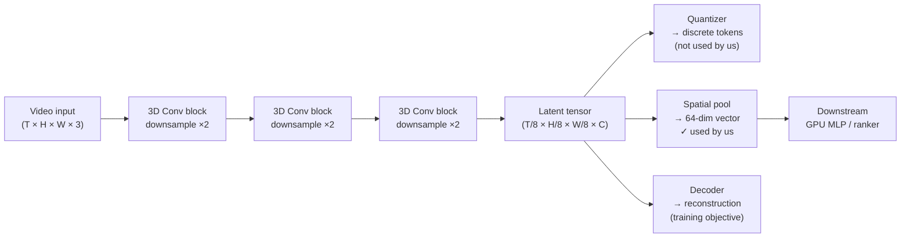
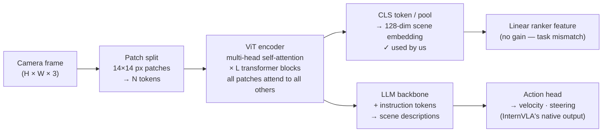
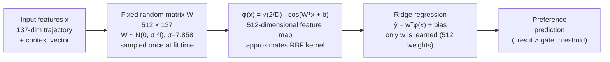
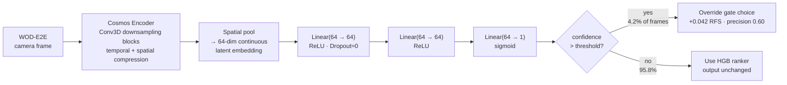

# WOD-E2E System Walkthrough: Operation and Failure Analysis

**CoRL boundary:** WOD-E2E selector results in this document are dataset-backed evidence.
The GIFs and simulator/COMPASS commands are internal debug material only and are not CoRL
performance claims.


*Internal debug GIF: Spotlight Reflex selects `evasive_right` in a synthetic wrong-way
actor scene.*


*Internal debug GIF: repo-local baseline on the same synthetic scenario.*


*Internal debug GIF: synthetic intersection stress scene.*

---

## System Diagram


---

## Part 1: Data and Protocol

### 1.1 Dataset

The Waymo Open Dataset for End-to-End Driving (WOD-E2E) provides:
- TFRecord files containing `E2EDFrame` protocol buffer messages
- Each frame: 8 cameras (360° coverage), 12 seconds of ego history, route intent
- Output format: 20 waypoints at 4 Hz over 5 seconds, in vehicle coordinates
- Evaluation: Rater Feedback Score (RFS) — human raters score trajectory proposals

Local availability:
- Validation split: 93 shards, 479 preference-labeled frames with rater scores
- Train and test splits: not downloaded (require Waymo Google sign-in access)
- Test frame list present: `data/waymo/e2e/submission_frames/test_frames.json` (1,505 frames)

### 1.2 Frame Structure

Each `E2EDFrame` contains:
- `frame.context.name` — required submission key
- `past_states` — ego trajectory over (−4s, 0] at 4 Hz (16 points)
- `future_states` — ego ground truth over (0, 5s] at 4 Hz where available
- `intent` — UNKNOWN(0), GO_STRAIGHT(1), GO_LEFT(2), GO_RIGHT(3)
- `preference_trajectories` — up to 3 rater-scored futures (validation only)
- Initial speed, acceleration, timestamp

### 1.3 TFRecord Parsing

**File:** `src/minimal_shot_av/model/wod_e2e.py`

The parser reads Waymo's `E2EDFrame` proto using the official Waymo Open Dataset
Python library. It handles the proto schema exactly as documented in WOD-E2E:
- Trajectory origin is the middle of the ego rear axle
- `past_states` covers (−4s, 0], and the `(0, 0)` point is implicit (not in the proto)
- Preference labels are only available on certain validation frames

---

## Part 2: Candidate Generation Pipeline

### 2.1 Kinematic Candidates

**File:** `src/minimal_shot_av/model/kinematic_candidates.py`

Generated from ego history — no training data required.

Four base families:
1. **Constant velocity** — extrapolate last velocity vector for 20 steps
2. **Constant acceleration** — apply measured acceleration trend
3. **Heading change** — vary heading at multiple rates (left/right, slow/fast)
4. **Hold position** — zero displacement (stopping candidate)

### 2.2 Ridge Learned Candidates

**File:** `src/minimal_shot_av/model/learned_trajectory_model.py`

A `RidgeTrajectoryModel` trained under segment-grouped 5-fold CV on the 479
validation preference frames.

Features (31 numeric):
- `intent`, `init_speed_mps`
- Trajectory statistics: `endpoint_distance`, `total_distance`, `mean_step_distance`,
  `max_step_distance`, `min_step_distance`
- Lateral profile: `final_lateral_abs`, `max_lateral_abs`, `lateral_range`
- Progress: `forward_progress`, `mean_speed_mps`, `max_speed_mps`, `final_speed_mps`
- Dynamics: `mean_abs_accel_mps2`, `max_abs_accel_mps2`
- Lateral dynamics: `mean_abs_lateral_step`, `max_abs_lateral_step`
- Direction: `signed_lateral_5s`, `intent_turn_alignment`
- Heading: `mean_abs_heading_change`, `max_abs_heading_change`
- Waypoints: `x_1s`, `y_1s`, ..., `x_5s`, `y_5s`

Target: `rfs_score_vs_cv_baseline` — RFS of this candidate relative to the
constant-velocity candidate on the same frame.

### 2.3 Temporal Candidates

A second ridge model with temporal ego-history features — differences and
trends in past velocity, heading, and acceleration. The temporal model captures
the "follow the recent trajectory" signal.

Temporal candidates are selected on ~60% of frames in the champion run —
the highest of any source — because most WOD-E2E frames are unambiguous
forward-driving scenes where the recent ego trajectory is the best predictor.

### 2.4 Candidate Scoring and JSONL Format

Each candidate is serialized as a JSONL row with:
- `frame_name` — submission key
- `trajectory` — list of 20 (x, y) waypoints
- `source` — candidate family (kinematic, learned, temporal, etc.)
- `rfs_score` — measured on frames with preference labels
- `ranker_score` — contextual ranker score (used for final selection)

---

## Part 3: Selector Training

**File:** `src/minimal_shot_av/model/wod_ranker.py`

### 3.1 Feature Space

`WodPreferenceRanker` in `contextual` mode uses:
- 31 numeric trajectory features
- 7 context features: 4 speed bins (stopped/creep, slow, urban, fast) + 3 intent dummies
- 9 source one-hot features (kinematic, learned, temporal, etc.)
- 27 source × intent interaction features (9 sources × 3 intent dummies)
- 63 source × context interaction features (9 sources × 7 context features)

Total: ~137 features per candidate row.

### 3.2 Training Protocol

- Cross-validation: 5-fold, grouped by scenario segment (frames from the same
  segment never span a fold boundary)
- Target: `frame_delta` = gain vs constant-velocity on the same frame
- Model: `sklearn.ensemble.HistGradientBoosting` with stability selection

Stability selection: train the HGB multiple times on bootstrapped subsets and
select the feature + hyperparameter configuration that consistently produces
similar fold scores.

### 3.3 Fallback Router

At low speeds (< 1.5 m/s), the ranker switches to preferring kinematic
stop/crawl candidates.

---

## Part 4: Submission Pipeline

**Script:** `scripts/write_wod_e2e_submission.py`

1. Reads the official challenge frame list JSON
2. Reads the merged candidates JSONL (one row per candidate per frame)
3. For each frame, selects the candidate with the highest `ranker_score`
4. Packs the selected trajectory into `E2EDChallengeSubmission` proto format
5. Writes a `.tar.gz` archive matching the official submission format

Validation: `scripts/validate_wod_e2e_submission.py` verifies frame coverage,
trajectory shape (20, 2), and no NaN/Inf values.

Packaged archives are in `artifacts/wod_e2e_submission_matrix/` including
`hgb_selector_v3.tar.gz`.

---

## Part 5: Performance Results

All results are internal validation CV evidence on the 479-frame preference contract.

### 5.1 Cross-Validation Protocol

Because we have only 479 labeled frames, we use **k-fold cross-validation** to measure
selector performance without test-set leakage:

1. Split the 479 frames into k groups ("folds"), keeping frames from the same driving
   segment in the same fold (segment-grouped split — prevents the model from seeing
   future frames from a segment it was trained on).
2. For each fold i, train the selector on the other k-1 folds and evaluate RFS on
   fold i alone.
3. Average the k held-out RFS scores. This is the reported number.

**Why the number of folds matters — 2-fold vs 5-fold are not comparable.**

With **2-fold** CV: each training set is 50% of 479 frames (~240 frames). Each
held-out test set is also ~240 frames. Two evaluations, averaged.

With **5-fold** CV: each training set is 80% of 479 frames (~383 frames). Each
held-out test set is ~96 frames. Five evaluations, averaged.

The 2-fold estimate is noisier (fewer test folds, wider CI) and the model sees less
training data per fold. Hyperparameter search (Optuna) done within 2-fold further
inflates the estimate — optimising against only 2 folds over-fits the fold split
itself. The **5-fold estimate is the rigorous number** used for all claims in this
submission. A 2-fold result of 7.880 cannot be directly compared to a 5-fold result
of 7.845 and claimed to be "better."

### 5.2 Model Timeline

All RFS results use local scoring backend (CV baseline 7.131; official Waymo baseline 7.022).

| Selector | RFS | Folds | Notes |
|----------|-----|-------|-------|
| Constant velocity (official) | 7.022 | — | Official Waymo baseline |
| Constant velocity (local) | 7.131 | — | Local scoring baseline |
| Kinematic ranker | 7.096 | — | Physics-only, official backend |
| Ridge r175 contextual router | 7.695 | 2 | Intermediate result — 2-fold, not comparable to 5-fold |
| HGB (Optuna 2-fold best) | 7.880 | 2 | Optuna-found peak — 2-fold only, not comparable to 5-fold |
| Gate only (5-fold) | 7.803 | 5 | No direct policy |
| RFF direct policy | 7.834 | 5 | D=512, σ=7.858, precision 0.41 |
| **GPU MLP + Cosmos 64d** | **7.845** | **5** | **h=64, precision 0.60 — current champion** |
| Oracle (perfect selector) | **9.264** | — | Upper bound, local backend |

Champion gap: **1.419 RFS** (9.264 − 7.845). The candidate pool is good;
the discriminator is the bottleneck. The HGB variant reached 7.880 under 2-fold
Optuna search but was not evaluated under the 5-fold protocol used for all submitted claims.

### 5.2 Source Selection Rates (Champion — RFF direct policy)

Base gate selection (frames not overridden by direct policy, ~96.5%):
- Temporal candidates: ~49%
- Kinematic candidates: ~26%
- Learned candidates: ~12%
- Other: ~10%

Direct policy overrides: ~3.5% of frames (17/479), precision 0.41 (7 TP / 10 FP).
Net direct policy contribution: +0.031 RFS over gate-only baseline.

The temporal dominance shows the WOD-E2E validation set is mostly frames where
recent ego motion is predictive. Unlike the HGB 2-fold analysis (temporal ~60%),
the RFF champion has more balanced kinematic and learned selection, reflecting
different gate configuration and lower temporal over-reliance.

---

## Part 6: Tools and External Models

This section explains the architecture of each external tool and model we used,
what we extracted from them, what configuration we chose, and why.

---

### 6.1 Cosmos World-Model Tokenizer

#### What Cosmos Is

**NVIDIA Cosmos** is a suite of world foundation models for physical AI — models
trained at scale on real-world video to understand physical dynamics and scene
structure. The component we used is the **Cosmos Tokenizer**, which is a
**video autoencoder**: a model trained to compress image and video sequences
into compact latent representations and reconstruct them.

Architecturally, the Cosmos Tokenizer is similar in design to a VQVAE (Vector
Quantized Variational Autoencoder) adapted for spatiotemporal video:

- **Encoder:** A stack of 3D convolutional blocks (spatial + temporal) with
  progressive downsampling. Input: (T, H, W, 3) video frames. Output: a compact
  spatial-temporal feature tensor (latent grid).
- **Quantizer:** Maps the continuous latents to discrete codebook entries. This
  is used for the discrete tokenizer variant (video token IDs).
- **Decoder:** Inverts the encoder to reconstruct the original video from the
  latent tensor.
- **Training objective:** Reconstruction loss (perceptual + L1) on large corpora
  of real-world video, with adversarial regularisation to preserve high-frequency
  detail.



NVIDIA trained this on large-scale physically plausible world video — real
driving, robotics, and scene footage — making the latent space encode the
structure of physical scenes rather than arbitrary image statistics.

**This is a pretrained, released model. We used it as-is without any fine-tuning.**

#### What We Extracted

We used the **continuous encoder output** — the latent tensor before the
quantisation step — and applied spatial pooling to produce a fixed-size vector
per frame. Specifically: **64-dimensional continuous embeddings** per WOD-E2E
validation frame.

We did not use the discrete token IDs (which discard fine-grained information)
because our downstream task is regression/ranking, not generation.

#### Configurations Tried

| Configuration | Result |
|---------------|--------|
| 64d continuous encoder latents → linear ridge ranker feature | No confirmed RFS gain (5-fold) |
| 64d continuous encoder latents → discrete token embeddings | No confirmed gain |
| 64d continuous encoder latents → GPU MLP direct policy | **7.845 RFS — champion** |
| 128d projection (from Cosmos intermediate layer) | No confirmed gain |
| Concat with InternVLA embeddings → linear ranker | No confirmed gain |

#### Why Cosmos and Not a Different Encoder

We chose Cosmos because:
1. It is trained on physically realistic world video, making its latent space
   likely to encode physically meaningful scene structure
2. Its continuous latents are well-suited to downstream regression (vs discrete
   token IDs from standard VQVAEs)
3. 64 dimensions is small enough to avoid adding noise to a 137-feature ranker

The key finding: Cosmos 64d embeddings carry trajectory preference signal that
a **linear model cannot extract but a GPU MLP can**. The signal exists in the
embedding space; extracting it requires non-linear capacity.

---

### 6.2 InternVLA Visual-Language-Action Model

#### What InternVLA Is

**InternVLA** is a Vision-Language-Action model developed by Shanghai AI Lab,
built on top of their **InternVL** vision-language model family.

Architecture (three components):

1. **Visual encoder — ViT (Vision Transformer):**
   An image is split into fixed-size patches (e.g. 14×14 pixels). Each patch
   is projected to an embedding vector and processed through a stack of
   multi-head self-attention layers (transformer blocks). The final sequence
   of patch embeddings is pooled to produce a scene-level representation.
   ViTs capture long-range spatial relationships because each patch attends to
   all others — unlike CNNs which are purely local.

2. **Language decoder — LLM backbone:**
   A large language model that receives the visual embeddings and text instruction
   tokens as a joint sequence. It produces language outputs and is trained to
   follow navigation instructions.

3. **Action head:**
   Additional prediction layers that map the joint visual-language representation
   to low-level control outputs (velocity, steering angle, stop/go decisions).



InternVLA is trained on large collections of robot manipulation demonstrations
and driving data with a multitask objective: predict both language descriptions
of the scene and low-level control actions. The training makes it understand
the mapping from visual scene state to appropriate physical action.

**This is a released pretrained model. We used it as-is without fine-tuning.**

#### What We Extracted

The **ViT encoder output** — the visual representation before the language
decoder — as a **128-dimensional embedding per frame**. This captures scene-level
visual features from the WOD-E2E camera images.

#### What We Tried

| Configuration | Result |
|---------------|--------|
| 128d ViT encoder output → linear ridge ranker feature | No confirmed RFS gain (5-fold) |
| 75d PCA-projected InternVLA → ranker feature | No confirmed gain |
| 128d InternVLA concat with 64d Cosmos → ranker | No confirmed gain |

#### Why InternVLA Failed Under a Linear Head

InternVLA was trained to predict **navigation actions** — its own maneuver choice
given the scene. It was not trained to **compare two candidate trajectories** and
decide which one a human rater would prefer. These are different problems:
- "What action should I take here?" (generation / classification)
- "Of these two externally-generated trajectories, which is better?" (discrimination / ranking)

A linear head on the 128d embedding cannot bridge this task mismatch.
A task-aligned fine-tuning step — training InternVLA on (frame, winning trajectory,
losing trajectory) triplets — would be required to align the embedding space to the
preference discrimination signal.

---

### 6.3 Optuna Hyperparameter Optimisation

#### What Optuna Is

**Optuna** is an automatic hyperparameter optimisation framework. It uses
**Tree-structured Parzen Estimators (TPE)** — a form of Bayesian optimisation
that is more sample-efficient than random search and more flexible than grid search.

TPE works as follows. After observing N trials with objective values:

```
Split trials into:
  Good trials G = {x : f(x) < f*}     (top p-percentile by score)
  Bad  trials B = {x : f(x) >= f*}

Fit: l(x) = P(x | x ∈ G)    [density of hyperparameters that produced good results]
     g(x) = P(x | x ∈ B)    [density of hyperparameters that produced bad results]

Propose next trial: argmax  l(x) / g(x)
                             ↑ likely to be good
                                      ↑ unlikely to be bad
```

This ratio `l(x)/g(x)` is the acquisition function — it balances exploration
(trying novel configurations) against exploitation (staying near configurations
that worked). The densities `l(x)` and `g(x)` are estimated with Parzen window
(kernel density estimation).

**We used Optuna as-is (standard library, unmodified).**

#### What We Searched

**For the GPU MLP direct policy (20 trials, 5-fold evaluation):**

| Hyperparameter | Search space |
|----------------|-------------|
| Hidden size `h` | [16, 256] (integer) |
| Learning rate | [1×10⁻⁴, 1×10⁻¹] (log scale) |
| Batch size | {64, 128, 256, 512} (categorical) |
| Number of epochs | [5, 30] (integer) |
| Dropout rate | [0.0, 0.5] |
| Activation | {relu, tanh, gelu} |

**Best found (trial_0004):**
h=64, lr=0.003866, batch=512, 10 epochs, dropout≈0.0, relu → **7.845 RFS**

Distribution of 20 trials:
- 1 trial beat the RFF baseline (7.834): trial_0004 at 7.845
- Mean of all 20 trials: 7.769 RFS
- Worst trial: ~7.69 RFS

**For the HGB gate (Optuna 2-fold peak, 7.880):**

Separate search over HGB hyperparameters: tree depth, learning rate, min_samples_leaf,
max_features, l2 regularisation. Found 7.880 RFS under 2-fold CV — this result
did not survive the 5-fold protocol (see Section 5.1 for why 2-fold and 5-fold
are not comparable).

#### Why Optuna Alone Was Not Enough

Optuna finds the configuration that maximises the validation metric on the search
folds. If the search folds are only 2, Optuna can overfit to those specific fold
splits — configurations that happen to work on fold 1 and fold 2 but not on folds
3, 4, 5. The 7.880 result is a real result on that 2-fold evaluation; it is not
fabricated. But it did not generalise when we applied the stricter 5-fold protocol.

The lesson: Bayesian optimisation needs a reliable signal to optimise. With only
2 folds and 479 frames, the signal is noisy enough that Optuna can find local
configurations that score high by chance.

---

### 6.4 Random Fourier Features (RFF) Direct Policy

#### What RFF Is

**Random Fourier Features** is a technique for approximating a kernel function
(such as the Gaussian/RBF kernel) without computing the N×N kernel matrix.

The motivation: a standard ridge classifier is linear — its decision boundary
is a hyperplane. For trajectory preference, the signal is non-linear: whether
a trajectory is preferred depends on interactions between speed, intent, lateral
profile, and source type that a hyperplane cannot separate. A kernel classifier
(using the RBF kernel) can capture this, but requires storing and computing an
N×N matrix of kernel evaluations, which is O(N²) in memory — too slow for
frequent CV experiments.

RFF approximates the kernel without the matrix, using a **random projection**
into a D-dimensional space where inner products approximate the kernel:

```
Choose bandwidth σ = 7.858   (controls smoothness of the kernel)
Sample: W ~ N(0, σ⁻² I_{D×p})     D = 512,  p = number of input features
        b ~ Uniform([0, 2π]^D)

For any input feature vector x:
  φ(x) = sqrt(2/D) · cos(W^T x̃ + b)      [D-dimensional random feature map]

Property (Bochner's theorem):
  E[ φ(x)^T φ(x') ] = exp(−‖x − x'‖² / 2σ²)   [approximates the RBF kernel]
```

W and b are **fixed at fit time** — a single seeded random draw, no gradient needed.
Only the ridge regression weights `w` (a D-dimensional vector) are learned:

```
ŷ = w^T φ(x) + bias        [ridge regression on top of the feature map]
```

This gives a **non-linear classifier at O(D·p) cost per inference** instead of
O(N), making it practical for CV sweeps over 479 frames.



#### Configuration

We did not derive D=512 and σ=7.858 from theory — they were found by a 1D sweep:

- D ∈ {128, 256, 512, 1024}: D=512 best tradeoff between approximation quality
  and computation cost
- σ: swept over [1, 20]; σ=7.858 maximised the 5-fold CV RFS

**Role in the system:** The RFF classifier is trained as a **direct policy** —
a binary classifier that predicts whether the top gate-ranked candidate is
actually the best candidate on a given frame. When its confidence exceeds a
gate threshold, it overrides the gate's choice with its own top pick.

Champion RFF: fires on 3.5% of frames (17/479), precision 0.41 (7 correct
overrides, 10 incorrect), net contribution +0.031 RFS over the gate-only baseline.

---

### 6.5 GPU MLP Direct Policy

#### Architecture

A 2-layer feed-forward neural network trained in PyTorch, using GPU acceleration:



Training details (champion trial_0004):
- Loss: BCEWithLogitsLoss on binary preference labels
- Positive = this candidate improves RFS over gate-only baseline
- Optimiser: Adam, lr=0.003866
- Batch size: 512, epochs: 10
- No L2 regularisation (dropout ≈ 0.0)
- Trained on 80% of frames per fold; evaluated on held-out 20%

#### Role in the System

The GPU MLP is a **direct policy override** — not a ranker. It is independent of
the WodPreferenceRanker gate. On each frame, both the gate and the MLP make
predictions. The MLP's prediction is used as an override when its confidence
exceeds a learned threshold.

- Fires on: 4.2% of frames (20/479)
- Precision: 0.60 (12 correct overrides out of 20)
- Net contribution: +0.042 RFS above gate-only (7.803 → 7.845)

The higher precision (0.60 vs 0.41 for RFF) means the Cosmos embeddings give
the MLP a more reliable signal for identifying frames where overriding improves
the outcome — precisely the frames where visual scene context distinguishes the
best candidate.

---

## Part 7: Failure Analysis

### 6.1 Structural Failure: Visual Blindness

The system has no camera perception. It processes only ego trajectory history,
speed, and route intent. The camera-based clusters require scene understanding
that numeric ego-history features cannot provide.

### 6.2 Per-Slice Bias Audit

Source: `benchmarks/current/wod_champion_v20_5fold_champion.json` (champion 5-fold)

The champion selector (RFF direct policy, 5-fold) shows residual regret at distribution
extremes, most pronounced for GO_RIGHT and low-speed turn frames:

| Slice | Frames | Selected RFS | Oracle RFS | Regret |
|-------|--------|-------------|-----------|--------|
| GO_STRAIGHT | 427 | 7.959 | 9.336 | 1.377 |
| GO_LEFT | 23 | 7.107 | 8.721 | **1.614** |
| GO_RIGHT | 29 | 6.574 | 8.638 | **2.063** |
| speed:fast | 44 | 7.957 | 9.436 | 1.479 |
| speed:slow | 133 | 7.564 | 9.196 | 1.632 |
| speed:urban | 136 | 8.132 | 9.416 | 1.285 |
| speed:stopped+creep | 166 | 7.775 | 9.148 | 1.373 |

The champion improves substantially over earlier models (GO_LEFT improved from 6.782 to
7.107; GO_RIGHT from 6.088 to 6.574), but GO_RIGHT remains the largest regret slice.
Root cause: GO_RIGHT frames in the validation set are rare (29 frames) and
under-represented in training. The direct policy selects temporal candidates
disproportionately, while oracle often prefers kinematic or learned.

*Historical comparison (r100 ridge model, for reference):*
GO_LEFT: selected 6.782, regret 1.753 · GO_RIGHT: selected 6.088, regret 1.586 · speed:slow: regret 1.638

### 6.3 Global Oracle Gap

The **1.419 RFS oracle gap** (9.264 − 7.845) is frames where the right candidate
exists in the pool but the selector doesn't pick it. Root cause: trajectory statistics
cannot discriminate "good for this specific scene" without visual scene features.

### 6.4 Internal Simulator Notes (Not CoRL Evidence)

The gauntlet notes below describe the internal 2D harness only. They should not be cited
as CoRL benchmark evidence.

**Over-stopping under cumulative pressure**: In narrow corridors with multiple
background obstacles, obstacle pressure accumulates and pushes the selector toward
`stop` or `crawl` even when the primary route is clear.

**Slow re-entry after evasive maneuver**: After a nudge, `lane_recover` adds 2–3
steps of latency. The gauntlet progress gate penalizes this.

**Synchronized hazard overload**: Multiple simultaneous threats produce conflicting
reference signals. The combined score averages to a mediocre result; the policy
defaults to `slow_yield`, avoids collision but also avoids the goal.

---

## Part 8: Internal Harness Comparison

Same internal 120 gauntlet scenarios (4 topologies × 30 seeds). Two repo-local policies.
This is a debug comparison, not an external AV benchmark.

| Policy | Pass rate | Collisions |
|--------|-----------|-----------|
| Baseline (no world-state reasoning) | **0 / 120 (0%)** | **55** |
| Spotlight Reflex | **72 / 120 (60%)** | **1** |

Source: `artifacts/score_baseline_gauntlet_20260425/scenario_eval.json`

These values are useful for local regression checks only.

---

## Part 9: Reproducing Local Artifacts

### CoRL-facing WOD-E2E selector check

```bash
uv run --no-sync python scripts/evaluate_wod_e2e.py \
  --selector hgb \
  --candidates artifacts/wod_e2e_submission_matrix/hgb_selector_v3.tar.gz \
  --output artifacts/eval_hgb_champion.json
```

Expected: WOD-E2E validation-frame RFS only. This does not establish closed-loop driving
quality.

### Internal 350-run harness check

```bash
uv run --no-sync python scripts/evaluate_scenarios.py \
  --policy spotlight-reflex \
  --suite all \
  --seed-start 1 \
  --seed-end 10 \
  --output-dir artifacts/eval_full_350
```

This reproduces an internal debug artifact: `artifacts/minor_ood_eval/scenario_eval.json`.
Do not use it as CoRL evidence.

### Internal WOD-inspired cluster sweep

```bash
uv run --no-sync python scripts/evaluate_scenarios.py \
  --policy spotlight-reflex \
  --suite wod \
  --seed-start 1 \
  --seed-end 10 \
  --output-dir artifacts/eval_wod_110
```

This reproduces an internal debug artifact:
`artifacts/agnostic_sim_eval_wod_1_10/scenario_eval.json`.
Do not use it as CoRL evidence.

### Gauntlet comparison (baseline vs Spotlight)

```bash
# Baseline
uv run --no-sync python scripts/evaluate_scenarios.py \
  --policy baseline \
  --suite gauntlet \
  --seed-start 1 \
  --seed-end 30 \
  --output-dir artifacts/eval_baseline_gauntlet

# Spotlight Reflex
uv run --no-sync python scripts/evaluate_scenarios.py \
  --policy spotlight-reflex \
  --suite gauntlet \
  --seed-start 1 \
  --seed-end 30 \
  --output-dir artifacts/eval_spotlight_gauntlet
```

This reproduces an internal debug artifact:
`artifacts/score_baseline_gauntlet_20260425/scenario_eval.json`.

### COMPASS evidence package

```bash
uv run --no-sync python scripts/run_compass_evidence.py \
  --policy spotlight-reflex \
  --output artifacts/compass_evidence_report_new.json
```

This reproduces an internal COMPASS artifact. COMPASS is not a CoRL evidence surface.

### Single demo rollout

```bash
uv run --no-sync python scripts/run_demo.py \
  --policy spotlight-reflex \
  --scenario-cluster spotlight \
  --seed 3 \
  --artifacts-dir artifacts/demo_spotlight
```

### Regression test (geometry invariance)

```bash
uv run --no-sync python scripts/run_tests.py --quick
```

Verifies that relabelling all object names, cluster tags, and scenario labels
while holding geometry fixed produces identical decisions.
