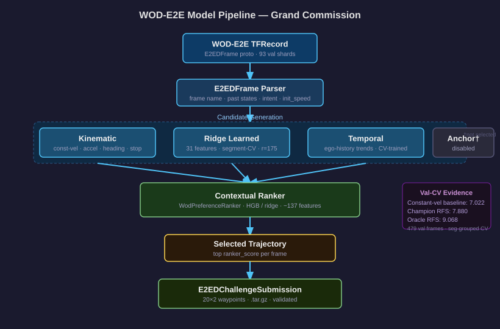
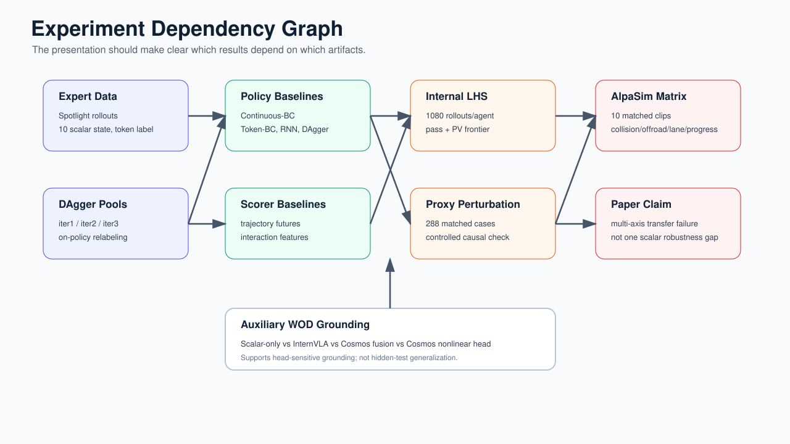
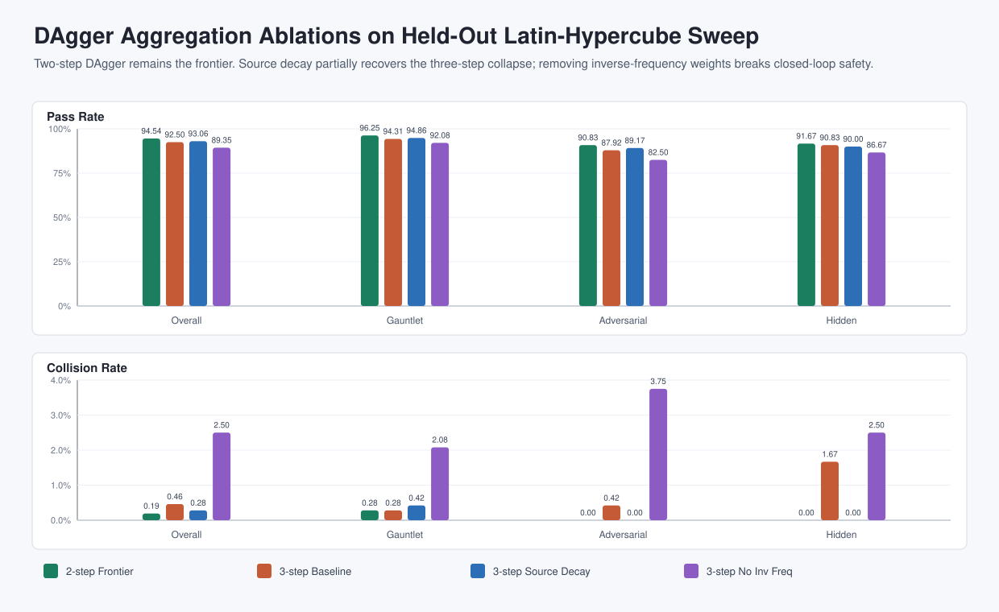

<!--
SOTA + CoRL 2027 presentation deck.
Render HTML:
  npx @marp-team/marp-cli presentation.md --html --allow-local-files -o presentation.html
Render PDF:
  npx @marp-team/marp-cli presentation.md --pdf --allow-local-files -o presentation.pdf
PDF export requires Chrome, Chromium, Edge, or Firefox on the host.
-->

# Minimal-Shot AV Evidence Deck

## Architecture, SOTA Submission Results, and CoRL Transfer Diagnostics

Alba Maria Tellez Fernandez<br>
Waymo Open Dataset E2E Challenge / SOTA + CoRL 2027 branch

---

# How to Read This Deck

This is not only a CoRL paper presentation.

It has two audiences:

| Audience | What they need | Claim boundary |
| --- | --- | --- |
| SOTA auditors | architecture, reproducibility, packaged evidence | submission candidate, not production |
| CoRL reviewers | mechanistic transfer diagnosis | diagnostic paper, not method dominance |

The architecture is the bridge between both.

---

# The Whole System in One Graph


Read left to right: runtime and simulator first, learning probes second, AlpaSim transfer third.

WOD grounding is auxiliary evidence for grounded candidate selection.

---

# What We Actually Built

| Component | Role | Why it matters |
| --- | --- | --- |
| Spotlight Reflex runtime | geometry-driven token selector | auditable minimal-shot policy |
| Custom simulator | closed-loop long-tail stress lab | controlled causal experiments |
| DAgger / scorer probes | learned baselines | tests what imitation learns |
| AlpaSim adapter | external transfer interface | exposes proxy-state mismatch |
| WOD-E2E harness | real-data selector benchmark | tests frozen grounding priors |

The repo is valuable because these pieces connect into one reproducible evidence chain.

---

# Runtime Architecture: Spotlight Reflex



Runtime path:

- obstacle and route geometry become scalar world-state
- 9 ManeuverTokens are generated
- reference rules score token futures
- selected token is executed by the controller

No object identity lookup. No episode lookup. No language prompt at runtime.

---

# Token Interface

The same token interface is used across the SOTA runtime, learned policies, and AlpaSim variants.

| Token family | Examples | Function |
| --- | --- | --- |
| stop / crawl / slow-yield | stop, crawl, slow_yield | longitudinal safety |
| nominal progress | maintain | forward route completion |
| mild lateral evasion | nudge_left, nudge_right | local clearance |
| strong lateral evasion | evasive_left, evasive_right | emergency separation |
| recovery | lane_recover | return to lane center |

This shared interface is why we can isolate selection failure from candidate-set failure.

---

# Simulator Architecture


The simulator is not the realism claim.

It is the controlled lab where we can hold dynamics fixed and perturb only policy-visible state.

---

# What the Simulator Lets Us Test

| Variable | Controlled how |
| --- | --- |
| scenario difficulty | WOD-style clusters, gauntlet, adversarial, hidden |
| distribution shift | Latin-hypercube sampled generator profiles |
| policy class | Spotlight, BC, RNN, DAgger, scorer, veto |
| proxy mismatch | heading bias, actor latency, route offset, lane scale, noise |
| outcome axis | collision, PV, lane, offroad, progress, distance-to-GT |

This is why the simulator results are useful for CoRL: they isolate mechanism before external validation.

---

# Visual Intuition

| Baseline failure | Geometry-grounded success |
| --- | --- |
|  |  |

Same scenario family: wrong-way actor under low visibility.

The baseline extrapolates into the hazard. Spotlight chooses an evasive token from geometry.

---

# AlpaSim Transfer Architecture


The policy binary stays fixed.

The transfer problem enters through the adapter:

- front-camera frames
- route commands
- ego dynamics
- sparse hazards

These are reconstructed into the scalar/token interface.

---

# AlpaSim Adapter View


What this slide is showing:

- real WOD-E2E front-camera frames
- adapter reconstruction of route and hazard signals
- same downstream scalar policy API

This is the proxy-state reconstruction gap made visible.

---

# Experiment Dependency Graph



The main paper result is not one table.

It is a chain: expert data -> DAgger/scorer probes -> internal LHS -> proxy perturbation -> AlpaSim transfer.

---

# SOTA Submission Status

| Gate | Status |
| --- | --- |
| Grand archive ready | pass |
| Minor archive ready | pass |
| Minimal-shot integrity | pass |
| Judging-criteria evidence | pass |
| Production no-go boundary declared | pass |
| WOD symbolic-trust risk-control boundary | pass |

No blockers are reported in `artifacts/final_submission_readiness_audit.json`.

Boundary: `submission_candidate_not_hidden_test_not_production`.

---

# SOTA Primary Result

Closed-loop simulation headline from the SOTA evidence package:

| Suite | Runs | Collisions | Pass |
| --- | ---: | ---: | ---: |
| WOD-style, all 11 clusters | 110 | 0 | 100% |
| Compositional OOD | 60 | 0 | 100% |
| Adversarial | 60 | 0 | 100% |
| Hidden holdout | 60 | 0 | 100% |
| Gauntlet | 60 | 0 | 60% |
| Total | 350 | 0 | 93.1% |

COMPASS: **9.137 / 10** over 700 ranked runs.

Source: `README.md`, `artifacts/compass_evidence_report.json`.

---

# SOTA Baseline Comparison

Matched gauntlet comparison: same 420 scenarios, same seeds.

| Policy | Pass rate | Collision rate |
| --- | ---: | ---: |
| Baseline, no world-state reasoning | 2.1% | 20.5% |
| Spotlight Reflex | **57.6%** | **7.9%** |

Interpretation:

- the SOTA contribution is an auditable runtime path
- the policy is not selected by scenario ID
- the failure boundary is measured, not hidden

---

# WOD-E2E Auxiliary Benchmark

479 WOD-E2E validation frames, segment-grouped CV.

| Selector | RFS | Folds | Role |
| --- | ---: | ---: | --- |
| Waymo baseline | 7.022 | - | reference |
| Local baseline | 7.131 | - | reference |
| Gate-only | 7.803 | 5 | selector baseline |
| RFF direct policy | 7.834 | 5 | learned baseline |
| GPU MLP + Cosmos 64d | **7.845** | 5 | champion validation-CV |
| Oracle selector | 9.264 | 5 | upper bound |

This is auxiliary evidence, not a hidden-test or zero-shot WOD claim.

---

# CoRL Research Question

Internal success looked strong.

But did it transfer?

The question became:

> When a learned token policy succeeds inside the training simulator,
> which parts of its behavior survive a different observation and execution interface?

That is the CoRL paper: a diagnostic of transfer-axis disagreement.

---

# Internal LHS Result

Held-out Latin-hypercube sweep: 12 profiles, seeds 1-10, Gauntlet / Adversarial / Hidden.

Each agent: 1080 closed-loop rollouts.

| Agent | Overall pass / PV | Gauntlet | Adversarial | Hidden |
| --- | ---: | ---: | ---: | ---: |
| Continuous-BC | 77.69 / 3.52 | 77.50 / 4.31 | 75.42 / 2.08 | 83.33 / 1.67 |
| Token-BC | 76.85 / 4.26 | 77.64 / 4.86 | 71.67 / 2.92 | 82.50 / 3.33 |
| Token-RNN-BC | 78.43 / 2.96 | 79.17 / 2.92 | 74.58 / 2.50 | 81.67 / 4.17 |
| Token-DAgger-BC, 2-step | **94.54 / 0.19** | 96.25 / 0.28 | **90.83 / 0.00** | **91.67 / 0.00** |
| Spotlight Reflex | 94.44 / 0.65 | **96.67 / 0.28** | 90.00 / 0.83 | 90.00 / 2.50 |

Internal conclusion: two-step DAgger nearly closes the simulator frontier.

---

# DAgger Aggregation Is Non-Monotonic



Main pattern:

- DAgger iter2 is the internal frontier
- iter3 regresses
- source decay partially repairs iter3
- removing inverse-frequency weighting improves offline fit but breaks closed-loop safety

This is the first offline-vs-closed-loop decoupling result.

---

# Why Trajectory Scoring Was Not Enough

We tested trajectory-informed scorers over candidate futures with:

- curvature, heading deltas, path length, jerk proxies
- minimum dynamic clearance and time-to-closest-approach
- signed lateral and longitudinal miss distances

| Policy | Gauntlet pass / PV | Adversarial | Hidden |
| --- | ---: | ---: | ---: |
| Interaction scorer, learner states | 86.81 / 1.94 | 85.00 / 1.67 | 89.17 / 1.67 |
| Interaction scorer, merged states | 88.75 / 1.67 | 82.92 / 2.50 | 90.00 / 2.50 |
| Token-DAgger-BC, 2-step | **96.25 / 0.28** | **90.83 / 0.00** | **91.67 / 0.00** |

Closed-loop state coverage mattered more than the tested offline scorer.

---

# AlpaSim Result: Axes Separate

10 matched WOD-E2E clips completed by all four variants.

| Model | Collision | Offroad | Wrong lane | Progress | Dist. m | Dist.-GT |
| --- | ---: | ---: | ---: | ---: | ---: | ---: |
| Raw DAgger iter2 | 0.600 | 0.900 | 0.700 | 0.034 | 61.98 | 13.86 |
| Clamped lateral | 0.700 | 0.500 | 0.200 | 0.384 | 59.85 | 5.21 |
| Hard veto hybrid | 0.800 | 0.200 | 0.700 | 0.837 | 166.06 | 22.71 |
| Source decay | 0.600 | 0.900 | 0.400 | 0.175 | 62.92 | 27.16 |

One intervention repairs one axis and fails or worsens another.

Source: `artifacts/alpasim_matrix10_analysis.md`.

---

# Interpreting the AlpaSim Matrix

| Intervention | Repairs | Worsens or fails |
| --- | --- | --- |
| clamping | offroad, wrong-lane, distance-to-GT | collision increases |
| hard veto | progress, offroad | collision increases, wrong-lane unchanged |
| source decay | wrong-lane, progress | offroad unchanged, distance-to-GT worsens |

The hard-veto log is decisive:

- 1987 / 1990 learned DAgger argmax decisions were vetoed
- progress recovered mostly by collapsing toward geometric scoring
- that is not a clean hybrid win

It exposes decision-space mismatch.

---

# Controlled Proxy-State Test

The internal simulator reproduces the same effect when only the policy-visible proxy state is corrupted.

| Perturbation | Raw p/c/l | Clamp | Hybrid | Oracle | Spot |
| --- | ---: | ---: | ---: | ---: | ---: |
| clean | 0.917/0.083/0.312 | 0.938/0.062/0.167 | 0.958/0.042/0.167 | 0.938/0.062/0.167 | 0.938/0.062/0.167 |
| actor latency | 0.604/0.396/0.875 | 0.604/0.396/0.521 | **0.854/0.146/0.208** | 0.833/0.167/0.271 | 0.583/0.417/0.250 |
| route offset | 0.938/0.062/0.229 | 0.875/0.125/0.021 | 0.896/0.104/0.062 | 0.938/0.042/0.125 | 0.917/0.083/0.083 |
| feature noise | 0.917/0.083/0.917 | 0.938/0.062/0.146 | 0.917/0.083/0.125 | 0.896/0.104/0.104 | 0.938/0.062/0.167 |

`p/c/l` means pass / collision / lane-violation rate.

Source: `artifacts/internal_proxy_transfer_medium.md`.

---

# The Mechanism

AlpaSim alone could be dismissed as an adapter artifact.

The proxy test makes the mechanism harder to dismiss:

- same simulator dynamics
- same token library
- same controller
- same matched seeds
- only proxy state is corrupted

The multi-axis tradeoff appears internally and externally.

---

# The Paper Claim

Let each candidate token have a metric vector:

`m(a) = [collision risk, offroad risk, lane risk, progress loss, tracking error]`

If a proxy-state perturbation changes action ordering for one metric but not another,
a scalar intervention can improve one axis while worsening another.

The empirical contribution is showing that this happens repeatedly in the AV transfer stack.

---

# Grounding Context: LaST-VLA

Recent VLA work argues for physically grounded latent reasoning.

LaST-VLA uses 3D geometric priors and world-model dynamics to improve autonomous-driving VLA planning.

Our result is complementary:

- grounding signal exists
- but grounding must be evaluated per transfer axis
- aggregate planning scores can hide conflicting improvements

Reference: [LaST-VLA, arXiv:2603.01928](https://arxiv.org/abs/2603.01928)

---

# WOD Grounding Probe

| Ablation | RFS | Oracle | Regret | Oracle match | Grounding signal |
| --- | ---: | ---: | ---: | ---: | --- |
| Scalar / geometry only | 7.695 | 9.068 | 1.373 | 0.403 | none |
| InternVLA only | 7.672 | 9.225 | 1.554 | 0.392 | InternVLA |
| Cosmos + InternVLA linear fusion | 7.728 | 9.208 | 1.480 | 0.403 | Cosmos + InternVLA |
| Cosmos 64d nonlinear head | **7.845** | 9.264 | 1.419 | 0.390 | Cosmos + nonlinear head |

Grounding helps only with the right head.

This supports the paper framing, but it is not a hidden-test claim.

---

# Evidence Strength Audit

Current CoRL audit conclusion: `strong_diagnostic`.

| Gate | Current | Target | Status |
| --- | ---: | --- | --- |
| Internal proxy diagnostic | 288 cases | >=288 cases | pass |
| External transfer diagnostic | 10 matched scenes | >=10 scenes | pass |
| Larger external scale | 10 scenes | >=30 scenes | not yet |
| Uniform positive method | 0 external dominance cases | >=1 | not yet |
| Grounding prior signal | +0.150 RFS | >0 | pass |
| Hidden-test grounding claim | false | true | not yet |

This should be presented as strong diagnostic evidence, not best-method evidence.

---

# Claim Boundary

| Question | Answer |
| --- | --- |
| Is the SOTA submission packaged? | yes, readiness audit has no blockers |
| Is this a production AV safety claim? | no, production audit is `no_go` |
| Is WOD 7.845 a hidden-test claim? | no, validation-CV only |
| Is the CoRL method a uniform winner? | no, external dominance count is 0 |
| Is the CoRL diagnosis supported? | yes, internal proxy + AlpaSim both show tradeoffs |

This protects both submissions: SOTA stays auditable, CoRL stays scientifically defensible.

---

# Reproducibility Path

SOTA submission audits:

```text
artifacts/final_submission_readiness_audit.json
artifacts/sota_judging_criteria_audit.json
artifacts/minimal_shot_claim_audit.json
artifacts/sota_submission_bundles/
```

CoRL paper and audit:

```text
docs/corl2027/paper.tex
docs/corl2027/AUDIT.md
./scripts/run_corl2027_audit.sh
```

GitHub branch path:

```text
https://github.com/amtellezfernandez/minimal-shot-av/tree/CoRL-2027/docs/corl2027
```

---

# Presentation Framing

For SOTA:

> A reproducible minimal-shot AV system with explicit claim boundaries,
> simulation evidence, WOD validation-CV auxiliary results, and packaged audit artifacts.

For CoRL:

> Internal imitation-learning success can hide transfer-axis disagreement.
> We reproduce the mechanism under controlled proxy corruption and external AlpaSim transfer.

Do not pitch this as “the hybrid wins.”

The data does not support that.

---

# Final Takeaway

The architecture work matters because it lets us localize failure:

- Spotlight shows geometry-grounded token selection can work
- DAgger learns the internal simulator boundary
- AlpaSim exposes proxy-state decision mismatch
- proxy perturbations reproduce the same failure internally
- WOD grounding shows frozen priors help only with the right head

The best claim is architectural and diagnostic:

robust AV evaluation needs grounded, per-axis transfer diagnostics,
not only offline accuracy or aggregate closed-loop pass rate.
