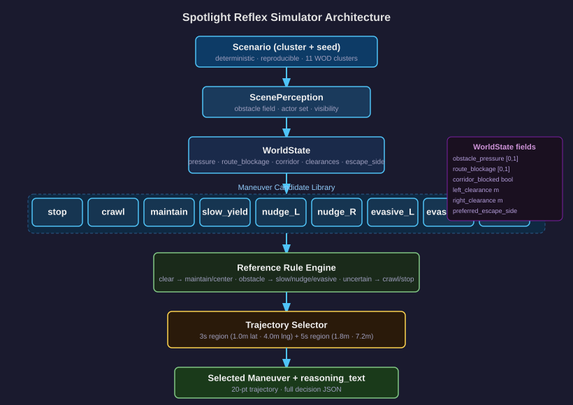

<!--
CoRL 2027 presentation deck.
Render HTML:
  npx @marp-team/marp-cli presentation.md --html --allow-local-files -o presentation.html
Render PDF:
  npx @marp-team/marp-cli presentation.md --pdf --allow-local-files -o presentation.pdf
PDF export requires Chrome, Chromium, Edge, or Firefox on the host.
Primary evidence files:
- docs/corl2027/paper.tex
- artifacts/corl_evidence_strength_audit.md
- artifacts/internal_proxy_transfer_medium.md
- artifacts/alpasim_matrix10_analysis.md
- artifacts/wod_grounding_ablation_table.md
-->

# Multi-Axis Failure Modes in Simulator Transfer

## Diagnostics from Discrete Maneuver Tokens and Grounded Selection

Alba Maria Tellez Fernandez<br>
Waymo Open Dataset E2E Challenge / CoRL 2027 branch

---

# The Core Claim

Internal closed-loop success is not a reliable transfer proxy.

We find that simulator transfer failure decomposes into separate axes:

- geometry: offroad and route reconstruction
- safety: collision and proximity violation
- progress: distance and route completion
- lane adherence: wrong-lane or lane-violation behavior

No evaluated intervention is co-monotone across all axes in AlpaSim.

---

# Why This Matters Now

Recent VLA work moves toward physically grounded latent reasoning.

LaST-VLA argues that autonomous-driving VLA reasoning should use 3D geometric priors
and world-model dynamics, not only text chain-of-thought.

It reports NAVSIM v1/v2 gains through latent spatio-temporal reasoning.

Our question is narrower and diagnostic:

If a policy or selector is internally strong, which transfer axes actually survive when the observation and dynamics interface changes?

Reference: [LaST-VLA, arXiv:2603.01928](https://arxiv.org/abs/2603.01928)

---

# Experimental Stack

| Layer | Purpose | Evidence |
| --- | --- | --- |
| Custom closed-loop simulator | Controlled long-tail AV stress lab | LHS generator, DAgger, proxy perturbations |
| AlpaSim adapter | External sim-to-sim validation on WOD-E2E clips | 10 matched clips, partial 13-scene refresh |
| WOD candidate-selection track | Real-data grounding probe | 479 validation frames, segment-grouped CV |

The tracks are deliberately separated.

Simulator metrics are not used to tune WOD selector results.

---

# What the Simulator Tests



The internal simulator is a controlled micro-lab, not a realism claim.

It lets us isolate:

- discrete token action spaces
- rule-based geometric selection
- BC and DAgger imitation variants
- proxy-state corruption with true-state evaluation
- matched seeds across policies and perturbations

The point is causal isolation before external validation.

---

# Visual Failure and Success Cases

| Baseline failure | Geometry-grounded success |
| --- | --- |
|  |  |

Same scenario family: wrong-way actor under low visibility.

The baseline extrapolates into the hazard. Spotlight selects an evasive token from geometry.

---

# Policy Interface


State:

- 10 scalar geometric features for learned policies
- six core world-state scalars for Spotlight

Action:

- 9 ManeuverTokens
- stop, crawl, maintain, slow-yield
- nudge left/right, evasive left/right, lane-recover

The policy selects a token; the controller executes the corresponding short-horizon trajectory.

---

# Internal Result: DAgger Closes the Local Frontier

Held-out Latin-hypercube sweep: 12 profiles, seeds 1-10, Gauntlet / Adversarial / Hidden.

Each agent: 1080 closed-loop rollouts.

| Agent | Overall pass / PV | Gauntlet | Adversarial | Hidden |
| --- | ---: | ---: | ---: | ---: |
| Continuous-BC | 77.69 / 3.52 | 77.50 / 4.31 | 75.42 / 2.08 | 83.33 / 1.67 |
| Token-BC | 76.85 / 4.26 | 77.64 / 4.86 | 71.67 / 2.92 | 82.50 / 3.33 |
| Token-RNN-BC | 78.43 / 2.96 | 79.17 / 2.92 | 74.58 / 2.50 | 81.67 / 4.17 |
| Token-DAgger-BC, 2-step | **94.54 / 0.19** | 96.25 / 0.28 | **90.83 / 0.00** | **91.67 / 0.00** |
| Spotlight Reflex | 94.44 / 0.65 | **96.67 / 0.28** | 90.00 / 0.83 | 90.00 / 2.50 |

Source: `docs/corl2027/paper.tex`, Table 2.

---

# Internal Result: More DAgger Is Not Monotonic

| Policy | Overall pass / PV | Gauntlet | Adversarial | Hidden |
| --- | ---: | ---: | ---: | ---: |
| Token-DAgger, 1-step | 93.98 / 0.46 | 96.81 / 0.56 | 87.50 / 0.42 | 90.00 / 0.00 |
| Token-DAgger, 2-step | **94.54 / 0.19** | **96.25 / 0.28** | **90.83 / 0.00** | **91.67 / 0.00** |
| Token-DAgger, 3-step | 92.50 / 0.46 | 94.31 / 0.28 | 87.92 / 0.42 | 90.83 / 1.67 |
| 3-step source decay | 93.06 / 0.28 | 94.86 / 0.42 | 89.17 / 0.00 | 90.00 / 0.00 |
| 3-step no inverse frequency | 89.35 / 2.50 | 92.08 / 2.08 | 82.50 / 3.75 | 86.67 / 2.50 |

Interpretation:

Offline accuracy and closed-loop safety are structurally decoupled under aggregation.

Source: `docs/corl2027/paper.tex`, Tables 3 and 6.

---

# DAgger Aggregation Visual


The plot is generated from the held-out Latin-hypercube sweep.

It makes the main internal pattern visible immediately:

- iteration 2 is the frontier
- source decay partially rescues iteration 3
- removing inverse-frequency weighting breaks closed-loop safety

---

# Negative Result: Scoring Ego Trajectories Was Not Enough

We trained trajectory-informed scorers over candidate futures with:

- curvature and heading deltas
- path length, acceleration, jerk proxies
- minimum dynamic clearance and time-to-closest-approach
- signed lateral and longitudinal miss distances

| Policy | Gauntlet pass / PV | Adversarial | Hidden |
| --- | ---: | ---: | ---: |
| Interaction scorer, learner states | 86.81 / 1.94 | 85.00 / 1.67 | 89.17 / 1.67 |
| Interaction scorer, merged states | 88.75 / 1.67 | 82.92 / 2.50 | 90.00 / 2.50 |
| Token-DAgger-BC, 2-step | **96.25 / 0.28** | **90.83 / 0.00** | **91.67 / 0.00** |

Conclusion: closed-loop state coverage mattered more than the tested offline trajectory scorer.

---

# External Diagnostic: AlpaSim


AlpaSim uses real WOD-E2E front-camera frames and an adapter that reconstructs:

- brightness
- route command
- ego dynamics
- sparse hazard primitives
- geometric scalars consumed by the policy

This is a transfer diagnostic, not a full safety benchmark.

---

# AlpaSim Bridge


The external bridge keeps the policy binary fixed.

What changes is the interface:

- camera and route observations become proxy geometric scalars
- sparse hazards become obstacle and actor primitives
- token selection is evaluated under AlpaSim execution

This is exactly where sim-to-sim mismatch is exposed.

---

# AlpaSim Matrix: One Fix Does Not Repair All Axes

10 matched WOD-E2E clips completed by all four variants.

| Model | Collision | Offroad | Wrong lane | Progress | Dist. m | Dist.-GT |
| --- | ---: | ---: | ---: | ---: | ---: | ---: |
| Raw DAgger iter2 | 0.600 | 0.900 | 0.700 | 0.034 | 61.98 | 13.86 |
| Clamped lateral | 0.700 | 0.500 | 0.200 | 0.384 | 59.85 | 5.21 |
| Hard veto hybrid | 0.800 | 0.200 | 0.700 | 0.837 | 166.06 | 22.71 |
| Source decay | 0.600 | 0.900 | 0.400 | 0.175 | 62.92 | 27.16 |

Each intervention improves at least one axis and fails or worsens another.

Source: `artifacts/alpasim_matrix10_analysis.md`.

---

# What the AlpaSim Interventions Show

| Intervention | Repairs | Worsens or fails |
| --- | --- | --- |
| Clamped lateral | offroad, wrong-lane, progress, distance-to-GT | collision increases |
| Hard veto hybrid | progress, offroad | collision increases, wrong-lane unchanged |
| Source decay | wrong-lane, progress | offroad unchanged, distance-to-GT worsens |

The hard veto is especially diagnostic:

- vetoed 1987 / 1990 DAgger argmax decisions
- selected mostly the geometric scorer path
- recovered progress by collapsing toward Spotlight-style selection

This is not a clean hybrid win; it exposes decision-space mismatch.

---

# Controlled Proxy-State Perturbation

Internal simulator, true-state physics and evaluation fixed.

Only the planner-visible proxy state is corrupted.

| Perturbation | Raw p/c/l | Clamp | Hybrid | Oracle | Spot |
| --- | ---: | ---: | ---: | ---: | ---: |
| clean | 0.917/0.083/0.312 | 0.938/0.062/0.167 | 0.958/0.042/0.167 | 0.938/0.062/0.167 | 0.938/0.062/0.167 |
| heading bias | 0.896/0.104/0.562 | 0.938/0.062/0.396 | 0.938/0.062/0.375 | 0.896/0.104/0.292 | 0.938/0.062/0.312 |
| actor latency | 0.604/0.396/0.875 | 0.604/0.396/0.521 | **0.854/0.146/0.208** | 0.833/0.167/0.271 | 0.583/0.417/0.250 |
| route offset | 0.938/0.062/0.229 | 0.875/0.125/0.021 | 0.896/0.104/0.062 | 0.938/0.042/0.125 | 0.917/0.083/0.083 |

Source: `artifacts/internal_proxy_transfer_medium.md`.

---

# Why the Proxy Sweep Matters

AlpaSim alone leaves an adapter-confound objection.

The proxy sweep removes that escape hatch:

- same simulator dynamics
- same token library
- same controller
- matched scenarios
- only proxy state is corrupted

The same multi-axis tradeoff appears internally under controlled corruption.

That makes the external result mechanistic rather than anecdotal.

---

# The Proposition

Let each candidate token have a metric vector:

`m(a) = [collision risk, offroad risk, lane risk, progress loss, tracking error]`

If a proxy-state perturbation changes the action ordering for one metric but not another,
a scalar intervention can improve one axis while worsening another.

The empirical question is not whether this is possible.

The empirical question is whether it occurs repeatedly under realistic AV transfer interfaces.

Our answer: yes, in AlpaSim and in controlled proxy perturbations.

---

# WOD Grounding Probe

479 WOD-E2E validation frames, segment-grouped CV.

| Ablation | RFS | Oracle | Regret | Oracle match | Grounding signal |
| --- | ---: | ---: | ---: | ---: | --- |
| Scalar / geometry only | 7.695 | 9.068 | 1.373 | 0.403 | none |
| InternVLA only | 7.672 | 9.225 | 1.554 | 0.392 | InternVLA |
| Cosmos + InternVLA linear fusion | 7.728 | 9.208 | 1.480 | 0.403 | Cosmos + InternVLA |
| Cosmos 64d nonlinear head | **7.845** | 9.264 | 1.419 | 0.390 | Cosmos + nonlinear head |

Grounding helps only with the right head.

This supports the LaST-VLA-aligned thesis, but it is not yet a hidden-test claim.

Source: `artifacts/wod_grounding_ablation_table.md`.

---

# Evidence Strength Audit

Current repo audit conclusion: `strong_diagnostic`.

| Gate | Current | Target | Status |
| --- | ---: | --- | --- |
| Internal proxy diagnostic | 288 cases | >=288 cases | pass |
| External transfer diagnostic | 10 matched scenes | >=10 scenes | pass |
| Larger external scale | 10 scenes | >=30 scenes | not yet |
| Uniform positive method | 0 external dominance cases | >=1 | not yet |
| Grounding prior signal | +0.150 RFS | >0 | pass |
| Hidden-test grounding claim | false | true | not yet |

This is intentionally honest: the current claim is diagnostic, not “best method wins.”

Source: `artifacts/corl_evidence_strength_audit.md`.

---

# Media and Figures Included

| Asset | Use |
| --- | --- |
| `docs/images/baseline_spotlight.gif` | baseline visual failure |
| `docs/images/spotlight_success.gif` | geometry-grounded success |
| `docs/images/construction_success.gif` | long-tail construction case |
| `docs/images/intersection_stress.gif` | multi-actor stress case |
| `docs/images/alpasim_reasoning_panel.png` | AlpaSim adapter reasoning |
| `docs/images/dagger_aggregation_ablation.svg` | DAgger aggregation plot |
| `docs/images/alpasim-bridge.svg` | external bridge diagram |

GIFs are used as short videos in GitHub, Marp, and most slide renderers.

---

# Additional Visual Cases

| Construction | Intersection stress |
| --- | --- |
|  |  |

These examples are not the proof.

They show what the controlled simulator is stressing: narrow corridors, route blockage, multi-actor timing, and lateral escape geometry.

---

# Reproducibility Path for Auditors

Start with the audit wrapper:

```bash
./scripts/run_corl2027_audit.sh
```

Core evidence files:

```text
docs/corl2027/paper.tex
docs/corl2027/AUDIT.md
artifacts/corl_evidence_strength_audit.md
artifacts/internal_proxy_transfer_medium.md
artifacts/alpasim_matrix10_analysis.md
artifacts/wod_grounding_ablation_table.md
```

AlpaSim setup and runtime are documented in `docs/notes/alpasim-integration.md`.

---

# Submission Framing

Do not frame this as:

“Our hybrid method dominates.”

The data does not support that.

Frame it as:

“Internal imitation-learning success can hide transfer-axis disagreement.

We provide a controlled diagnostic, reproduce the effect externally in AlpaSim,
and show that physical grounding must be evaluated per axis rather than as one aggregate
planning score.”

That is the defensible CoRL contribution.

---

# Takeaway

The surprising result is not that DAgger fails externally.

The result is where it fails:

- the internal simulator says the learned token policy is calibrated
- AlpaSim shows the selected tokens are often externally incompatible
- controlled proxy corruption reproduces the same axis conflicts
- frozen world/VLA priors help only through head-sensitive grounded selection

Robust AV evaluation needs per-axis transfer diagnostics, not only offline accuracy or aggregate closed-loop pass rate.
