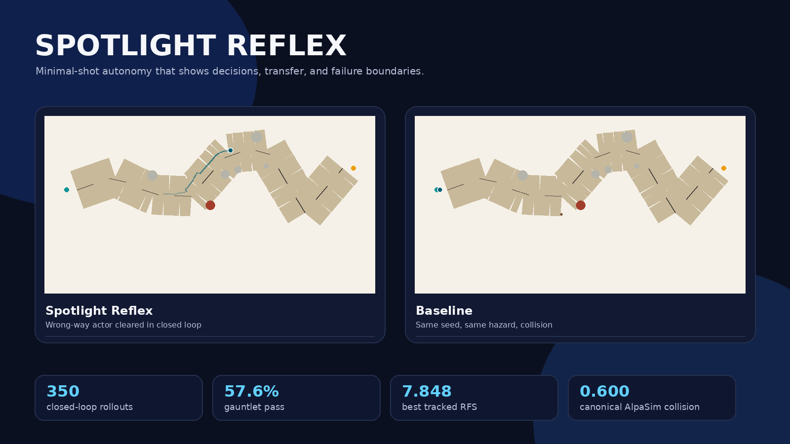
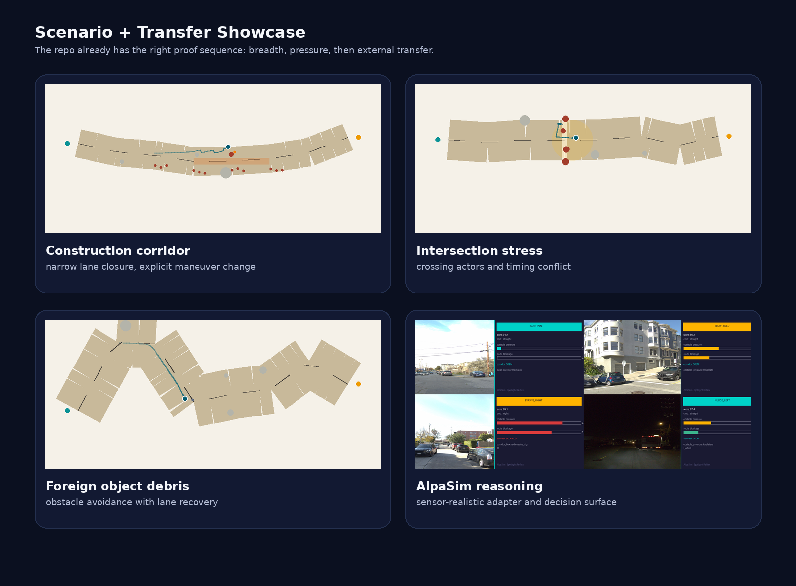

# Spotlight Reflex Showcase

> A compact autonomy stack with closed-loop long-tail rollouts, AlpaSim transfer diagnostics, and a grounded WOD-E2E selector path.

## Open This First

| Surface | Why it exists |
|---|---|
| [`README.md`](README.md) | fastest visual pitch |
| [`docs/corl2027/paper.pdf`](docs/corl2027/paper.pdf) | strongest current paper line |
| [`docs/simulation.md`](docs/simulation.md) | closed-loop simulator and Spotlight Reflex policy |
| [`docs/wod-e2e-system-walkthrough.md`](docs/wod-e2e-system-walkthrough.md) | Waymo candidate stack and selector grounding |
| [`docs/video_reel_plan.md`](docs/video_reel_plan.md) | exact media order for demos and uploads |

## Visual Surface

## What the Repo Is Selling

- **Closed-loop autonomy, not static path pictures.**
- **Geometry-first decisions, not label-memorized behavior.**
- **Transfer honesty, not one scalar score hiding failure modes.**
- **Auditability across simulator, AlpaSim, and Waymo candidate selection.**

## Strongest Story Order

1. Spotlight Reflex vs baseline on the same wrong-way actor seed.
2. Construction corridor and intersection stress to show breadth.
3. AlpaSim transfer diagnostics to show the repo does not stop at internal simulation.
4. The CoRL paper for the full "collision survives actor completion" argument.

## Decks and PDFs

If you need the deck artifacts directly:

- [`presentation-sota.pdf`](presentation-sota.pdf)
- [`presentation.pdf`](presentation.pdf)
- [`docs/presentation.pdf`](docs/presentation.pdf)
- [`docs/presentation.tex`](docs/presentation.tex)

Those are outputs. The actual entry surface for this branch should be the README,
paper, simulator walkthrough, and WOD walkthrough above.
