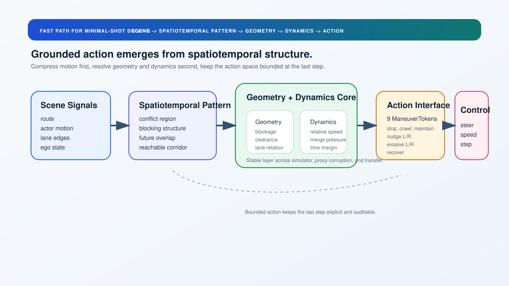
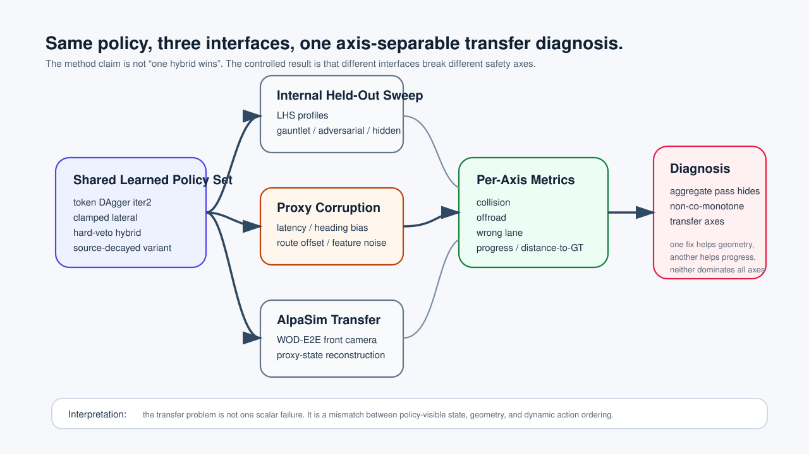

<!--
SoTA Commission I primary submission deck.
Render HTML:
  npx @marp-team/marp-cli presentation.md --html --allow-local-files -o presentation.html
Render PDF:
  npx @marp-team/marp-cli presentation.md --pdf --allow-local-files -o presentation.pdf
PDF export requires Chrome, Chromium, Edge, or Firefox on the host.
-->

# Minimal-Shot Autonomous Driving

## SoTA Commission I Submission

Alba Maria Tellez Fernandez<br>
GitHub branch: `CoRL-2027`

**Goal:** build an autonomous-driving prototype that can face unfamiliar long-tail
scenarios by reasoning from geometry, not memorizing a mapped training world.

---

# Motivation

Autonomy that depends on collecting every rare case will always lag reality.

Minimal-shot autonomy needs a different capability:

| Standard AV scaling | Minimal-shot target |
| --- | --- |
| train on many mapped cases | reason from first principles |
| optimize average-case driving | survive long-tail scenarios |
| hide failures inside aggregate metrics | expose failures by scenario and axis |
| expensive data dependence | reusable simulator and audit harness |

This project asks whether a small, auditable driving system can handle rare
geometry shifts without fine-tuning on an AV dataset.

---

# What Was Built For The Challenge

| SoTA requirement | Delivered artifact |
| --- | --- |
| simulation environment | custom 2D long-tail AV simulator |
| randomized scenarios | WOD-style clusters, OOD generator, gauntlet, LHS sweeps |
| autonomous system demo | Spotlight Reflex token policy + rollout GIFs |
| realistic constraints | small scalar runtime, deterministic controller, no heavy online model |
| WOD-E2E pathway | selector harness over real WOD-E2E validation frames |
| repo and evidence | reproducible scripts, audit reports, presentation, paper draft |

The submission is not a production AV claim. It is a working prototype and
evaluation harness for minimal-shot autonomy research.

---

# Whole System Map


The architecture has three connected layers:

1. custom simulator for controlled minimal-shot experiments
2. WOD-E2E selector harness for real-data grounding probes
3. AlpaSim transfer harness for sensor-realistic external validation

---

# Runtime Architecture



Spotlight Reflex is organized as a spatial-temporal compression path:

- scene signals are compressed into spatiotemporal pattern
- pattern is resolved into geometry and dynamic risk
- action stays bounded through the 9-token interface
- the last step is explicit control, not hidden language-like chaining

The runtime does not use scene IDs, maps of prior episodes, or dataset-specific
fine-tuning.

---

# Token Interface

The same action interface is used by the rule policy, learned policies, and
AlpaSim transfer experiments.

| Token family | Examples | Role |
| --- | --- | --- |
| longitudinal safety | stop, crawl, slow_yield | reduce collision pressure |
| nominal progress | maintain | continue along route |
| mild lateral evasion | nudge_left, nudge_right | create local clearance |
| emergency evasion | evasive_left, evasive_right | handle close hazards |
| recovery | lane_recover | return to lane center |

This shared token interface makes failures diagnosable: we can separate bad
candidate geometry from bad token selection.

---

# Simulator Environment


The simulator is the challenge environment and the controlled lab.

It supports WOD-style long-tail clusters, compositional OOD scenarios,
adversarial multi-hazard scenes, hidden holdout profiles, and Latin-hypercube
stress sampling.

---

# Demo: Minimal-Shot Success And Failure

| Baseline failure | Geometry-grounded success |
| --- | --- |
|  |  |

Same scenario family: wrong-way actor, low visibility, night.

The baseline extrapolates into the hazard. Spotlight selects an evasive token,
clears the actor, and returns to lane center.

---

# More Long-Tail Scenarios

| Construction zone | Foreign object debris |
| --- | --- |
|  |  |

The point is not photorealism. The point is controlled variation of geometry,
hazards, clearances, and recovery choices.

---

# Primary Simulation Result

Closed-loop simulation evidence package:

| Suite | Runs | Collisions | Pass |
| --- | ---: | ---: | ---: |
| WOD-style, all 11 clusters | 110 | 0 | 100% |
| Compositional OOD | 60 | 0 | 100% |
| Adversarial | 60 | 0 | 100% |
| Hidden holdout | 60 | 0 | 100% |
| Gauntlet | 60 | 0 | 60% |
| Total | 350 | 0 | 93.1% |

COMPASS: **9.137 / 10** over 700 ranked runs.

Source: `README.md`, `artifacts/compass_evidence_report.json`.

---

# Baseline Comparison

Matched gauntlet comparison: same 420 scenarios, same seeds.

| Policy | Pass rate | Collision rate |
| --- | ---: | ---: |
| Baseline, no world-state reasoning | 2.1% | 20.5% |
| Spotlight Reflex | **57.6%** | **7.9%** |

Takeaway for SoTA: explicit geometric reasoning gives a large improvement over a
non-reasoning baseline in the randomized challenge environment.

---

# AlpaSim External Transfer


This is a WOD-E2E front-camera AlpaSim rollout with adapter map and metrics.

AlpaSim is not used to claim production safety. It is used to test whether the
token interface survives a different observation and execution stack.

---

# Transfer Diagnostic Schema



The same learned token policies are tested
inside the simulator, under controlled proxy corruption, and in AlpaSim.

---

# What Failed Externally

10 matched WOD-E2E clips completed by all four learned variants:

| Model | Collision | Offroad | Wrong lane | Progress | Dist. m |
| --- | ---: | ---: | ---: | ---: | ---: |
| Raw DAgger iter2 | 0.600 | 0.900 | 0.700 | 0.034 | 61.98 |
| Clamped lateral | 0.700 | 0.500 | 0.200 | 0.384 | 59.85 |
| Hard-veto hybrid | 0.800 | 0.200 | 0.700 | 0.837 | 166.06 |
| Source decay | 0.600 | 0.900 | 0.400 | 0.175 | 62.92 |

No single learned intervention fixed all axes. This is the main understood
failure case: transfer breaks into collision, offroad, lane, and progress axes.

Source: `artifacts/alpasim_matrix10_analysis.md`.

---

# WOD-E2E Auxiliary Track

479 WOD-E2E validation frames, segment-grouped 5-fold CV.

| Selector | RFS | Folds | Role |
| --- | ---: | ---: | --- |
| Waymo baseline | 7.022 | - | reference |
| Local baseline | 7.131 | - | reference |
| Gate-only | 7.803 | 5 | selector baseline |
| RFF direct policy | 7.834 | 5 | learned baseline |
| GPU MLP + Cosmos 64d | **7.845** | 5 | best validation-CV |
| Oracle selector | 9.264 | 5 | upper bound |

This is auxiliary evidence, not a hidden-test claim: the right trajectory often
exists, but selection needs stronger grounded scene understanding.

---

# Why The Project Is Novel

| Judging axis | Evidence |
| --- | --- |
| technical excellence | simulator, token runtime, AlpaSim bridge, WOD-E2E harness |
| novelty | minimal-shot geometry-first token selection, per-axis transfer diagnosis |
| feasibility | small runtime, deterministic policy, clear deployment path |
| adherence to brief | custom simulation, randomized scenarios, videos, repo, audit trail |

The strongest idea is not “one model wins everywhere.”

It is that minimal-shot autonomy should be evaluated by how failures decompose
under new geometry, not only by aggregate pass rate.

---

# What Funding Enables

The next prototype milestone is a real grounded-selection loop:

1. scale AlpaSim validation from 10 paired scenes to 100+ scenes
2. add camera-grounded hazard and lane reconstruction to reduce proxy mismatch
3. train an axis-aware selector that optimizes collision, lane, offroad, and progress separately
4. run the same system on off-road or closed-course RC vehicle footage
5. publish the simulator and audit protocol as a minimal-shot AV benchmark

The prize money would fund compute, WOD/AlpaSim storage, annotation checks, and
hardware for a small physical prototype.

---

# Reproducibility

Start here:

```text
README.md
presentation.md / presentation.pdf
docs/corl2027/paper.pdf
docs/corl2027/AUDIT.md
./scripts/run_corl2027_audit.sh
```

Submission evidence:

```text
artifacts/final_submission_readiness_audit.json
artifacts/sota_judging_criteria_audit.json
artifacts/minimal_shot_claim_audit.json
artifacts/alpasim_matrix10_analysis.md
```

Branch:

```text
https://github.com/amtellezfernandez/minimal-shot-av/tree/CoRL-2027
```

---

# Claim Boundary

| Claim | Status |
| --- | --- |
| working minimal-shot AV simulator | yes |
| autonomous policy demo in randomized long-tail scenes | yes |
| WOD-E2E validation-CV selector result | yes, not hidden-test |
| AlpaSim external transfer diagnosis | yes, 10 paired shared clips |
| production AV safety claim | no |
| uniform positive learned method | no |

The submission is strongest as a prototype plus diagnostic environment, with an
honest failure analysis and a concrete path to a stronger grounded selector.

---

# CoRL Research Appendix

The same repo also contains a CoRL 2027 diagnostic paper draft:

> Internal imitation-learning success can hide transfer-axis disagreement. We
> reproduce the mechanism under controlled proxy-state corruption and external
> AlpaSim transfer.

This appendix supports the SoTA submission but is not the main deck framing.

---

# Internal Imitation-Learning Result

Held-out Latin-hypercube sweep: 12 profiles, seeds 1-10, Gauntlet / Adversarial / Hidden.

| Agent | Overall pass / PV | Gauntlet | Adversarial | Hidden |
| --- | ---: | ---: | ---: | ---: |
| Continuous-BC | 77.69 / 3.52 | 77.50 / 4.31 | 75.42 / 2.08 | 83.33 / 1.67 |
| Token-BC | 76.85 / 4.26 | 77.64 / 4.86 | 71.67 / 2.92 | 82.50 / 3.33 |
| Token-RNN-BC | 78.43 / 2.96 | 79.17 / 2.92 | 74.58 / 2.50 | 81.67 / 4.17 |
| Token-DAgger-BC, 2-step | **94.54 / 0.19** | 96.25 / 0.28 | **90.83 / 0.00** | **91.67 / 0.00** |
| Spotlight Reflex | 94.44 / 0.65 | **96.67 / 0.28** | 90.00 / 0.83 | 90.00 / 2.50 |

Internal success alone was misleading; external transfer exposed axis conflicts.

---

# Controlled Proxy-State Test

The simulator reproduces AlpaSim-style tradeoffs when only policy-visible state is corrupted.

| Perturbation | Raw p/c/l | Clamp | Hybrid | Oracle | Spot |
| --- | ---: | ---: | ---: | ---: | ---: |
| clean | 0.917/0.083/0.312 | 0.938/0.062/0.167 | 0.958/0.042/0.167 | 0.938/0.062/0.167 | 0.938/0.062/0.167 |
| actor latency | 0.604/0.396/0.875 | 0.604/0.396/0.521 | **0.854/0.146/0.208** | 0.833/0.167/0.271 | 0.583/0.417/0.250 |
| route offset | 0.938/0.062/0.229 | 0.875/0.125/0.021 | 0.896/0.104/0.062 | 0.938/0.042/0.125 | 0.917/0.083/0.083 |
| feature noise | 0.917/0.083/0.917 | 0.938/0.062/0.146 | 0.917/0.083/0.125 | 0.896/0.104/0.104 | 0.938/0.062/0.167 |

`p/c/l` means pass / collision / lane-violation rate.

Source: `artifacts/internal_proxy_transfer_medium.md`.

---

# Grounding Context

Recent VLA work argues for physically grounded latent reasoning.

LaST-VLA uses 3D geometric priors and world-model dynamics to improve autonomous-driving VLA planning.

Our complementary lesson:

- grounding is useful
- but aggregate scores can hide metric-axis conflicts
- grounded selectors should report collision, lane, offroad, progress, and tracking separately

Reference: [LaST-VLA, arXiv:2603.01928](https://arxiv.org/abs/2603.01928)

---

# Final Takeaway

The SoTA contribution is a complete minimal-shot AV prototype:

- custom randomized simulator
- auditable geometry-first policy
- scenario videos and external AlpaSim transfer
- WOD-E2E validation-CV selector harness
- transparent failure analysis

The research contribution is the diagnosis:

**minimal-shot AV systems should be judged by grounded, per-axis transfer behavior,
not by offline accuracy or a single aggregate score.**

---
